# Stage 1 · 数据取证与清洗

生成时间：2026-09-04T14:12:59.673422+00:00

## 结论

G1 **通过**，但发现一项会实质影响后续研究的数据覆盖偏差：多数非周五 session 在固定时刻截断（CME 约 09:46 ET；HKEX 约 21:46 HKT），不是完整交易时段。系统已把这些 session 标为 `is_truncated_session`；Stage 2 的季节性与 HAR 只能在实际覆盖区间内估计，D08 收盘前机制的有效独立样本显著少于原计划。

5 分钟有效率远高于门槛，roll 边界实测为 **18**（不是宪章正文一处误写的 22；按 3×2 + 2×6 正确合计即 18）。

## C1 · Schema 与完整性

**成立。** 原始数据 494,035 行、12 字段、5 个 root、23 个合约、空值 0、重复主键 0。

## C2 · 时区与会话映射（F1/F2）

**F1 成立。** ES 的会话首 bar 众数在 DST 前为 00:00 UTC、DST 后为 00:00 UTC，但转换后均为 18:00 ET，证明必须使用 IANA timezone database。

**F2 成立。** HSI/HTI 在 HKT 09:15–16:29 的 bar 数为 **0**，样本只有 T+1 夜盘。

同时发现每日尾部系统性截断，见会话端点图：

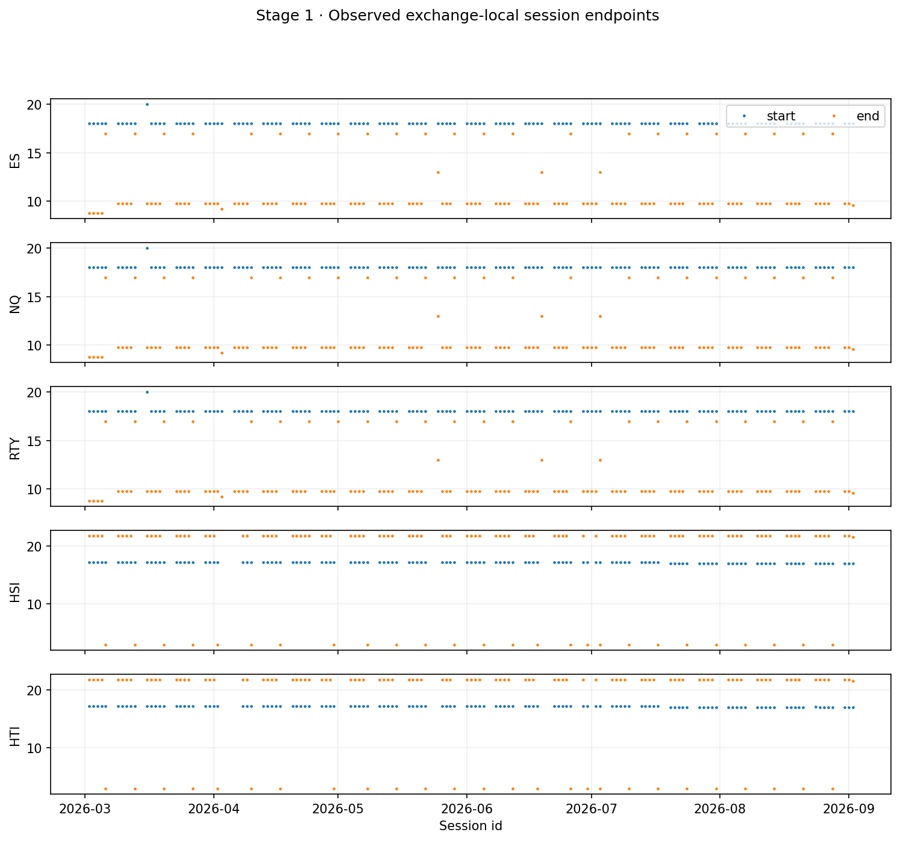

各品种按月、本地小时的有效 bar 分布：

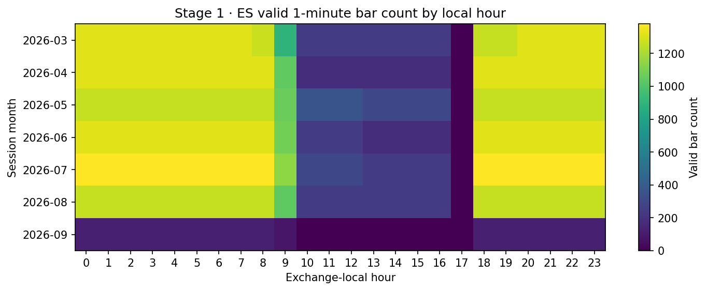

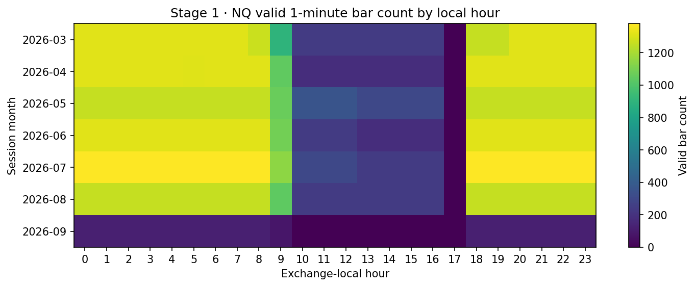

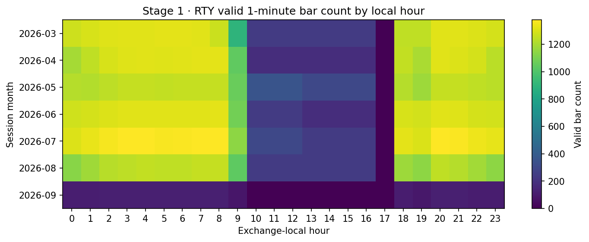

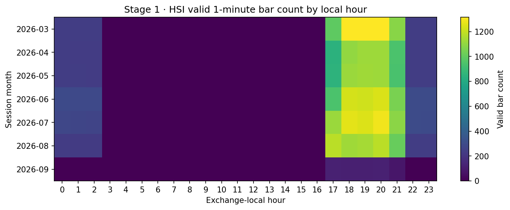

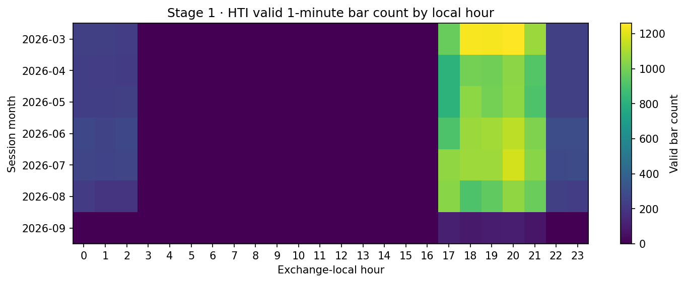

## C3 · 会话变更与短会话（F3）

**F3 成立，精确生效日为 2026-07-20。** HSI/HTI 夜盘开盘从 17:15 HKT 调整到 17:00 HKT；这与 HKEX 公布的 2026-07-20 生效日一致。推断结果已写入 `configs/session_defs.yaml`。

官方资料核对：[HKEX AHT 变更说明](https://www.hkex.com.hk/Services/Trading/Derivatives/Overview/Trading-Mechanism/After-Hours-Trading?sc_lang=en)、[HKEX 衍生品交易时段](https://www.hkex.com.hk/Services/Trading-hours-and-Severe-Weather-Arrangements/Trading-Hours/Derivatives-Market?sc_lang=en)、[CME 2026 holiday schedule](https://www.cmegroup.com/trading-hours.html)。

| root | half_days | truncated_sessions |
|---|---|---|
| ES | 4 | 105 |
| HSI | 0 | 96 |
| HTI | 0 | 96 |
| NQ | 4 | 105 |
| RTY | 4 | 105 |

`is_half_day` 只标记经官方日历确认的缩短时段；规则性文件截断单独标为 `is_truncated_session`，不混淆二者。

## C4 · 填充 bar（F4/F5）

**F4 成立。** 填充 bar 保留在时间轴中但不进入价格、收益或成本估计。**F5 成立。** ES/NQ/RTY 时间网格完全一致：`True`；RTY 的填充比例显著高于 ES。

| root | filled_1m_ratio |
|---|---|
| ES | 0.0 |
| HSI | 0.0253 |
| HTI | 0.0965 |
| NQ | 0.0001 |
| RTY | 0.0179 |

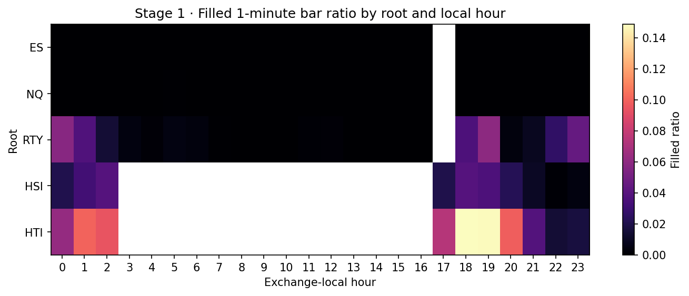

## C5 · Roll 边界（F6）

**F6 成立。** 共 18 个边界，全部后合约首时刻晚于前合约末时刻，无法从重叠报价中分离展期价差与周末跳空。因此维持“不后复权”，跨边界收益为 NaN。

| root | roll_boundaries |
|---|---|
| ES | 2 |
| HSI | 6 |
| HTI | 6 |
| NQ | 2 |
| RTY | 2 |

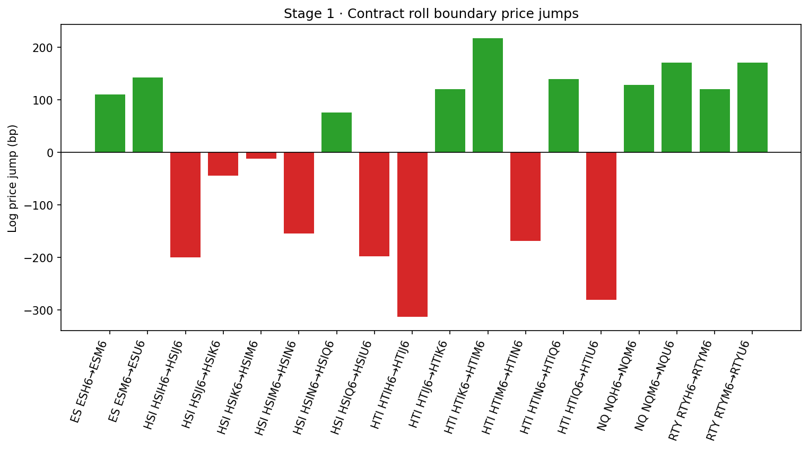

完整边界表：`reports/tables/01_roll_boundaries.csv`。

## C6 · 价格与跳动网格（F7）

| root | tick_size | median_close | tick_bp |
|---|---|---|---|
| ES | 0.25 | 7449.75 | 0.3356 |
| HSI | 1.0 | 25387.0 | 0.3939 |
| HTI | 1.0 | 4812.0 | 2.0781 |
| NQ | 0.25 | 29115.75 | 0.0859 |
| RTY | 0.1 | 2907.0 | 0.344 |

**F7 成立。** HTI 的相对跳动为 2.078 bp，是 HSI 的 5.28 倍；维持 context-only 分层。

## C7 · 异常值扫描

OHLC/WAP 逻辑违反数：**0**。滚动 MAD（390 分钟、8×）标记 1162 个候选跳跃，其中 34 个呈下一分钟近似反向回补。前 25 个候选已逐项检查并输出 ±5 bar 上下文至 `reports/tables/01_anomaly_contexts.csv`；最大事件多在相同 UTC 时刻同时出现于 ES/NQ/RTY/HSI/HTI（例如 2026-03-23 11:05、2026-07-14 12:30），支持共同信息冲击而非单品种坏点。由于没有 OHLC 逻辑错误，本阶段不主观改价；所有点保留并依靠 valid/cost/robust-vol 流程处理。

## C8 · 缺口结构

| root | 1m | 2-30m | 30m-1d | >1d |
|---|---|---|---|---|
| ES | 135948 | 3 | 106 | 26 |
| HSI | 40890 | 789 | 98 | 27 |
| HTI | 35677 | 2943 | 98 | 27 |
| NQ | 135938 | 8 | 106 | 26 |
| RTY | 131433 | 2081 | 106 | 26 |

| root | sessions |
|---|---|
| ES | 133 |
| HSI | 126 |
| HTI | 126 |
| NQ | 133 |
| RTY | 133 |

ES/NQ/RTY 各 133 个 session；HSI/HTI 各 126 个，符合文档量级。工作日缺失清单已写入 `reports/tables/01_missing_weekdays.csv` 并与交易所 holiday schedule 对照；最重要的缺陷不是缺整日，而是前述 session 内尾部截断。

## C9 · 成交量与笔数结构（F8）

| root | median_minute_volume | median_bar_count | median_trade_size |
|---|---|---|---|
| ES | 177.0 | 84.0 | 2.1344 |
| HSI | 16.0 | 15.0 | 1.0303 |
| HTI | 13.0 | 8.0 | 1.4 |
| NQ | 111.0 | 86.0 | 1.2842 |
| RTY | 19.0 | 14.0 | 1.3333 |

**F8 成立。** HSI/HTI 的单分钟量与笔数显著低于 CME 三品种，成本模型必须按本地时段变化。

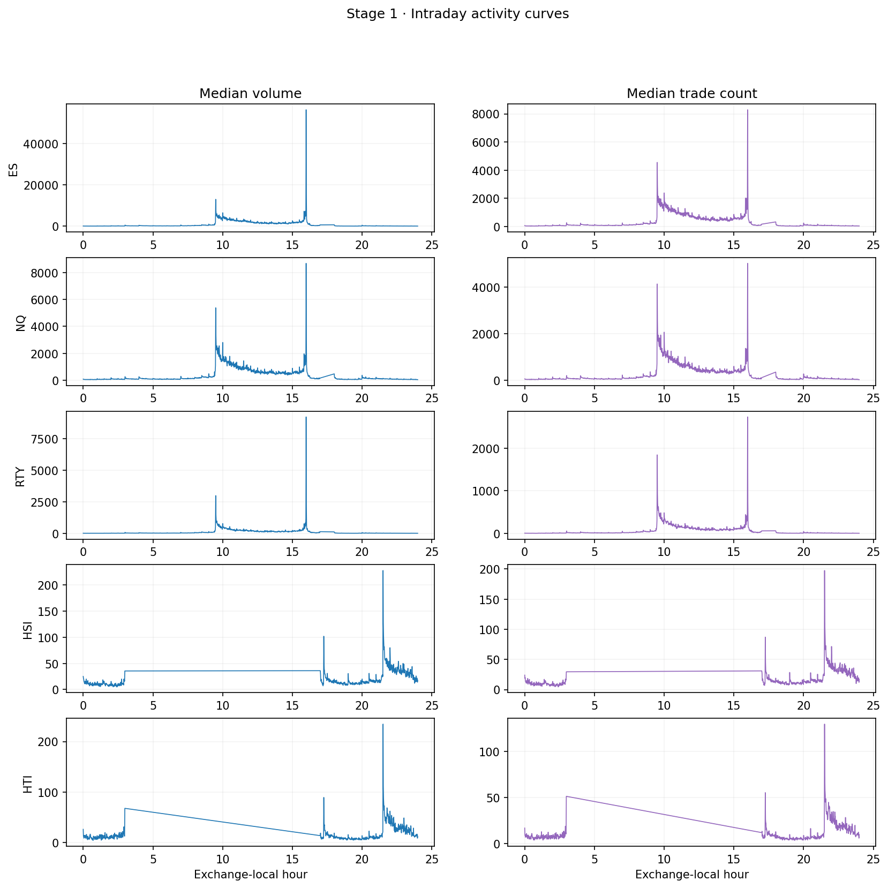

## C10 · 跨市场同步性

ES–HSI 同时 5 分钟收益相关为 **0.764**；相关峰值为 **0.764**，位于 k=0 个 5 分钟 bar（n=8179）。这一定义下正 k 表示 ES 的更早收益与当前 HSI 收益相关。文档预期的 1–2 分钟领先在 5 分钟数据上未出现，峰值是同步且明显高于预期 0.3–0.5；因此 D06 不应预设 k=1/2，而应把同步 beta 残差作为首要版本，并把非零 lag 作为有计数的参数检验。

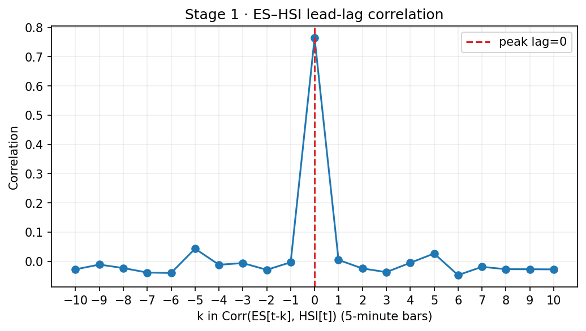

## C11 · 有效点差

CHL 估计使用相邻有效 5 分钟 bar，并逐 root×本地小时施加 1 tick 下界；成本配置固定乘以 1.5。

| root | median_spread_bp | max_spread_bp |
|---|---|---|
| ES | 0.3356 | 3.1524 |
| HSI | 0.8543 | 2.7914 |
| HTI | 2.0781 | 4.2424 |
| NQ | 0.0859 | 4.3102 |
| RTY | 0.3744 | 4.492 |

HSI/HTI 的 CHL 点差点估计低于文档参考区间，但该估计不含额外滑点与佣金；`cost_model.yaml` 的完整往返成本仍包含双边 0.5 tick 滑点、双边佣金和 1.5× 保守倍数。静态曲线仅作 Stage 1 校准，Stage 2 输出到逐 bar context 时必须改为扩展窗口估计。

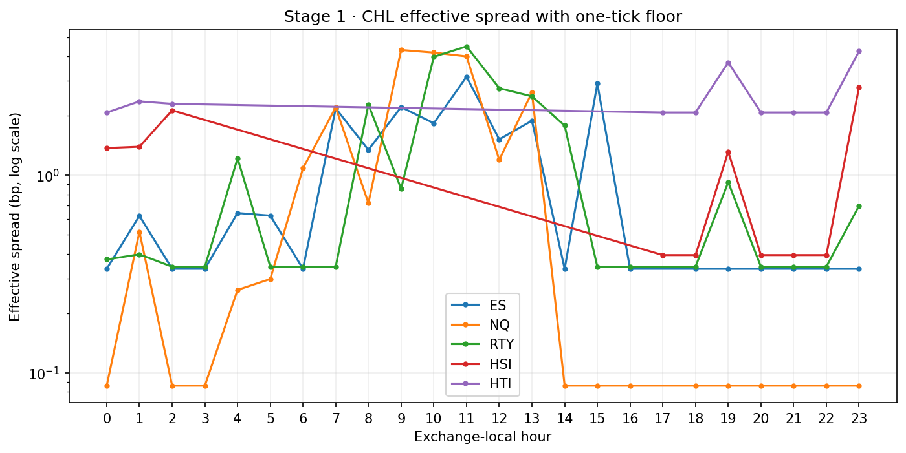

## C12 · 有效样本量

重叠 UTC 09:00–18:59 有效 5 分钟收益相关矩阵：

| root | ES | HSI | HTI | NQ | RTY |
|---|---|---|---|---|---|
| ES | 1.0 | 0.765 | 0.7029 | 0.9049 | 0.8451 |
| HSI | 0.765 | 1.0 | 0.9232 | 0.6567 | 0.7213 |
| HTI | 0.7029 | 0.9232 | 1.0 | 0.6314 | 0.642 |
| NQ | 0.9049 | 0.6567 | 0.6314 | 1.0 | 0.7139 |
| RTY | 0.8451 | 0.7213 | 0.642 | 0.7139 | 1.0 |

- `N_eff = 1.518`
- `T_eff = 0.759` 年
- `se(SR_hat) ≈ 1.148`（以 SR≈0 的基准项计算）

## F1–F8 汇总

| 事实 | 结论 | 设计后果 |
|---|---|---|
| F1 UTC + DST | 成立 | 始终使用 timezone database |
| F2 HK 仅夜盘 | 成立 | 港股开盘 gap 机制不可实现 |
| F3 17:15→17:00 | 成立，2026-07-20 | 分段 session spec |
| F4 填充 bar | 成立 | 保留网格但排除计算 |
| F5 CME 共用网格 | 成立 | RTY valid mask 尤其重要 |
| F6 roll 无重叠 | 成立 | 不后复权，边界收益 NaN |
| F7 HTI 相对 tick 过大 | 成立 | HTI 维持 context-only |
| F8 HK 夜盘成交稀薄 | 成立 | HSI/HTI 独立成本曲线 |

## G1 门禁

| root | valid_5m_ratio |
|---|---|
| ES | 1.0 |
| HSI | 0.9955 |
| HTI | 0.9862 |
| NQ | 1.0 |
| RTY | 0.9992 |

- [x] F1–F8 均有明确结论。
- [x] ES 5min `is_valid`=100.0000% ≥70%。
- [x] HSI 5min `is_valid`=99.5485% ≥55%。
- [x] roll 边界实测 18，并记录文档算术偏差。
- [x] `test_calendar` 与 `test_roll_boundary_nan` 通过。

## 产物

- `data/interim/bars_5m.parquet`
- `configs/session_defs.yaml`
- `configs/cost_model.yaml`
- `data/interim/bars_5m_manifest.json`
- `reports/tables/01_*.csv`
