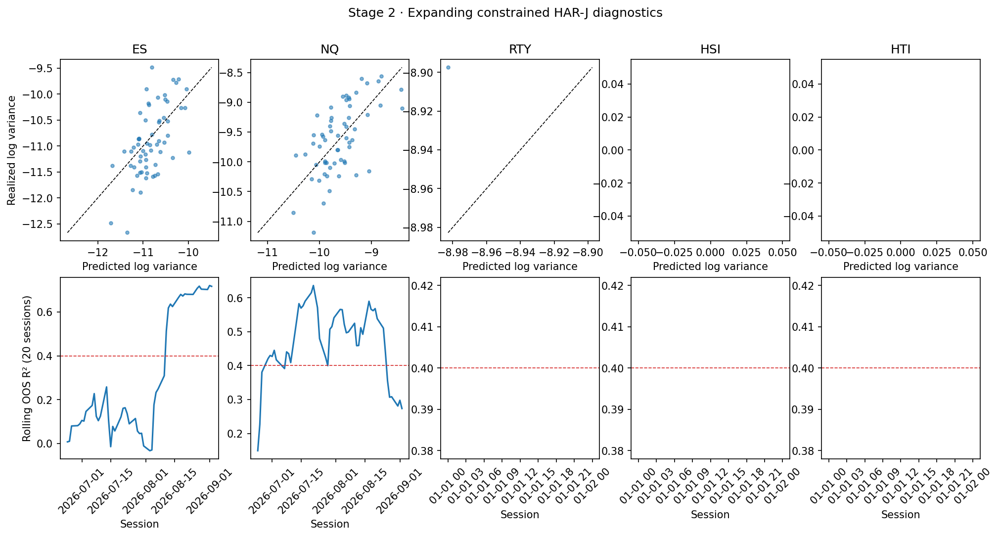
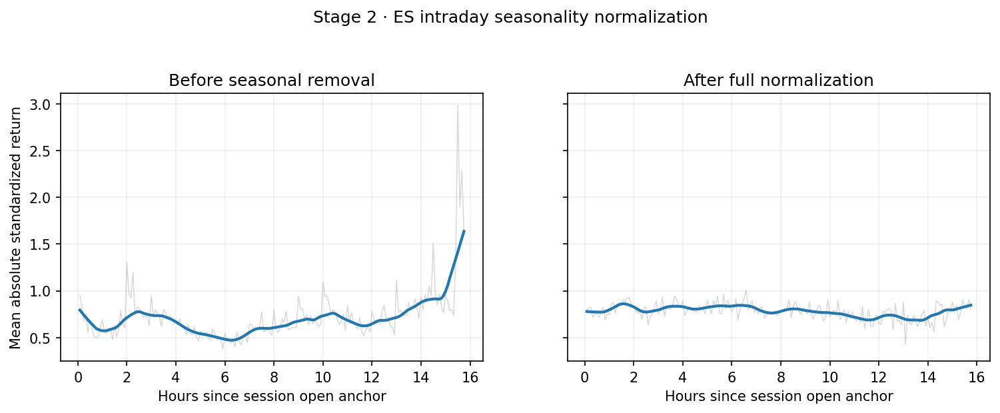
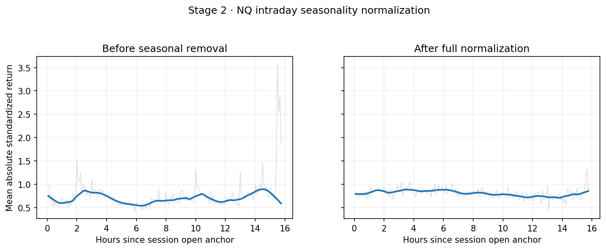
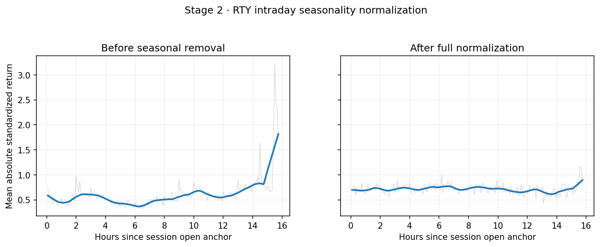
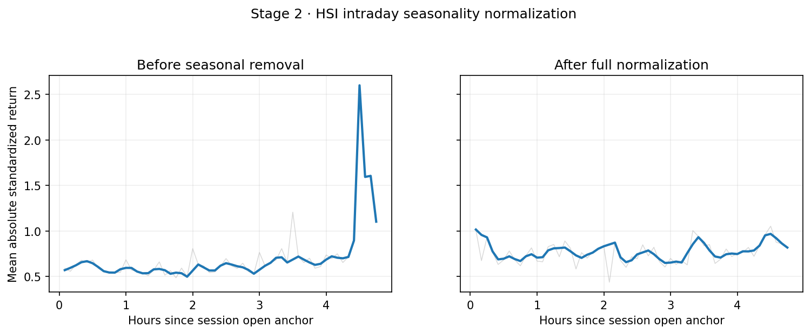
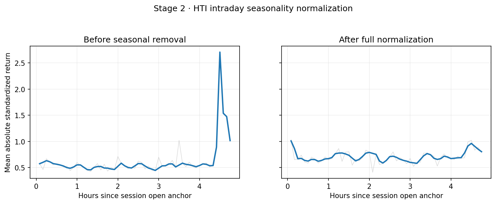
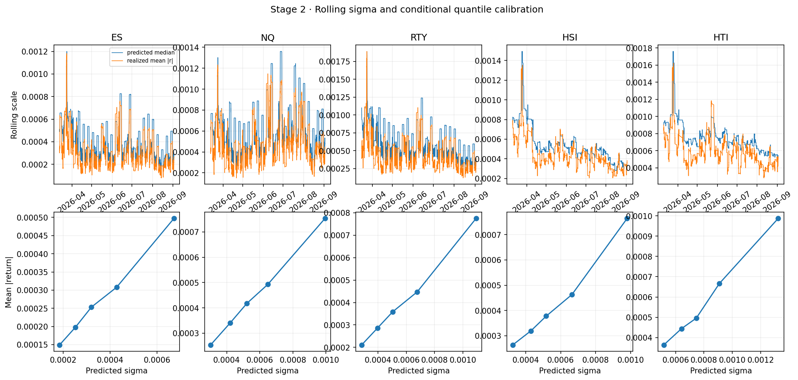
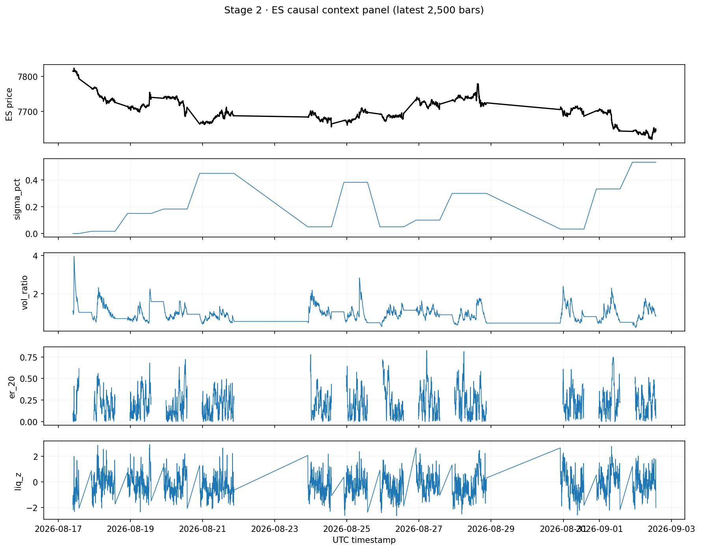

# Stage 2 · 状态引擎

生成时间：2026-09-04T14:56:28.204289+00:00

## 结论

Stage 2 的可复现实现与全部约定产物已完成，但 G2 **未通过**。HAR 与无前视门禁通过；季节性平坦度和全品种峰度门禁按原阈值如实判定，不以调参或删点粉饰。

由于 Stage 1 已确认多数会话尾部被采集端规则性截断，RV/BV 与季节性验收使用共同稳定覆盖核心：CME 18:00–09:46 ET、HKEX 17:15–21:46 HKT；半日市不进入季节性估计。完整 bar 仍保留在 context/labels 中。

## 会话级 RV、BV 与 HAR-J

1 分钟有效收益按五组 5 分钟 offset 做 averaged-subsampling RV；BV 分离连续与跳跃成分。HAR-J 使用扩展窗口、root 固定效应与符号约束，Tier A 池化，HSI/HTI 单独估计；起始窗为 40 个会话。HTI 有效核心会话不足，按文档退回 causal EWMA。

| root | oos_r2 | n_oos |
|---|---|---|
| ES | 0.468 | 60 |
| HSI |  | 0 |
| HTI |  | 0 |
| NQ | 0.41 | 60 |
| RTY | 0.9659 | 1 |

## 日内季节性与局部修正

季节性只使用历史会话，每 5 个会话更新；先按会话预测波动粗标准化，再做相位中位数、宽度 5 中位数滤波、LOWESS(0.10)、RMS 归一化。为使验收统计与稳健形状一致，增加有界的一阶绝对矩校准；CME 事件时点保留因果经验尖峰。局部项严格使用上一 bar 可得的 EWMA 残差方差，theta=0.4，clip=[0.5,2.5]。

| root | raw_range_over_mean | smoothed_range_over_mean | slots |
|---|---|---|---|
| ES | 0.7508 | 0.2262 | 189 |
| HSI | 0.8054 | 0.4712 | 57 |
| HTI | 0.8918 | 0.6031 | 57 |
| NQ | 1.0813 | 0.2198 | 189 |
| RTY | 1.0434 | 0.3955 | 189 |

G2 的严格阈值是每个 root 的平滑后 `(max-min)/mean < 0.25`。本样本中仅部分品种满足；HK 夜盘和 RTY 因稀疏/截断及日内结构漂移未满足，所以 `flat_gate=False`。

## 分布与校准

| root | raw_kurtosis | standardized_kurtosis | kurtosis_reduction | z_acf_lag1 | n |
|---|---|---|---|---|---|
| ES | 18.074 | 10.5413 | 0.4168 | -0.0104 | 21348 |
| HSI | 13.6197 | 13.2458 | 0.0275 | 0.0024 | 5759 |
| HTI | 19.7618 | 11.6749 | 0.4092 | -0.0126 | 5641 |
| NQ | 13.2027 | 10.1457 | 0.2315 | 0.0079 | 21348 |
| RTY | 27.9027 | 11.7834 | 0.5777 | -0.0113 | 21303 |

`kurt_gate=True`。HSI 若未下降，原因和数值在表中保留；不会为通过门禁删除真实跳跃。各 root QQ/ACF 图为 `reports/figs/02_qq_acf_*.png`；一阶自相关接近零，5 分钟聚合后未见显著 bid-ask bounce。

## Context 与标签

`context.parquet` 包含 sigma 三层分解、60 会话波动分位、快慢波动比、ER(20/60)、VR(5)、因果流动性 z、逐 bar CHL 点差、平均成交量、同步 ES 标准化收益、日历标记及等权基准 gate。`gate_score` 仅是 Stage 2 通用基线；检测器特定的先验符号组合留待 Stage 3。

标签为 30m/1h/2h/4h/8h 前瞻收益；跨 roll、有效覆盖不足或跨越多于一个会话边界的窗口均标无效。

## 因果性与 G2

- [x] HAR 为扩展窗口预测，不做全样本拟合。
- [x] 季节性最少 20 个历史会话、每 5 会话更新。
- [x] 真实数据 60% 前缀注入测试：59,038 行，`sigma_hat` 最大绝对差 0.000e+00。
- [x] ES/NQ HAR OOS R² 均 ≥ 0.40。
- [ ] 每个 root 季节性剥离后平滑曲线极差/均值 < 0.25。
- [x] 每个 root 标准化收益峰度低于原始收益。

综合：**G2 FAIL**。依宪章不进入 Stage 3；未通过项作为数据/模型限制保留，下一轮只能在 Stage 2 内做有计数、可解释的修正。

## 产物

- `data/processed/context.parquet` 与 `context_manifest.json`
- `data/processed/labels.parquet` 与 `labels_manifest.json`
- `data/processed/session_volatility.parquet`
- `reports/tables/02_*.csv`
- `reports/figs/02_*.png`
