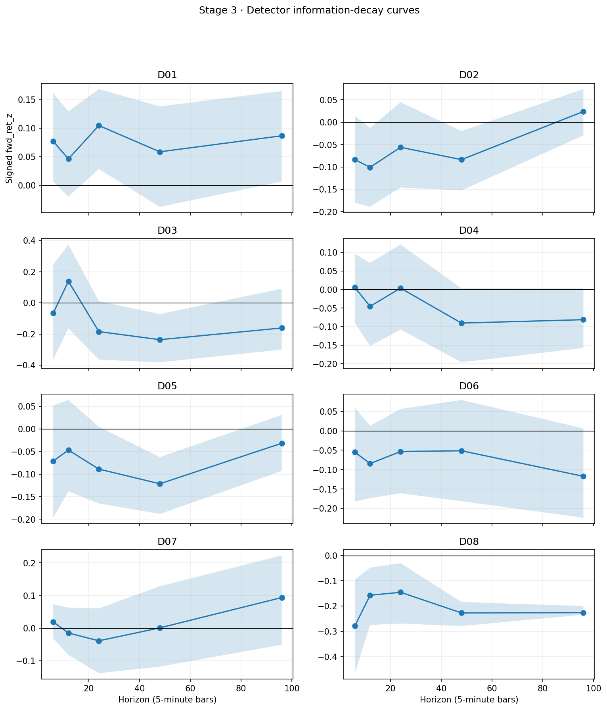
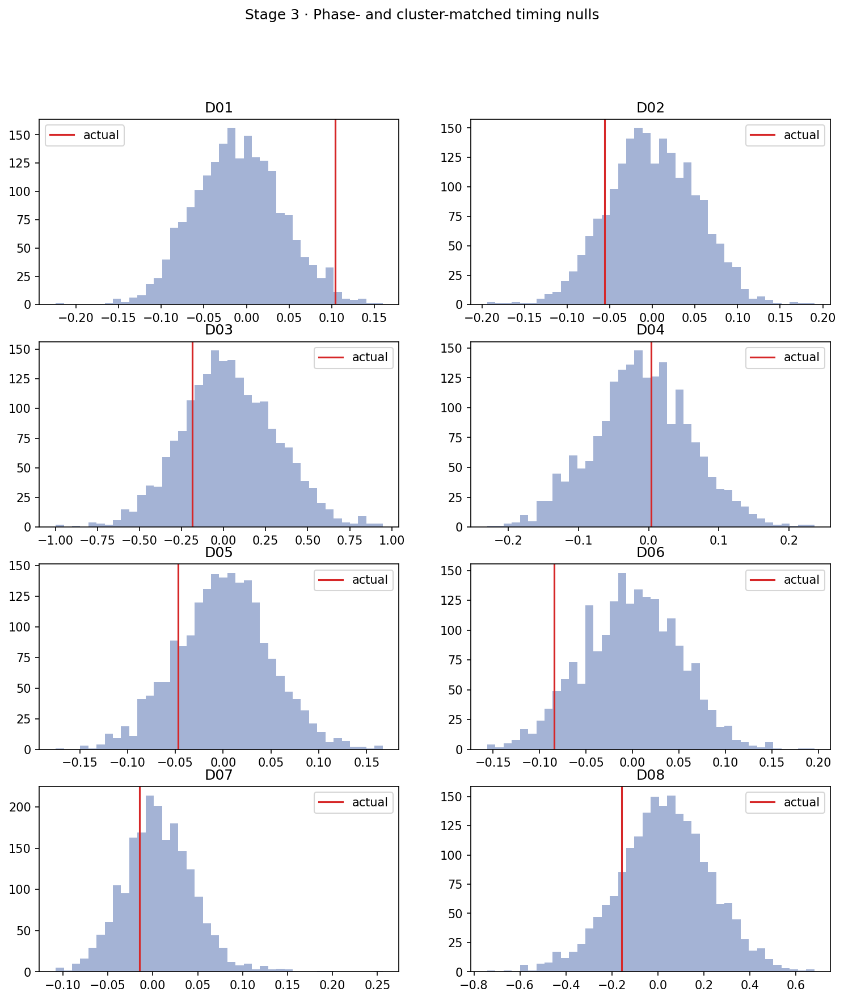
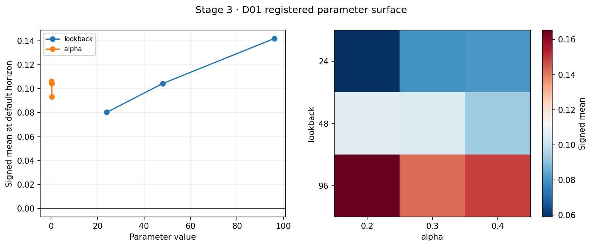
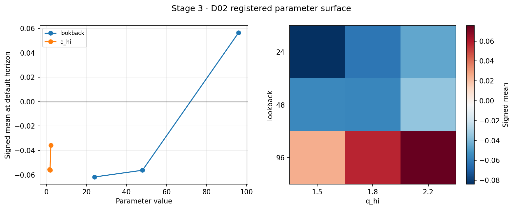
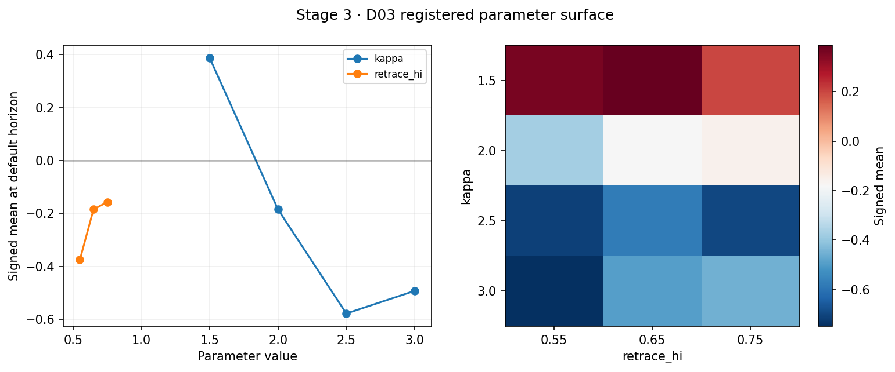
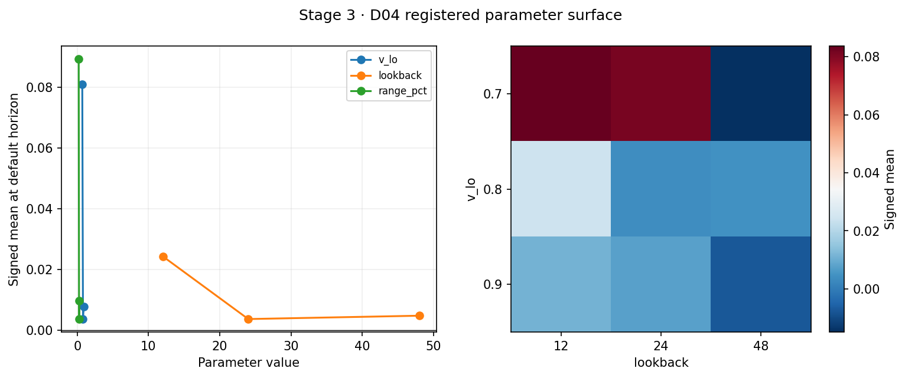
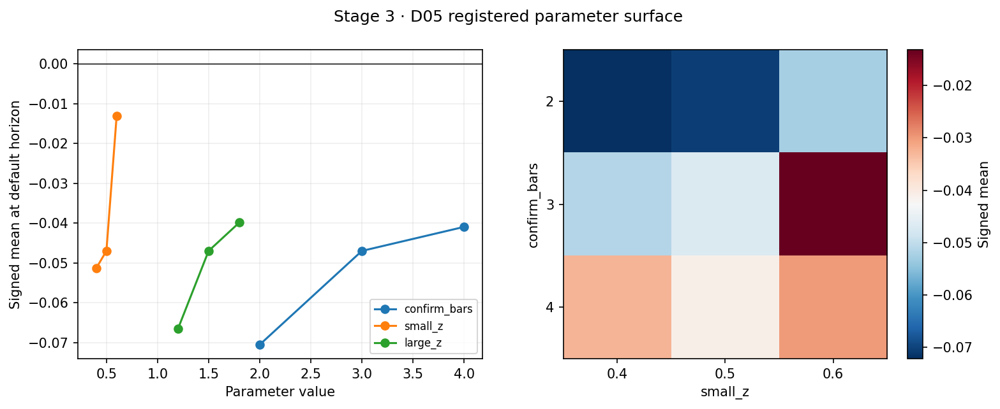
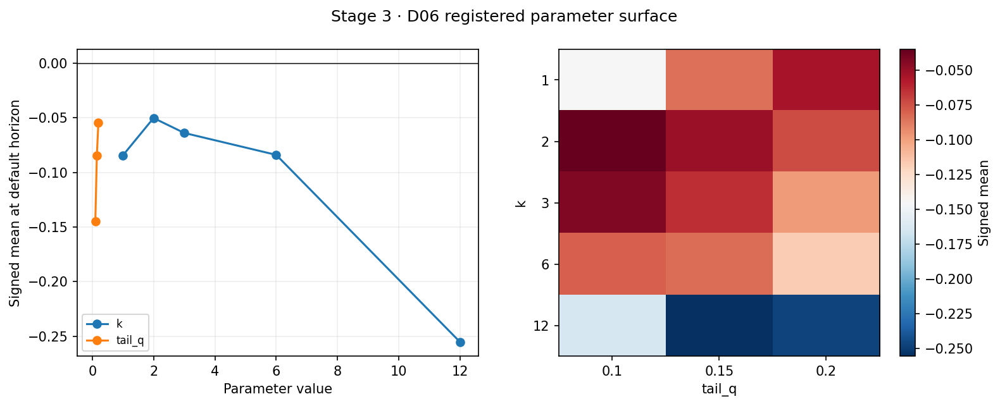
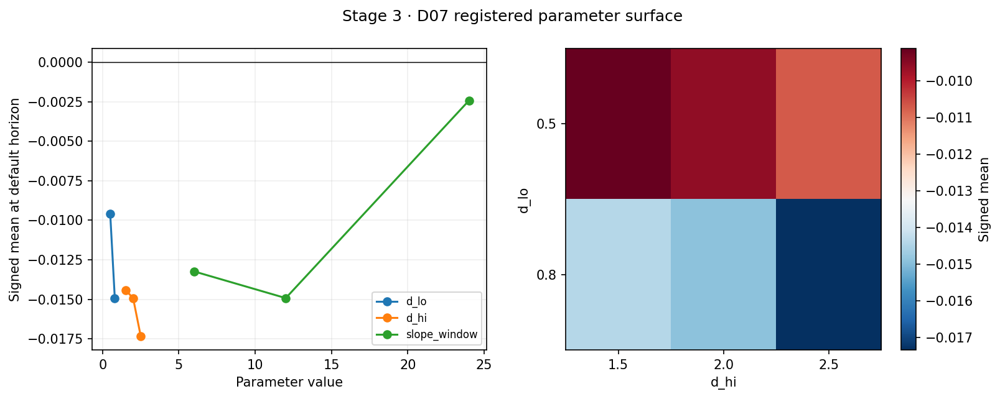
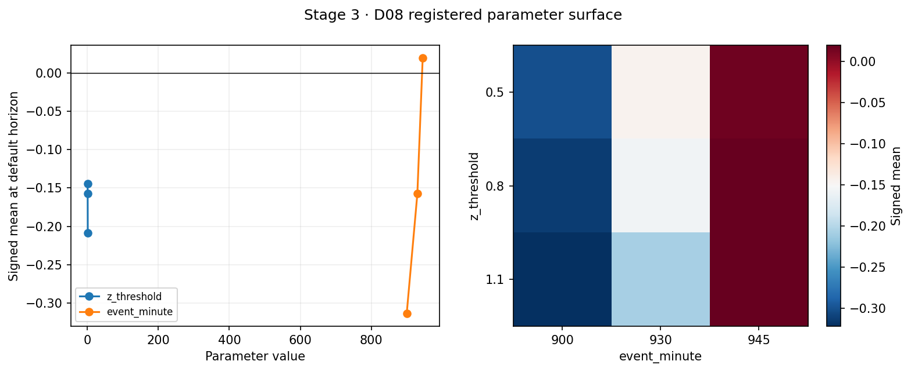

# Stage 3 · 检测器与单形态统计

生成时间：2026-09-05T02:04:21.647990+00:00

## 结论

8 个预注册检测器、在线 ZigZag、统计卡片、stationary bootstrap、phase/聚类/多空匹配随机时点零分布、LOI 所需 root 分解以及一维/二维参数曲面均已完成。共有 **1** 个检测器通过全部 G3 子门禁，故 G3 **未通过**。

Stage 2 的季节性平坦度降级由用户接受，但原始失败指标继续保留；本阶段没有重估 `sigma_hat`。HTI 仍只作 context，不计入 Tier A 符号一致性。

## G3 汇总

| detector_id | triggers | ES | NQ | RTY | tier_a_positive | stability | null_percentile | mean_z | mean_net | g3_pass |
|---|---|---|---|---|---|---|---|---|---|---|
| D01 | 1227 | 371 | 449 | 272 | 3 | 0.735149 | 0.9875 | 0.104294 | 2.2e-05 | True |
| D02 | 2403 | 595 | 561 | 744 | 1 | 0.0 | 0.1395 | -0.056189 | -0.000499 | False |
| D03 | 87 | 12 | 39 | 15 | 0 | 0.0 | 0.2155 | -0.184676 | -0.00064 | False |
| D04 | 1039 | 257 | 247 | 287 | 1 | 0.098058 | 0.5765 | 0.00367 | -0.000449 | False |
| D05 | 788 | 185 | 185 | 197 | 1 | 0.0 | 0.1725 | -0.046971 | -0.000494 | False |
| D06 | 1954 | 0 | 0 | 0 | 0 | 0.0 | 0.058 | -0.084344 | -0.000446 | False |
| D07 | 10467 | 2952 | 3883 | 2054 | 1 | 0.0 | 0.282 | -0.01492 | -0.000226 | False |
| D08 | 61 | 21 | 21 | 19 | 0 | 0.0 | 0.1675 | -0.157411 | -0.000725 | False |

跨品种留一迁移比（固定预注册参数，不在 holdout 上调整）：

| detector_id | holdout_root | holdout_mean | development_mean | full_mean | loi_ratio |
|---|---|---|---|---|---|
| D01 | ES | 0.0756 | 0.1015 | 0.1043 | 0.7247 |
| D01 | NQ | 0.0523 | 0.1189 | 0.1043 | 0.501 |
| D01 | RTY | 0.0892 | 0.0945 | 0.1043 | 0.8557 |
| D01 | HSI | 0.4492 | 0.0694 | 0.1043 | 4.307 |
| D02 | ES | -0.0201 | -0.077 | -0.0562 |  |
| D02 | NQ | 0.0361 | -0.0956 | -0.0562 |  |
| D02 | RTY | -0.0902 | -0.0461 | -0.0562 |  |
| D02 | HSI | -0.2878 | -0.0309 | -0.0562 |  |
| D03 | ES | -1.0633 | -0.1718 | -0.1847 |  |
| D03 | NQ | -0.2093 | -0.4517 | -0.1847 |  |
| D03 | RTY | -0.0829 | -0.3829 | -0.1847 |  |
| D03 | HSI | -0.1506 | -0.3358 | -0.1847 |  |
| D04 | ES | 0.1461 | -0.0647 | 0.0037 | 39.8112 |
| D04 | NQ | -0.0765 | 0.022 | 0.0037 | -20.855 |
| D04 | RTY | -0.0104 | -0.0024 | 0.0037 | -2.845 |
| D04 | HSI | -0.1766 | 0.0196 | 0.0037 | -48.1156 |
| D05 | ES | -0.1015 | -0.0195 | -0.047 |  |
| D05 | NQ | 0.1896 | -0.1296 | -0.047 |  |
| D05 | RTY | -0.1988 | 0.0228 | -0.047 |  |
| D05 | HSI | -0.0509 | -0.0403 | -0.047 |  |
| D06 | ES |  | -0.0843 | -0.0843 |  |
| D06 | NQ |  | -0.0843 | -0.0843 |  |
| D06 | RTY |  | -0.0843 | -0.0843 |  |
| D06 | HSI | -0.0843 |  | -0.0843 |  |
| D07 | ES | -0.016 | -0.016 | -0.0149 |  |
| D07 | NQ | 0.0476 | -0.0584 | -0.0149 |  |
| D07 | RTY | -0.0977 | 0.006 | -0.0149 |  |
| D07 | HSI | -0.1133 | -0.0071 | -0.0149 |  |
| D08 | ES | -0.1151 | -0.1796 | -0.1574 |  |
| D08 | NQ | -0.3158 | -0.0743 | -0.1574 |  |
| D08 | RTY | -0.0292 | -0.2154 | -0.1574 |  |
| D08 | HSI |  | -0.1574 | -0.1574 |  |

参数峰值与采用值（采用预注册默认/高原中心，不追逐峰值）：

| detector_id | peak_parameters | peak_performance | adopted_parameters | adopted_performance | peak_to_adopted_gap |
|---|---|---|---|---|---|
| D01 | lookback=96; alpha=0.2 | 0.1654 | {'lookback': 48, 'alpha': 0.3} | 0.1043 | 0.3693 |
| D02 | lookback=96; q_hi=2.2 | 0.0756 | {'lookback': 48, 'q_hi': 1.8} | -0.0562 | 1.7428 |
| D03 | kappa=1.5; retrace_hi=0.65 | 0.3877 | {'kappa': 2.0, 'retrace_hi': 0.65} | -0.1847 | 1.4764 |
| D04 | v_lo=0.7; lookback=12 | 0.0837 | {'v_lo': 0.8, 'lookback': 24} | 0.0037 | 0.9561 |
| D05 | confirm_bars=3; small_z=0.6 | -0.0131 | {'confirm_bars': 3, 'small_z': 0.5} | -0.047 | 2.5745 |
| D06 | k=2; tail_q=0.1 | -0.0352 | {'k': 1, 'tail_q': 0.15} | -0.0843 | 1.3961 |
| D07 | d_lo=0.5; d_hi=1.5 | -0.0091 | {'d_lo': 0.8, 'd_hi': 2.0} | -0.0149 | 0.6363 |
| D08 | z_threshold=0.8; event_minute=945 | 0.0195 | {'z_threshold': 0.8, 'event_minute': 930} | -0.1574 | 9.0868 |

## 方法口径

- 所有检测器输出在 bar t 仅使用 t 及以前的信息；ZigZag pivot 只在 `confirm_time` 后可见。
- D01/D02 共享同一突破事件，分别要求收回/守住且低量/高量，触发集合互斥。
- 条件效应始终为 `direction × fwd_ret_z`，多空另表报告，禁止合并成绝对收益。
- 显著性同时报告原始 t、Newey-West(h) 和 stationary bootstrap（期望块长 5h）。
- 随机对照在 root×phase 内循环平移完整触发序列，精确保持触发数、方向序列与簇集间距。
- 成本使用 `cost_model.yaml` 中已经包含 1.5× 保守倍数的逐 root×本地小时往返成本，避免再次重复乘 1.5。
- 参数稳定性只扫描预登记网格；默认点、一维邻域和最重要两参数二维曲面去重后共 **84** 个参数变体。另有 8×5=40 个强制持有期诊断，总计 **124** 个 Stage 3 已查看变体，全部计入 K。

## 检测器卡片

### D01 · H-01

- 默认参数：`{'lookback': 48, 'confirm': 4, 'alpha': 0.3, 'q_lo': 1.2}`
- 触发：1,227；ES/NQ/RTY=371/449/272；前 10 会话集中度=18.3%
- 默认 horizon=24：signed mean z=0.1043，成本后原始均值=0.000022
- matched-null percentile=0.988；Stab=0.735；Tier A 正号数=3
- G3 单检测器结论：**PASS**

| detector_id | horizon | n | mean_z | ci_low | ci_high | raw_t | nw_t | stationary_t | event_sharpe | win_rate | payoff_ratio | mean_raw | mean_net |
|---|---|---|---|---|---|---|---|---|---|---|---|---|---|
| D01 | 6 | 1225 | 0.0768 | 0.0065 | 0.1608 | 1.8101 | 1.7244 | 1.8804 | 0.0517 | 0.511 | 1.0944 | 0.0001 | -0.0 |
| D01 | 12 | 1224 | 0.0461 | -0.0195 | 0.1292 | 1.1389 | 1.1256 | 1.1947 | 0.0326 | 0.5025 | 1.0764 | 0.0001 | -0.0 |
| D01 | 24 | 1221 | 0.1043 | 0.0284 | 0.1679 | 2.3429 | 2.388 | 3.1064 | 0.067 | 0.5094 | 1.1519 | 0.0002 | 0.0 |
| D01 | 48 | 1214 | 0.0585 | -0.0375 | 0.1377 | 1.1748 | 1.0895 | 1.3014 | 0.0337 | 0.5198 | 1.0086 | 0.0002 | 0.0001 |
| D01 | 96 | 1150 | 0.0864 | 0.0065 | 0.1644 | 1.7919 | 1.6545 | 2.1631 | 0.0528 | 0.5304 | 1.0224 | 0.0003 | 0.0002 |

### D02 · H-02

- 默认参数：`{'lookback': 48, 'confirm': 4, 'alpha': 0.3, 'q_hi': 1.8}`
- 触发：2,403；ES/NQ/RTY=595/561/744；前 10 会话集中度=15.4%
- 默认 horizon=24：signed mean z=-0.0562，成本后原始均值=-0.000499
- matched-null percentile=0.140；Stab=0.000；Tier A 正号数=1
- G3 单检测器结论：**FAIL**

| detector_id | horizon | n | mean_z | ci_low | ci_high | raw_t | nw_t | stationary_t | event_sharpe | win_rate | payoff_ratio | mean_raw | mean_net |
|---|---|---|---|---|---|---|---|---|---|---|---|---|---|
| D02 | 6 | 2395 | -0.0837 | -0.1798 | 0.0138 | -2.1352 | -1.6928 | -1.723 | -0.0436 | 0.4605 | 0.9997 | -0.0001 | -0.0004 |
| D02 | 12 | 2395 | -0.1009 | -0.1891 | -0.0127 | -2.8338 | -2.0612 | -2.2483 | -0.0579 | 0.4743 | 0.9091 | -0.0002 | -0.0005 |
| D02 | 24 | 2391 | -0.0562 | -0.1459 | 0.0444 | -1.6375 | -1.0422 | -1.1915 | -0.0335 | 0.4718 | 1.0046 | -0.0002 | -0.0005 |
| D02 | 48 | 2388 | -0.0837 | -0.1524 | -0.0198 | -2.768 | -1.8401 | -2.4622 | -0.0566 | 0.4736 | 0.9353 | -0.0004 | -0.0007 |
| D02 | 96 | 2199 | 0.0237 | -0.0297 | 0.0739 | 0.6889 | 0.5103 | 0.8704 | 0.0147 | 0.4948 | 1.0627 | 0.0002 | -0.0001 |

### D03 · H-03

- 默认参数：`{'kappa': 2.0, 'retrace_lo': 0.3, 'retrace_hi': 0.65, 'time_ratio': 1.2, 'volume_ratio': 0.85}`
- 触发：87；ES/NQ/RTY=12/39/15；前 10 会话集中度=55.2%
- 默认 horizon=24：signed mean z=-0.1847，成本后原始均值=-0.000640
- matched-null percentile=0.215；Stab=0.000；Tier A 正号数=0
- G3 单检测器结论：**FAIL**

| detector_id | horizon | n | mean_z | ci_low | ci_high | raw_t | nw_t | stationary_t | event_sharpe | win_rate | payoff_ratio | mean_raw | mean_net |
|---|---|---|---|---|---|---|---|---|---|---|---|---|---|
| D03 | 6 | 87 | -0.0671 | -0.3652 | 0.2461 | -0.4221 | -0.3094 | -0.442 | -0.0453 | 0.4943 | 0.9018 | -0.0002 | -0.0004 |
| D03 | 12 | 87 | 0.1385 | -0.1638 | 0.3744 | 0.7867 | 0.5442 | 1.0962 | 0.0843 | 0.5517 | 0.9768 | 0.0003 | 0.0001 |
| D03 | 24 | 86 | -0.1847 | -0.3649 | 0.0104 | -1.2566 | -1.1107 | -2.3559 | -0.1355 | 0.3953 | 1.0093 | -0.0004 | -0.0006 |
| D03 | 48 | 84 | -0.2365 | -0.3817 | -0.072 | -1.4806 | -1.5821 | -3.568 | -0.1615 | 0.369 | 1.1031 | -0.0003 | -0.0005 |
| D03 | 96 | 72 | -0.1615 | -0.3005 | 0.0909 | -0.8291 |  | -1.9719 | -0.0977 | 0.5417 | 0.6642 | 0.0006 | 0.0005 |

### D04 · H-04

- 默认参数：`{'v_lo': 0.8, 'persist': 6, 'lookback': 24, 'range_window': 120, 'range_pct': 0.25, 'alpha': 0.3}`
- 触发：1,039；ES/NQ/RTY=257/247/287；前 10 会话集中度=21.1%
- 默认 horizon=24：signed mean z=0.0037，成本后原始均值=-0.000449
- matched-null percentile=0.577；Stab=0.098；Tier A 正号数=1
- G3 单检测器结论：**FAIL**

| detector_id | horizon | n | mean_z | ci_low | ci_high | raw_t | nw_t | stationary_t | event_sharpe | win_rate | payoff_ratio | mean_raw | mean_net |
|---|---|---|---|---|---|---|---|---|---|---|---|---|---|
| D04 | 6 | 1038 | 0.0054 | -0.0899 | 0.0961 | 0.1085 | 0.0986 | 0.1113 | 0.0034 | 0.4634 | 1.1412 | -0.0 | -0.0003 |
| D04 | 12 | 1037 | -0.0455 | -0.1526 | 0.0719 | -0.7323 | -0.608 | -0.7939 | -0.0227 | 0.4629 | 1.0325 | -0.0002 | -0.0004 |
| D04 | 24 | 1031 | 0.0037 | -0.1079 | 0.1214 | 0.0571 | 0.0337 | 0.0643 | 0.0018 | 0.5024 | 0.9749 | -0.0002 | -0.0004 |
| D04 | 48 | 1030 | -0.0906 | -0.1964 | 0.0029 | -1.4942 | -1.1613 | -1.812 | -0.0466 | 0.4864 | 0.9047 | -0.0007 | -0.0009 |
| D04 | 96 | 896 | -0.0814 | -0.1577 | 0.0028 | -1.3725 | -1.1837 | -2.0965 | -0.0459 | 0.4766 | 0.9541 | -0.0009 | -0.0011 |

### D05 · H-05

- 默认参数：`{'confirm_bars': 3, 'small_z': 0.5, 'large_z': 1.5}`
- 触发：788；ES/NQ/RTY=185/185/197；前 10 会话集中度=10.2%
- 默认 horizon=12：signed mean z=-0.0470，成本后原始均值=-0.000494
- matched-null percentile=0.172；Stab=0.000；Tier A 正号数=1
- G3 单检测器结论：**FAIL**

| detector_id | horizon | n | mean_z | ci_low | ci_high | raw_t | nw_t | stationary_t | event_sharpe | win_rate | payoff_ratio | mean_raw | mean_net |
|---|---|---|---|---|---|---|---|---|---|---|---|---|---|
| D05 | 6 | 787 | -0.0714 | -0.1966 | 0.0518 | -1.2535 | -1.2426 | -1.1155 | -0.0447 | 0.4676 | 0.955 | -0.0002 | -0.0005 |
| D05 | 12 | 787 | -0.047 | -0.1384 | 0.0638 | -1.0367 | -1.0281 | -0.8836 | -0.037 | 0.46 | 1.0035 | -0.0002 | -0.0005 |
| D05 | 24 | 787 | -0.089 | -0.165 | 0.0047 | -2.2158 | -2.3258 | -1.9431 | -0.079 | 0.4625 | 0.9027 | -0.0003 | -0.0006 |
| D05 | 48 | 787 | -0.1215 | -0.1883 | -0.0624 | -3.4833 | -3.9264 | -3.8794 | -0.1242 | 0.4269 | 0.956 | -0.0006 | -0.0009 |
| D05 | 96 | 777 | -0.0319 | -0.0933 | 0.0307 | -0.6954 | -0.718 | -1.1176 | -0.0249 | 0.4723 | 1.0357 | -0.0001 | -0.0004 |

### D06 · H-06

- 默认参数：`{'k': 1, 'tail_q': 0.15, 'min_bars': 1000}`
- 触发：1,954；ES/NQ/RTY=0/0/0；前 10 会话集中度=23.1%
- 默认 horizon=12：signed mean z=-0.0843，成本后原始均值=-0.000446
- matched-null percentile=0.058；Stab=0.000；Tier A 正号数=0
- G3 单检测器结论：**FAIL**

| detector_id | horizon | n | mean_z | ci_low | ci_high | raw_t | nw_t | stationary_t | event_sharpe | win_rate | payoff_ratio | mean_raw | mean_net |
|---|---|---|---|---|---|---|---|---|---|---|---|---|---|
| D06 | 6 | 1939 | -0.055 | -0.182 | 0.0597 | -0.9567 | -0.914 | -0.885 | -0.0217 | 0.4941 | 0.9235 | -0.0001 | -0.0004 |
| D06 | 12 | 1929 | -0.0843 | -0.1735 | 0.013 | -1.4831 | -1.639 | -1.7456 | -0.0338 | 0.4764 | 0.9624 | -0.0002 | -0.0004 |
| D06 | 24 | 1902 | -0.0533 | -0.161 | 0.0565 | -0.9142 | -1.0261 | -0.9526 | -0.021 | 0.4784 | 1.0178 | -0.0002 | -0.0004 |
| D06 | 48 | 1868 | -0.0514 | -0.1815 | 0.0796 | -0.8231 | -1.0109 | -0.7462 | -0.019 | 0.4872 | 0.9899 | -0.0002 | -0.0005 |
| D06 | 96 | 1040 | -0.1172 | -0.2241 | 0.0064 | -1.7157 | -1.9708 | -2.0847 | -0.0532 | 0.4721 | 0.9646 | -0.0006 | -0.0008 |

### D07 · H-07

- 默认参数：`{'d_lo': 0.8, 'd_hi': 2.0, 'slope_window': 12, 'flat_slope': 0.15}`
- 触发：10,467；ES/NQ/RTY=2952/3883/2054；前 10 会话集中度=26.7%
- 默认 horizon=12：signed mean z=-0.0149，成本后原始均值=-0.000226
- matched-null percentile=0.282；Stab=0.000；Tier A 正号数=1
- G3 单检测器结论：**FAIL**

| detector_id | horizon | n | mean_z | ci_low | ci_high | raw_t | nw_t | stationary_t | event_sharpe | win_rate | payoff_ratio | mean_raw | mean_net |
|---|---|---|---|---|---|---|---|---|---|---|---|---|---|
| D07 | 6 | 10432 | 0.0191 | -0.0317 | 0.0729 | 1.2119 | 0.7122 | 0.6985 | 0.0119 | 0.5042 | 0.9866 | -0.0 | -0.0002 |
| D07 | 12 | 10410 | -0.0149 | -0.0822 | 0.0631 | -0.8738 | -0.4058 | -0.3963 | -0.0086 | 0.5023 | 0.9456 | -0.0 | -0.0002 |
| D07 | 24 | 10347 | -0.0388 | -0.1381 | 0.0605 | -2.2977 | -0.8081 | -0.7789 | -0.0226 | 0.4986 | 0.93 | -0.0001 | -0.0002 |
| D07 | 48 | 10286 | 0.0009 | -0.1181 | 0.1287 | 0.0511 | 0.014 | 0.0142 | 0.0005 | 0.5235 | 0.9034 | -0.0 | -0.0002 |
| D07 | 96 | 9467 | 0.0938 | -0.0509 | 0.223 | 5.2378 | 1.1774 | 1.2823 | 0.0538 | 0.538 | 0.9922 | 0.0004 | 0.0002 |

### D08 · H-08

- 默认参数：`{'z_threshold': 0.8, 'event_minute': 930}`
- 触发：61；ES/NQ/RTY=21/21/19；前 10 会话集中度=49.2%
- 默认 horizon=12：signed mean z=-0.1574，成本后原始均值=-0.000725
- matched-null percentile=0.168；Stab=0.000；Tier A 正号数=0
- G3 单检测器结论：**FAIL**

| detector_id | horizon | n | mean_z | ci_low | ci_high | raw_t | nw_t | stationary_t | event_sharpe | win_rate | payoff_ratio | mean_raw | mean_net |
|---|---|---|---|---|---|---|---|---|---|---|---|---|---|
| D08 | 6 | 61 | -0.279 | -0.4657 | -0.0957 | -1.7777 | -1.9311 | -2.987 | -0.2276 | 0.3607 | 0.9376 | -0.0006 | -0.0008 |
| D08 | 12 | 61 | -0.1574 | -0.275 | -0.0485 | -1.1255 | -1.741 | -2.9835 | -0.1441 | 0.4098 | 0.9572 | -0.0005 | -0.0007 |
| D08 | 24 | 56 | -0.1458 | -0.2696 | -0.0307 | -0.7217 | -1.6883 | -2.9305 | -0.0964 | 0.5536 | 0.624 | -0.0006 | -0.0009 |
| D08 | 48 | 56 | -0.2273 | -0.2791 | -0.1841 | -1.5899 | -6.0759 | -10.6007 | -0.2125 | 0.5179 | 0.5398 | -0.0012 | -0.0014 |
| D08 | 96 | 56 | -0.2263 | -0.2347 | -0.2004 | -2.0444 |  | -17.404 | -0.2732 | 0.4464 | 0.6034 | -0.0015 | -0.0018 |

## 门禁

- 触发数：池化 ≥150，且 ES/NQ/RTY 各 ≥25。
- D06 按预注册例外仅要求 HSI ≥150，并以 HSI 自身符号检验替代 Tier A 一致性。
- Tier A 至少两个 root 的有向条件均值为正。
- `Stab ≥ 0.70`。
- matched-null 单边分位 ≥0.925。
- 默认 horizon 扣已放大 1.5× 的成本后均值 >0。
- 至少三个检测器同时满足以上全部条件。

综合：**G3 FAIL**。按宪章在此 Stage 边界停止；Stage 4 不在本次执行范围内。
