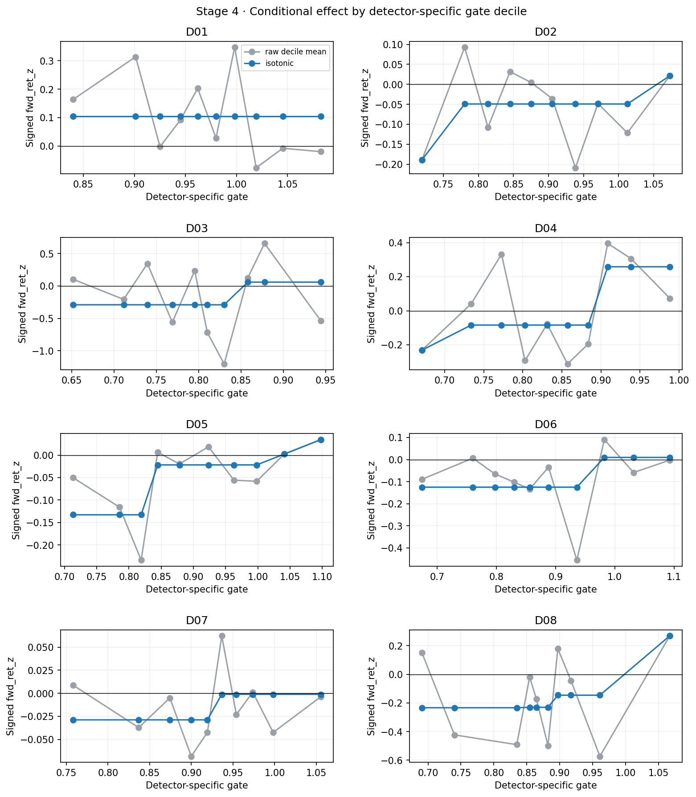
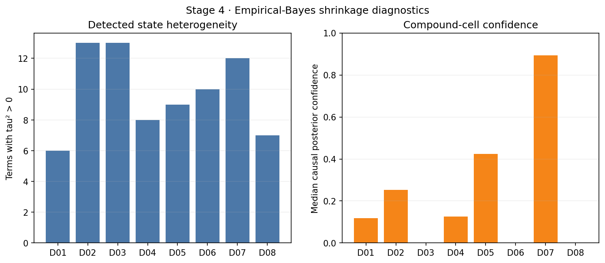

# Stage 4 · 状态条件化与分层收缩

生成时间：2026-09-05T02:24:29.852737+00:00

## 结论

按用户明确要求，D01–D08 全部进入 Stage 4，以验证完整框架；这不改写 Stage 3 只有 D01 通过的事实。二阶截断的经验贝叶斯分层、强收缩的跨品种层次、逐时点因果后验置信度、检测器专属 gate 与失败后无条件回退均已跑通。

正式 G3 候选 D01 的原始 gate G4 结论为 **FAIL**。八检测器实验性并行结果见下表；未通过单调/平滑门槛者已按文档自动退回 `gate_score=1.0`，没有把锯齿状态曲线带入 Stage 5。框架安全性检查为 **PASS**。

## 汇总

| detector_id | triggers | unconditional_mean | sigma2 | positive_tau_terms | median_trigger_confidence | mean_trigger_confidence | isotonic_r2 | adjacent_jump_ratio | raw_gate_pass | applied_mode | prefix_pass |
|---|---|---|---|---|---|---|---|---|---|---|---|
| D01 | 1227 | 0.10429 | 2.41948 | 6 | 0.11883 | 0.19944 | 0.0 | inf | False | unconditional | True |
| D02 | 2403 | -0.05619 | 2.81508 | 13 | 0.25229 | 0.28403 | 0.27394 | 0.6645 | False | unconditional | True |
| D03 | 87 | -0.18468 | 1.85742 | 13 | 0.0 | 0.08128 | 0.09168 | 1.0 | False | unconditional | True |
| D04 | 1039 | 0.00367 | 4.26512 | 8 | 0.12506 | 0.22012 | 0.45707 | 0.69954 | False | unconditional | True |
| D05 | 788 | -0.04697 | 1.61564 | 9 | 0.42443 | 0.38787 | 0.60852 | 0.66349 | False | unconditional | True |
| D06 | 1954 | -0.08434 | 6.23861 | 10 | 0.0 | 0.08381 | 0.20125 | 1.0 | False | unconditional | True |
| D07 | 10467 | -0.01492 | 3.03517 | 12 | 0.89263 | 0.70695 | 0.16044 | 1.0 | False | unconditional | True |
| D08 | 61 | -0.15741 | 1.1932 | 7 | 0.0 | 0.16205 | 0.2389 | 0.82566 | False | unconditional | True |

## 分层结构

- 复合 cell 固定为 `(structure, efficiency, volatility, vol_direction, liquidity, phase)`。
- 连续 context 用事前固定阈值离散为 2–3 档，不使用全样本分位拟合桶边界。
- 模型仅包含六组主效应与 15 组二阶交互，三阶及以上强制为零。
- 每个效应的 `tau²=max(Var(group mean)-E[sigma²/n],0)`；`tau²=0` 时该项完全收缩至零。
- root 偏离的 prior variance 额外上限为 `sigma²/100`，执行文档要求的强跨品种收缩。
- 完整效应表：`reports/tables/04_hierarchical_effects.parquet`；root 层次：`reports/tables/04_root_shrinkage.csv`。

## 因果置信度

每个触发的 cell posterior 只纳入在该时刻已经走完默认 horizon 的历史触发结果；不是简单使用 `timestamp < t`，而是显式使用 outcome availability timestamp。真实数据 60% 前缀复算结果：

| detector_id | rows | posterior_max_diff | confidence_max_diff | passed |
|---|---|---|---|---|
| D01 | 736 | 0.0 | 0.0 | True |
| D02 | 1442 | 0.0 | 0.0 | True |
| D03 | 52 | 0.0 | 0.0 | True |
| D04 | 623 | 0.0 | 0.0 | True |
| D05 | 473 | 0.0 | 0.0 | True |
| D06 | 1172 | 0.0 | 0.0 | True |
| D07 | 6280 | 0.0 | 0.0 | True |
| D08 | 37 | 0.0 | 0.0 | True |

所有检测器前缀逐点相同：**True**。Stage 4 输出中的 `confidence`、`posterior_mean` 与 `prior_cell_n` 可直接供 Stage 5 融合；非触发 bar 的 confidence 为零。

## Gate 设计

各 gate 的方向在查看条件收益前由 HYPOTHESES 固定：反转型偏低 ER/波动收缩/正常流动性，趋势型偏高 ER/波动扩张/高流动性；D07 按回归/延续分支分别映射；D08 只以月末/季末和正常流动性软调制。全部等权并映射至 `[0.2,1.5]`。

验收使用 10 分位 raw curve、递增 isotonic 拟合、`R²≥0.6` 且最大相邻拟合跳变/总幅度 `<0.4`。未通过即应用无条件版本，不二次改符号或重新分箱。

## 门禁解释

- 原始 G4 是对通过 G3 的候选执行；因此正式门禁取 D01 的 raw gate 结果。
- 用户要求其余七个阴性检测器也进入本阶段，它们用于管线压力测试，不因 Stage 4 的任何结果升级为有效 alpha。
- `framework_safe=True` 仅表示因果性、边界、回退和产物契约正确，不等价于经济门禁通过。
- 本阶段固定评估 8 个预注册 gate 与 8 个分层收缩规格，`ΔK=16`；不搜索 gate 权重或重新分箱，累计 `K=168`。

综合：**G4 FAIL**。本阶段在报告边界停止。
