# Stage 5 · 双正式组合、显式回测与效果诊断

生成时间：2026-09-17  
解释器：`D:\Total_Tools\miniforge3\python.exe`  
全局试验计数：**K=214**  
留出查看：**2/3；不运行第三组**

## 结论先行

Stage 5 的融合、仓位、成本、执行、归因、敏感性、随机对照和因果审计均已完整跑通。按用户要求，`D01` 与 `D01–D08` 都作为正式资格组合验收；但“完成正式流程”不等于“获得可交易策略”。两个组合的原始 G5 均失败。

| 正式组合 | 净 Sharpe（95% CI） | 年化收益 | 年化波动 | 最大回撤 | 成本/毛收益 | shuffle 分位 | DSR | 留出 Sharpe |
|---|---:|---:|---:|---:|---:|---:|---:|---:|
| D01 | -0.945 [-3.659, 1.769] | -3.08% | 3.31% | -2.56% | 1.982 | 97.8% | 0.00026 | -1.798 |
| D01–D08 | -5.175 [-8.223, -2.127] | -31.74% | 7.38% | -18.82% | 毛收益为负 | 86.6% | 4.82e-10 | -9.275 |

最优单检测器是 D08，Sharpe=1.087，但它只有 61 次 Stage 3 触发、方向标准化均值为 -0.157σ、matched-null 分位仅 16.8%，所以不能把这次组合回测中的正值解释为稳健 alpha。D01 与全量组合均未超过 `1.15 × 1.087 = 1.250`。

关键判断：当前主要问题不是仓位太小，而是**毛信号弱或为负，且成本吞噬全部优势**。D01 毛累计对数收益为 +1.68%，总成本为 3.33%；全量组合毛累计对数收益已经为 -0.17%，再叠加 19.99% 成本。提高杠杆不能修复负期望。

## 1. 正式实现口径

- 可交易 root：ES、NQ、RTY、HSI；HTI 按 Charter Tier C 保持 context-only。
- 信号生命周期：触发后只向未来按固定 horizon 线性衰减，不向历史回填。
- 融合：`sum(p × direction × magnitude × gate) / (sum(p) + 0.5)`；高相关 detector 先簇内平均、再簇间等权。
- 冗余簇按前一 UTC 日及更早共同触发因果更新；全样本相关矩阵只作报告诊断。
- 仓位：`vol_ratio × tanh(mu / 0.25)`，单品种绝对值不超过 2；组合协方差只用前一日及更早样本，20-session 半衰期并做 Ledoit–Wolf 收缩；只缩仓、不因低预测风险加杠杆。
- 成本：逐 bar 因果 spread + 双边滑点 + 双边佣金，再统一乘 1.5；没有重复乘倍数。
- 执行：bar t 收盘决策，下一有效 bar 以 WAP 成交；旧仓获得成交前收益，新仓只获得成交后收益。会话首尾、roll 邻域与 HK_LATE 禁止新增风险，但允许减仓和平仓。
- 到期退出：无交易带可以平滑 active signal，但不得阻止全部 vote 到期后的归零退出。
- roll：持仓平移收取完整一次往返成本。

首次冻结运行暴露出“无交易带阻止到期退出”，使 D01 平均持仓约 75.6 小时。该客观错误在第二次查看前预登记并修复；最终 D01 中位持仓 24 bar、平均约 2.84 小时，全量组合平均约 3.66 小时。旧语义下的 shuffle 文件已标记 superseded，最终只引用 `*_exitfix.csv`。

## 2. 融合冗余

全量诊断的有效检测器数 `J_eff=3.859`。聚类为：

- 簇 1：D01、D07；
- 簇 2：D02、D04、D06；
- 簇 3：D03；
- 簇 4：D05；
- 簇 5：D08。

需要谨慎：这些高相关关系只发生在非常少的共同触发上，相关 detector 的 Jaccard 共同触发率大多仅 1%–3.5%。因此 `J_eff>3` 只能说明线性方向矩阵不是完全同维，不能证明机制已经充分多样。

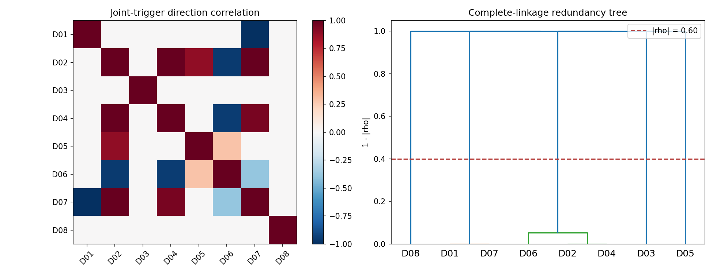

图中相关结构支持簇内去重，但稀疏共同触发使树结构本身仍有较大抽样误差。

## 3. 组合绩效

### D01 正式组合

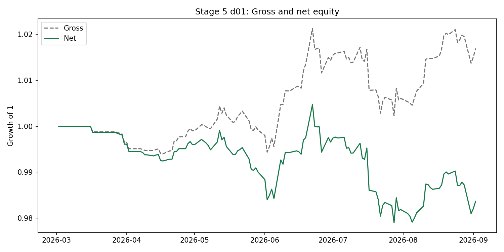

毛收益略为正，但 1.5× 成本使净值转负；这不是风险缩放可以解决的问题。

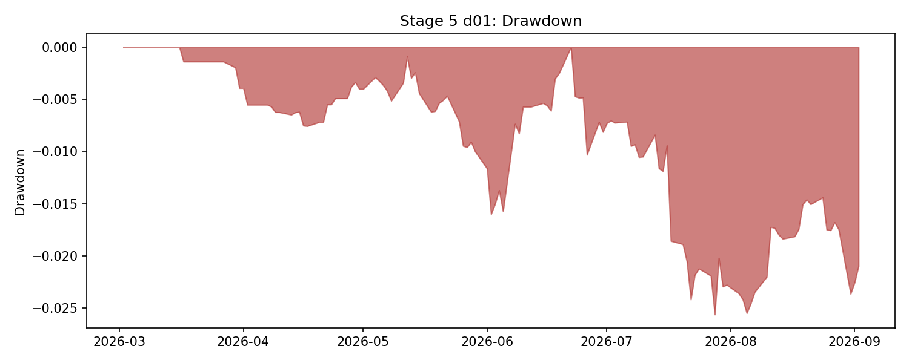

最大回撤 -2.56%，最长水下 69 个 session，样本结束前未恢复。

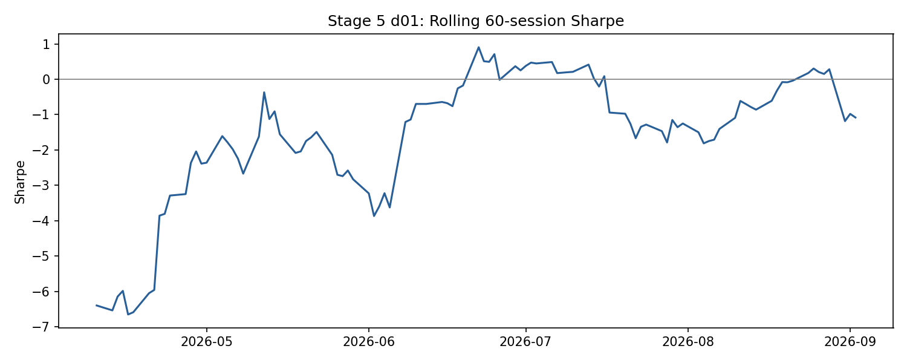

滚动结果随短样本大幅变化，没有稳定的正收益平台。

### D01–D08 正式组合

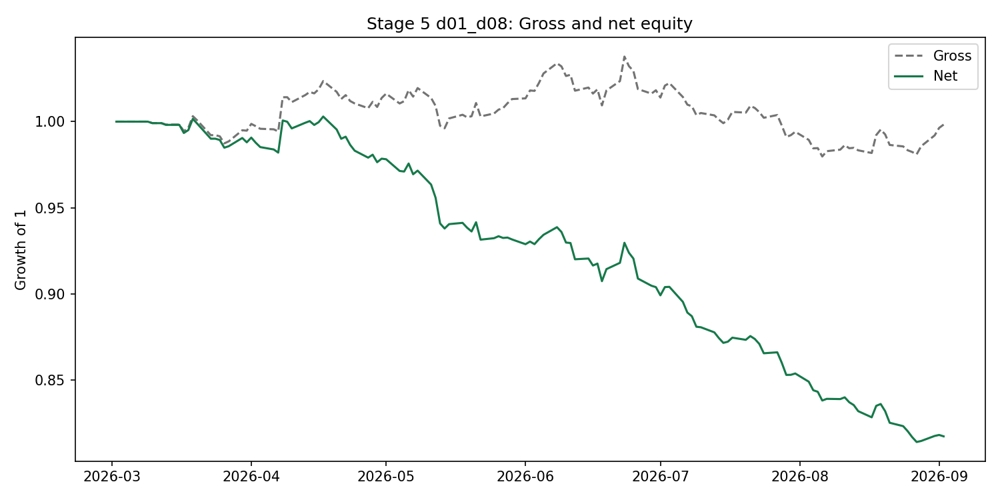

全量组合在成本前已经略为负，成本后累计收益 -18.25%；七个 Stage 3 阴性 detector 的正式纳入验证了管线，但没有形成分散化收益。

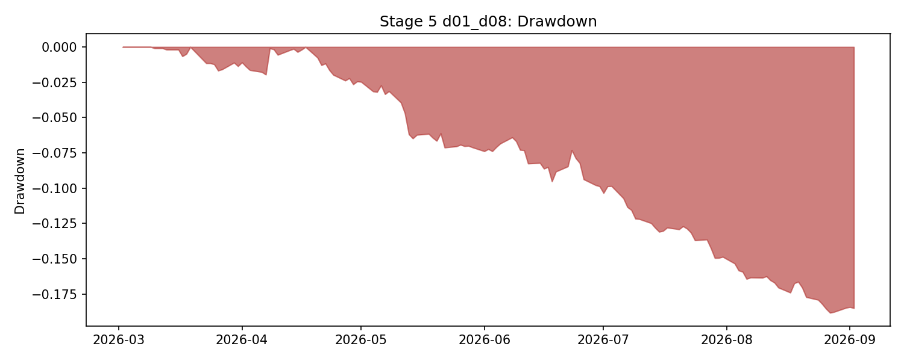

最大回撤 -18.82%，最长水下 98 个 session，表现不是少数极端日造成的单点异常。

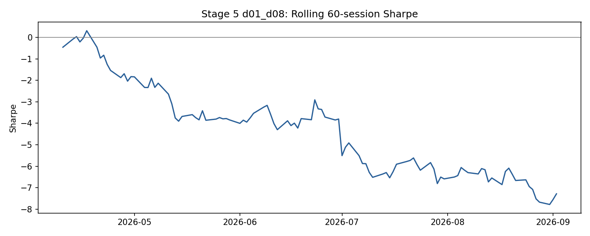

滚动 Sharpe 持续偏负，不能用单个月份或单个执行基准解释。

## 4. 七项归因

完整表位于 `reports/tables/05_{portfolio}_attribution_*.csv`。

### 4.1 品种

- D01：NQ 净贡献 +0.38%，ES/RTY 分别 -1.23%/-0.78%；负收益中 ES 占 74.7%，超过 60% 集中提示。
- 全量：HSI 净贡献 -10.88%，占总净损失 54.0%；ES/RTY 各约 -5.0%，NQ +0.88%。仅 ES/NQ/RTY 的 Sharpe=-2.866，优于全部 root 的 -5.175，说明 HSI 成本与错误 detector 的交互是重要拖累，但不是唯一原因。

### 4.2 检测器留一

- 去掉 D06：全量 Sharpe 从 -5.175 改善到 -4.217；去掉 D05/D02 分别改善到 -4.639/-4.678。
- 去掉 D07：Sharpe 恶化到 -6.185，说明 detector 边际贡献不是其单独 Sharpe 的简单排序。
- 没有任何单一剔除把组合变为正值；因此问题不是一个“坏因子污染”，而是多数输入缺乏正毛优势。

### 4.3 时段

- D01 的 EU_OPEN 为主要正贡献（+1.22%），ASIA 为主要负贡献（-2.23%）。
- 全量组合的 HK_EU 为最大损失时段（-8.14%），但损失也分散于 EU_OPEN、GLOBEX_OPEN、HK_NIGHT_OPEN 等时段。
- 不能把当前全量策略重新定性为一个单独时段效应；更像是多个低质量触发叠加成本。

### 4.4 raw gate 分位

D01 高分位部分较好，但 1–10 分位并不单调；全量组合高分位亏损较小，但仍非稳定单调。Stage 4 的 G4 回退正确：现在若直接挑高分位，只是在同一样本上二次挖掘状态。

### 4.5 月份

- D01 的 7 月净损失 -1.49%，约等于总净损失的 90%，短样本月份集中度很高。
- 全量组合 5–8 月连续亏损，7 月最差 -5.70%；不是单月偶然可以完全解释。

### 4.6 多空

- D01：多头 Sharpe=0.214，空头 Sharpe=-1.803；空头是主要弱点。
- 全量：多头/空头 Sharpe=-2.454/-3.931，双边都失败。

### 4.7 持仓期

- D01 的 ES/NQ/RTY 中位均约 24 bar（2 小时）；HSI 中位 24 bar、日历时间 2.58 小时，并未比 ES 长 5–8 倍。
- 全量 HSI 中位仅 13 bar，反而短于 Tier A。成本感知带宽未自动形成文档预期的 HSI 长周期分化。
- 后续不能只靠统一 zeta；HSI 应有事前成本可行性门槛、root-specific 最短 horizon 或直接不交易。

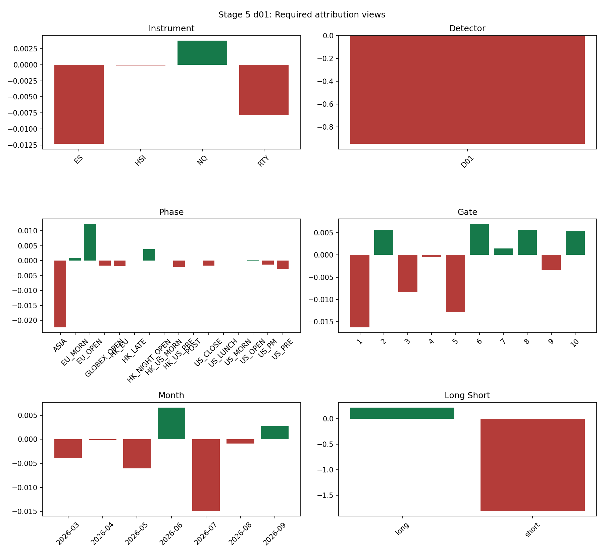

D01 的正贡献集中在 NQ、EU_OPEN 和多头侧，负贡献集中在 ES/RTY、ASIA 与空头侧。

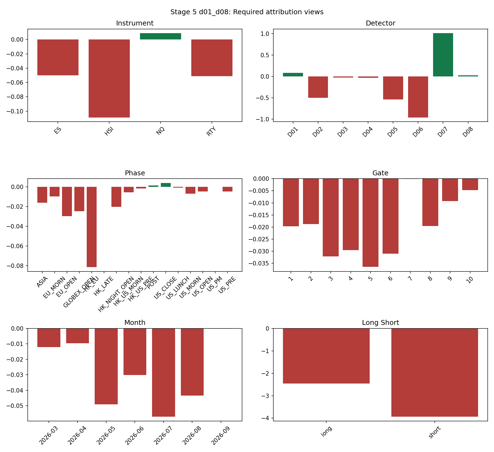

全量组合的损失在 detector、root 与月份上均较广，不支持通过删除一个分支完成修复。

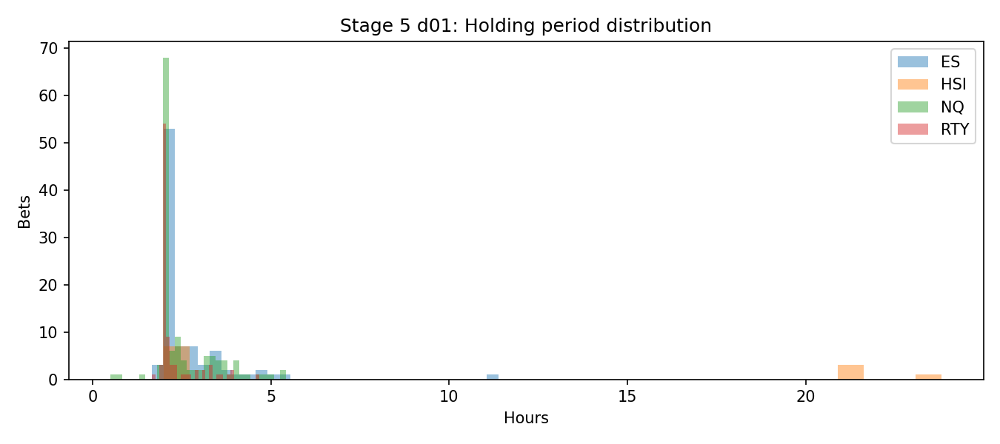

D01 修复后主要持仓落在既定 horizon 周围，长尾来自会话/周末间隔和重叠触发。

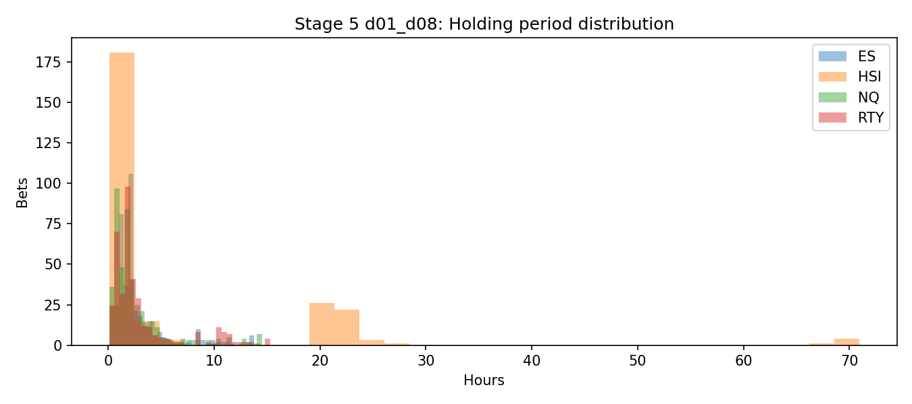

全量组合的短 horizon detector 增加了短持仓和交易次数，放大成本侵蚀。

## 5. 七项敏感性

完整表位于 `reports/tables/05_d01_sensitivity.csv` 与 `05_d01_d08_sensitivity.csv`。

| 维度 | D01 结果 | D01–D08 结果 | 判断 |
|---|---|---|---|
| 成本 1/1.5/2/3× | SR -0.31/-0.94/-1.58/-2.83 | -3.50/-5.17/-6.78/-9.72 | 1× 已为负，不能归因于保守成本倍数 |
| open/wap/mid | -1.22/-0.94/-1.13 | -5.07/-5.17/-5.05 | 全量对成交基准稳健地差；D01 有约 20%+ 差异，执行仍重要 |
| zeta 0.025/0.05/0.075 | -2.18/-0.94/-0.25 | -7.13/-5.17/-4.49 | 更宽带降低成本，但扫描内仍为负；不能把边界最优当正式参数 |
| vol target 5/10/15% | -0.19/-0.94/-1.29 | -2.31/-5.17/-5.97 | Sharpe 未保持不变，说明成本、仓位上限与 breaker 产生明显非线性 |
| detector 留一 | 现金基准 | 最好仍仅 -4.22 | 没有单一 detector 修复组合 |
| 额外延迟 0/1/2/3 bar | -0.94/-0.68/-0.49/+0.31 | -5.17/-4.73/-5.18/-3.57 | D01 可能是较慢效应或偶然延迟峰；未经独立样本不得选 3 bar |
| ES / Tier A / 全部 | -1.72/-0.94/-0.94 | -3.57/-2.87/-5.17 | 全量组合的 HSI 明显拖累；D01 的 HSI 影响很小 |

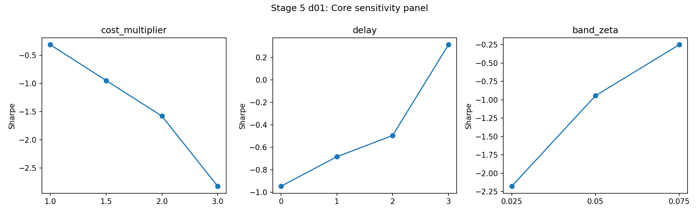

D01 对 zeta、vol target 和延迟均不平坦；这给出研究方向，但不构成可直接采用的最优点。

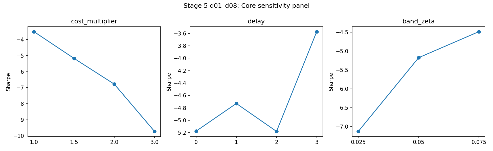

全量组合在所有扫描中均为负，说明融合输入质量比局部执行参数更关键。

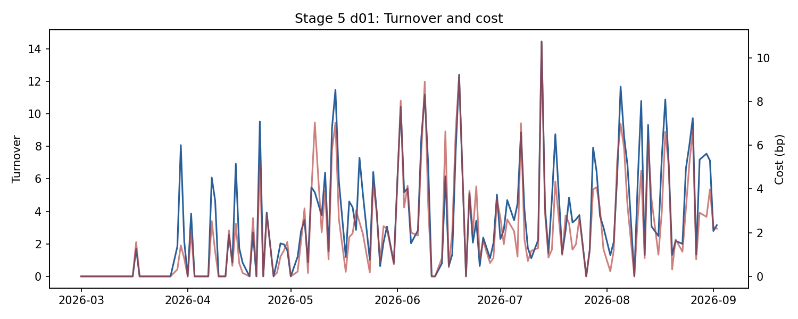

D01 有 1,711 次执行，对应 1,227 次原始触发；触发生命周期和调仓产生的额外换手足以吞噬微弱毛收益。

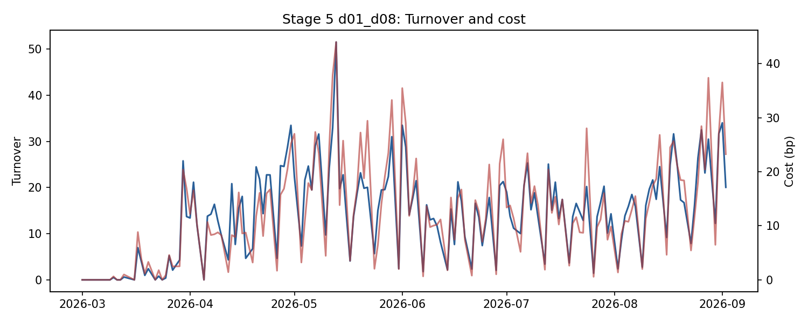

全量组合 6,046 次执行，年化换手约 4,393，成本成为主导项。

## 6. 审计

| 检查 | 结果 | 判定 |
|---|---:|---|
| 5% 真未来收益注入 | 净 Sharpe=25.000，毛 Sharpe=33.014 | 通过；信号能传导到 PnL |
| 信号前移一期 | 净 Sharpe -5.175 → -2.680 | 方向性通过；有明显数值改善，但不声称统计显著 |
| 纯随机信号 | 毛 Sharpe=-1.528，净 Sharpe=-35.060，成本=3.154 | 成本纯损失成立；单次 `|gross SR|<0.5` 失败，不挑种子重跑 |
| fusion 60% 前缀 | 最大绝对差 0 | 通过 |
| sizing 60% 前缀 | 最大绝对差 0 | 通过 |
| `net=gross-cost` | 最大误差 0 | 通过 |
| 单品种仓位上限 | 最大 2.0 | 通过 |
| 同向总暴露 | 最大 3.42，限制 5.0 | 通过 |
| 基准成交延迟 | 所有成交均为 1 bar | 通过 |
| HTI 不交易 | 无 HTI 行 | 通过 |
| 禁止模式 grep | 无 feature `shift(-k)`、`center=True`、`bfill()` | 通过 |
| 自动化测试 | 41/41 | 通过 |

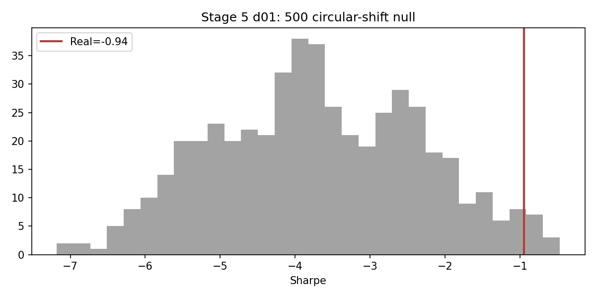

D01 位于 97.8% 分位，但真实 Sharpe 仍为负；它只表明原始对齐优于更差的随机错位，不代表经济可交易。

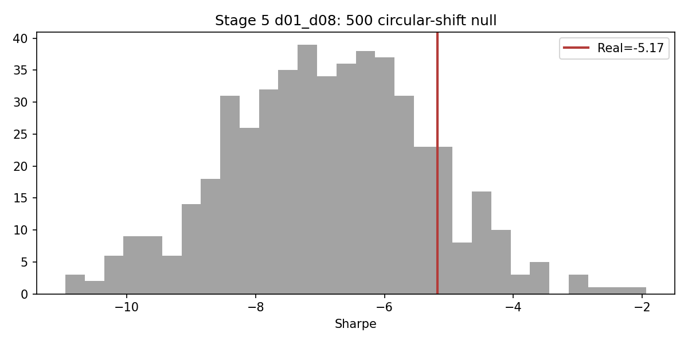

全量组合仅处于 86.6% 分位，未达到 95%。权威数据为 `05_*_shuffle_500_exitfix.csv`。

## 7. 为什么效果不行

### 7.1 多数 detector 的方向质量本身为负

Stage 3 已经给出先验警告：除 D01 外，D02/D03/D05/D06/D07/D08 的方向标准化均值为负，D04 近零；七个 detector 的稳定性、零分布或成本门槛失败。把它们“正式跑完”不会让其自动变成正 alpha。

### 7.2 `confidence` 混淆了可靠度与经济质量

当前 Stage 4 `confidence` 是分层后验的收缩权重，回答“这个 cell 均值估计有多可靠”，不回答“该 detector 的预注册方向净优势为正的概率”。例如 D07 的 median confidence=0.893，但 Stage 3 mean z=-0.0149、成本后均值=-0.000226。样本多、估计稳定的负效应因此可能获得高融合权重。这是下一轮应优先修复的概念接口。

正确拆分应为：

1. `reliability`：由有效历史样本量、后验方差决定；
2. `economic_quality`：由只使用已成熟历史 outcome 的 `P(signed edge > cost)` 或保守下置信界决定；
3. `fusion_weight = prior_qualification × reliability × economic_quality`。

若后验净优势为负，只允许收缩到零；不得在同一样本上翻转方向。

### 7.3 D01 毛优势小于交易摩擦

D01 不是完全没有形态信息：Stage 3 matched-null 分位 98.75%，Stage 5 shuffle 分位 97.8%，毛收益也略正。但每次优势太小，1,711 次执行的总成本约为毛收益两倍。真正需要的是提高“每次有效触发的净信息量”，不是提高目标波动。

### 7.4 触发频率两极化

- D07 触发 10,467 次，接近宽泛状态标签，导致高换手和低单位信息量；
- D03/D08 仅 87/61 次，任何正 Sharpe 都有极高抽样误差；
- D01 的 1,227 次触发较合理，但生命周期产生 1,711 次执行，仍需要更明确的 entry/hold/exit/cooldown 状态机。

### 7.5 状态 gate 没有可复现排序能力

八个 raw gate 均未同时通过单调与平滑门槛，最终正确回退为 1.0。当前没有证据表明择时 gate 能稳定提高准确率；直接挑 raw gate 高分位会构成同样本二次选择。

### 7.6 数据长度与独立性不足

样本仅半年，五个 root 的有效维度约 1.5；HSI/HTI 又只有夜盘，多个 session 规则性截断。参数面中出现局部高点是必然的，但独立下注数和跨 root 一致性不足以区分真实机制与偶然峰值。

## 8. 调参、择时和触发逻辑能否提高效果

答案是：**可以改善研究质量和成本效率，但现有证据不支持仅靠常规调参把当前组合升级为可交易策略。**

### 可以立即推进、但必须 walk-forward 的方向

1. **资格感知融合**：保留所有 detector 的正式输出，但生产权重加入 causal economic-quality；未证明正净优势者权重归零，而不是用高 reliability 放大负效应。
2. **D01 触发精化**：围绕已经预注册的 lookback/alpha 邻域做 purge walk-forward，不选单点峰值；目标是提高每次触发毛收益/成本比，而不是最大化样本内 Sharpe。
3. **显式信号状态机**：entry 后固定最短持有、同方向触发合并、反方向触发净额化、退出 cooldown；减少一个原始事件产生多次小调仓。
4. **root-specific 成本可行性**：候选事件在触发时若保守预测 edge 不超过 1.5×往返成本则不交易；HSI 使用更长最短 horizon，HTI 继续 context-only。
5. **空头单独建模**：D01 空头明显弱于多头。允许多空使用不同阈值，但必须作为两个新假设分别计 K、分别做 matched null，不能在现结果上直接删除空头并宣告成功。
6. **事件时间校准**：D01 额外延迟 3 bar 的局部改善提示当前确认时间可能早于效应兑现；应比较“确认事件 + 固定等待”与“更严格确认条件”，并要求相邻延迟形成平台，而非选择单个 +3 峰值。
7. **软概率触发替代硬阈值**：把距阈值的连续距离、形态完成度、成交量确认度作为特征，用 expanding calibration 输出概率；避免参数略变就使触发集合断裂。

### 不建议的做法

- 直接采用本样本最优 lookback、zeta、延迟或 gate 分位；
- 把负效应 detector 方向翻转后重新报告，而不注册新假设；
- 用 holdout 第三次查看挑参数；
- 因 D08 本次单独 Sharpe=1.087 就忽略其 61 次触发与 Stage 3 阴性证据；
- 调高波动目标或放宽仓位上限来掩盖成本/毛收益不足。

### 下一轮的严格接受标准

在不使用剩余 holdout 查看额度的前提下，建议只用 pre-holdout 做 anchored walk-forward：

- 每个参数方案必须在多个相邻点形成平台，而不是孤立峰值；
- Tier A 三个 root 至少两个同号，且最差 root 不显著为负；
- 每 fold 成本后 expectancy 为正，aggregate cost/gross <35%；
- 触发数满足 detector 原门槛，同时前 10 session 集中度受控；
- 延迟 0–3 bar 曲线平滑，不能只在某一个延迟点为正；
- 新方案计入 K，并重新执行 matched null、500 次 circular shift 与因果前缀；
- 只有冻结后才允许使用最后 1/3 次 holdout 查看。

上述规则已实现为 `src/selection.py`：`purged_anchored_splits` 负责带 embargo 的扩展窗口，`economic_quality_weight` 明确拆分 reliability 与成本后正优势概率，`summarize_walk_forward` 检查 fold/root 一致性，`add_plateau_diagnostics` 拒绝孤立参数峰值。当前 44/44 自动化测试通过；该模块尚未选择或宣告任何新正式参数，因此 `K` 与 holdout 查看次数均不增加。

## 9. G5 最终判定

| 子门禁 | D01 | D01–D08 |
|---|---|---|
| 组合 Sharpe > 最优单 detector ×1.15 | FAIL | FAIL |
| 成本/毛收益 <35% | FAIL | FAIL |
| 注入测试全部通过 | FAIL（随机毛 SR 阈值） | FAIL（随机毛 SR 阈值） |
| circular shift ≥95% | PASS | FAIL |
| 工程与因果契约 | PASS | PASS |

综合：**G5 FAIL；Stage 5 框架交付 PASS。** 当前结果应定性为“完整可复用基础设施 + 阴性经济结果 + 明确的下一轮改造假设”，不得描述为可部署策略。
