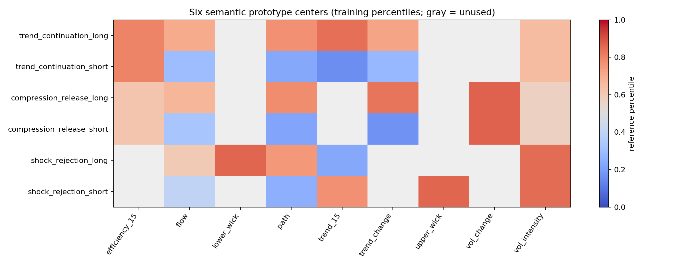
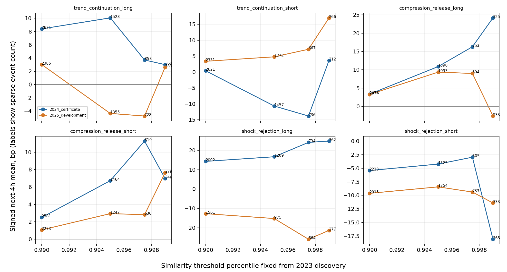

# 有限多维原型库 v0：第一轮相似度与结果分离研究

日期：2026-09-28。设计解释见 `docs/对改进提示词2的回应与原型研究设计.md`。本报告是**候选发现记录**，不构成已认证策略或可交易收益声明。

## 问题和事前结构

直接用少量字段作 Ridge 收益回归，并不能回答“当前状态为何触发多空”。本轮把 2023 年数据仅用于各坐标的历史分位映射与相似度阈值校准；由经济机制先写六个有限、离散、带方向的候选：趋势延续多/空、压缩释放多/空、冲击回收多/空。每个原型只启用相关坐标，设中心、可接受半宽和非负权重。当前权重是**机制固定权重**，尚不是用户期待的滚动动态权重。

研究单位为合约在已完成 15m bar 的状态。双频基础字段来自 `src/crypto/features.py`，相似度所用的局部坐标包括 15m 趋势/效率、5m 收盘位置、15m 波动短长比与主动流、最近 4h 趋势/波动变化、5m 上下影。相似度由历史分位空间中的加权距离生成：中心附近保留宽阔低损失区，区外加大惩罚；固定 2023 年分布的 99%、99.5%、99.75%、99.9% 四档阈值。每合约同一原型触发后至少相隔 4h；收益从下一可用 5m 开盘计至 4h 后的开盘，方向符号按原型多/空计算。2026 年价格和收益均未进入本轮读取。

2024 年为历史证据区，2025 年是此前实验已经看过的开发检查区。所谓 `certificate_period` 只是脚本里的历史区名称，**没有完成正式认证**。这些手工机制是在本项目已有 2023–25 研究反馈后提出；虽然本脚本没有用未来收益拟合中心或阈值，它们也不等于真正预注册假设。相似度平坦区在初轮输出后因大量并列分数被修正，相关结果全部重跑并留在研究日志，进一步削弱把 2024 当独立验证的理由。结果不以 2025 反向挑选阈值或调整原型。数据来源按用户说明为币安；具体合约规格仍未从文件独立证明。

## 实测结果

下表是固定 2023 年 99.5% 阈值、每合约 4h 稀疏事件的有方向 4h 平均毛收益。括号是按 UTC 日期、7 天循环块重抽样得到的 95% 区间，单位 bp；跨币同期相关由同一日期块一起抽样。结果只回答条件分布，不是连续仓位回测。

| 原型 | 2024 事件数；均值 [区间] | 2025 事件数；均值 [区间] | 2024 / 2025 匹配随机超额 |
|---|---:|---:|---:|
| 趋势延续多 | 1528；10.07 [−3.36, 23.12] | 1355；−4.36 [−18.30, 8.29] | +6.53 / −4.19 |
| 趋势延续空 | 1457；−10.67 [−28.55, 6.57] | 1272；+4.80 [−8.61, 19.13] | −9.38 / +2.46 |
| 压缩释放多 | 1390；+10.88 [+0.58, 21.91] | 1093；+9.36 [−4.43, 23.69] | +7.79 / +7.90 |
| 压缩释放空 | 1464；+6.73 [−14.41, 31.79] | 1247；+2.94 [−11.70, 16.07] | +4.90 / +4.58 |
| 冲击回收多 | 1209；+16.70 [−2.77, 34.39] | 975；−15.24 [−36.94, 5.25] | +10.74 / −9.74 |
| 冲击回收空 | 1325；−4.24 [−15.74, 8.19] | 1254；−8.43 [−22.31, 6.25] | −0.52 / −8.78 |

“匹配随机超额”是同币种、月份、UTC 小时、粗波动分层中逐事件抽取 500 组时点后的实际均值减随机均值。它保留若干条件背景，但**没有保留跨币事件簇、行情连续性及选原型的多重搜索**，不能把 500 次抽样分位当成认证 p 值。压缩释放多的随机超额在两年分别约 +7.8/+7.9bp，处于随机均值分布的 95.4%/92.8% 分位；仅是进一步研究的线索。趋势多、冲击回收多跨年符号翻转；不能因历史 2024 一年较好而认证。

## 高原与可视化

压缩释放多在 2023 年固定阈值 99% / 99.5% / 99.75% / 99.9% 下：

| 年份 | 事件数 | 有方向 4h 均值 bp |
|---|---|---|
| 2024 | 2478 / 1390 / 753 / 325 | +3.35 / +10.88 / +16.28 / +24.18 |
| 2025 | 2074 / 1093 / 594 / 233 | +3.27 / +9.36 / +9.00 / −2.63 |

2024 看起来随相似度提升而增强；2025 最严格档**转负**，故“高原”只在中间邻域初步可见，不能说整个高相似区稳定。更严格阈值的有效事件也快速减少。其他五个原型的完整曲线见图和 CSV。

原型坐标图的灰色表示该原型不启用该维度，并非缺失数据；图中分位数是训练参考空间，不是直接的原始波动或收益单位。阈值图标注的是稀疏事件数，不是独立的交易次数。

## 当前结论与下一轮改造

1. 有限原型、相似度匹配、事件触发这条因果链已经能实际运行；旧 Ridge 仍只是技术对照。六个候选**没有任何一个完成认证**。压缩释放多值得作为优先候选进一步检查，不能据此发布多头策略。
2. 此版只用一组手工机制中心，可能遗漏有效形态；其上下影特征为 5m 聚合，尚不足以证明“单次冲击后回收”的完整路径。需要对候选事件画真实时间轴，并加入 1h/多快照年龄与进入顺序，防止静态坐标冒充轨迹。
3. 下一轮在 2023–25 开发段内做训练前向的原型中心/宽度/组权重小幅扰动，先比较固定、可靠度收缩的动态权重，再引入历史轨迹 medoid 或判别片段发现。权重必须由过去时期估计，在下一折冻结。逐事件随机对照应升级为保留日/周和跨币同步结构的匹配块对照，并处理六原型 × 四阈值的选择偏差。
4. 研究 4h/12h/24h 条件收益、上下侧风险、相似度进入/退出与相反原型冲突，再形成基础信号生命周期和买入持有对比。未来最终信号可能进一步组合低频化，费用此阶段只作为次要情景；价格可用时间、收益标签边界仍需严格保持。
5. 2026 终段继续冻结；只有原型定义、阈值、冲突规则和后续仓位映射在开发段完成冻结后才评估。当前**没有实盘执行指令**。

可重跑：`python scripts/crypto_prototype_research.py`。机器可读结果：`reports/crypto/prototype_library_v0.json`、`prototype_similarity_cards.csv`、`prototype_research_events.parquet`。
