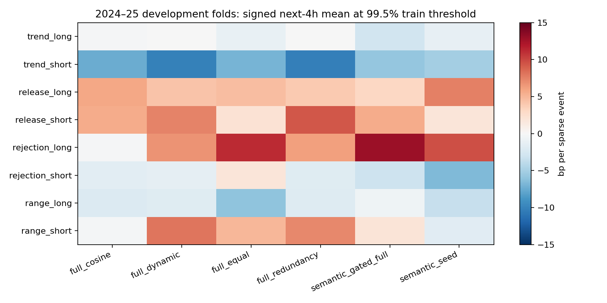
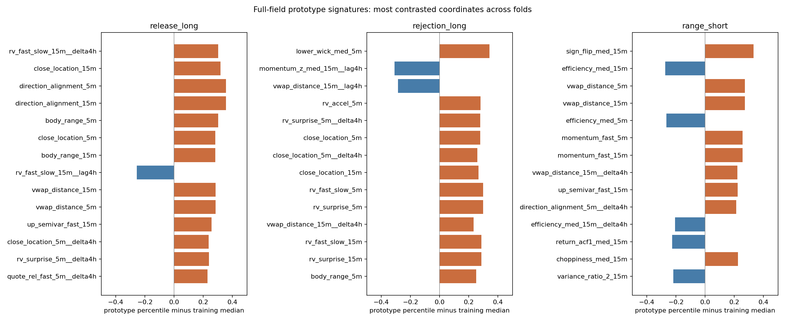
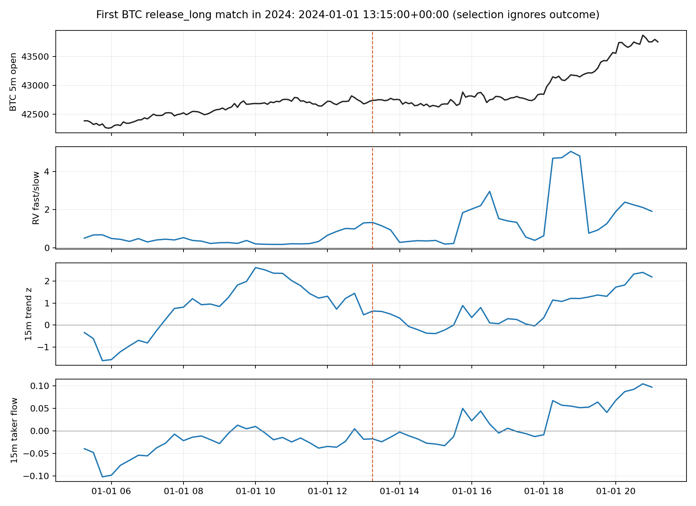
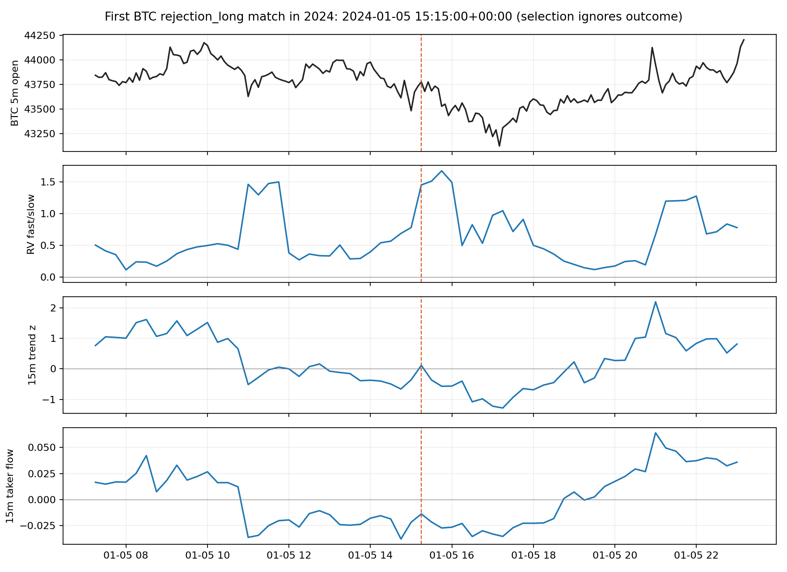

# 中期大阶段报告：136 维原型、方法对照与基础多空策略

日期：2026-09-28。对应[中期任务书](../../docs/MIDTERM_PATTERN_STAGE.md)。本轮完成一个可重跑的研究大阶段；**2023–25 全部属于开发研究，2026 未读取，尚无认证的可执行优势**。

本报告侧重结果；特征、原型发现、相似度与策略映射的公式和代码对应，见[研究设计与数理实现讲解](../../docs/04_full_pattern_研究设计与数理实现讲解.md)。

## 1. 本轮实际完成什么

原先 112 个 5m/15m 字段全部进入形态表示，不再只从七组中挑几个代表做收益回归。另取六个非时间组各两个有经济语义的代表，加入 4h 前值及当前相对 4h 前的变化，共 **136 个坐标**。时间组仍纳入当前 5m/15m 状态，但低权重，不把市场时段强行当成主信号。8 个有限候选为趋势延续、**确有过去低波动的压缩释放**、冲击回收、低效率区间回归的多/空两侧。

在每个测试折之前：从过去 365 天约 52,000 个随机快照拟合经验分位参考；由少数核心语义条件发现训练期候选事件，再从这些事件学习**全部 136 维的稳健中心及半宽**。每个维度的相似损失有宽容核心和越界惩罚；维度对背景的对比度提高其权重，组内高相关字段被下调，组间保留机制先验。动态版本只以训练期前后两段都出现的条件收益分离作有限权重调整，不用测试收益选中心。样本按固定随机种子抽取，覆盖各 15m 时点，避免隔 8 行取样只落在固定小时。

实际运行了六种内部方法消融：

| 方法 | 作用 | 本轮认知 |
|---|---|---|
| `semantic_seed` | 少量必要语义条件，不用全维中心 | 有些机制很有效，不能让高维平均淹没 |
| `full_equal` | 136 维中心，组间等权，组内仍按对比度 | 有些候选受益，非普遍改善 |
| `full_redundancy` | 全维、机制组权、组内冗余校正 | 减少重复投票，仍可能吸收噪声 |
| `full_dynamic` | 上版加训练期可靠度收缩组权 | 策略毛收益高于固定版，前向增量并不稳定 |
| `semantic_gated_full` | 核心语义约束与全维动态距离同时满足 | 改善部分冲击回收候选；并非所有家族受益 |
| `full_cosine` | 同样字段的普通向量余弦 | 多数机制的“数值近”未变为结果分离 |

这是**表示和距离的内部对照**；旧 Ridge 的 31 折结果仍保留在第二轮报告，但折划分与模型任务不同，不把两份累计收益直接作严格同协议排名。真正的外部投资 benchmark 仍只有初始等额、不再平衡的 12 币买入持有。

## 2. 时序、事件和统计检查

全 12 币按同一 UTC 边界运行 **9 个前向折**：2024-01-01 起每约 90 天冻结测试，末折至 2025-12-31；每折参考窗口回看 365 天，并要求训练标签在折开始前可得。所有当前字段用已完成 5m/15m bar，4h 路径只用同合约过去数据。信号在 15m bar 完成后观察；未来收益从下一个可用 5m 开盘开始。事件按合约和原型至少隔 4h，训练期阈值固定在相似度 99%、99.5%、99.75% 三档，未用测试收益逐档择优。

不确定性按 UTC 日期 7 天共同块重抽样，避免把同时发生的 12 币事件看成 12 份独立证据。另把一个折的整个跨币事件时钟共同循环移位整天，保持相同小时及同步事件簇，作为 200 次粗随机对照。它比逐事件独立抽样更贴近共同冲击，但循环边界和季度制度变化仍可能影响零分布；表中的移位分位**不是多重检验修正后的 p 值**。本轮比较 8 原型 × 6 方法 × 3 阈值，且 `semantic_gated_full` 在开发反馈后加入，任何单项漂亮结果都须再经新时间终段检验。[市场择时规则的数据窥探研究](https://academic.oup.com/jfec/article-abstract/9/3/550/841819)也提示，孤立规则显著不等于整个搜索家族稳健。

## 3. 形态结果：哪些信息有用

下表为固定训练期 99.5% 阈值、稀疏事件的后续 4h **有方向毛收益**，单位 bp。括号为 7 天日期块区间；“移位超额”是实际均值减共同时间移位均值。仅列对设计判断影响最大的候选，全部 48 个方法×原型结果见 `full_pattern_method_summary.csv`。

| 原型与方法 | 事件 | 4h 毛均值 [块区间] | 移位超额 | 判断 |
|---|---:|---:|---:|---|
| 压缩释放多，少量语义 | 2826 | +7.53 [−0.54, 16.02] | +7.19 | 核心顺序有信息，全维融合未稳定改善 |
| 压缩释放多，全维动态 | 2511 | +4.23 [−4.53, 13.18] | +5.43 | 高维平均稀释了部分必要语义 |
| 冲击回收多，语义约束全维 | 2123 | +12.85 [+0.89, 25.80] | +14.69 | 优先研究；**尚未认证** |
| 区间回归空，全维动态 | 2919 | +8.04 [−0.41, 16.86] | +7.24 | 两年均正，4h 不确定性仍跨零 |
| 趋势延续空，全维动态 | 1996 | −10.19 [见 CSV] | −10.98 | 与预设方向明显相反，暂停该机制 |

冲击回收多的语义约束全维版本，在 99% / 99.5% / 99.75% 阈值依次约 **+8.25 / +12.85 / +13.96bp**，不是孤立的单档峰值；2024／2025 分别 +12.58／+13.18bp，12 币中 11 币均值非负。但 2024 年末至 2025 年初的一个前向折为负，且该表示是观察开发结果后加入；未经家族选择偏差校正及未触碰终段，不可宣称已认证。第一张实际事件路径图还显示：单次“回收多”触发后价格可能继续下跌，原型只描述条件分布，不是确定性图案。

区间回归空在动态全维下 2024／2025 的 4h 有方向均值为 +12.25／+3.06bp；同一事件的 24h 均值约 +31.08／+30.95bp。**24h 是看过多个持仓期后发现的线索**，不能作为事前指定的 24h 策略绩效。跨币差异大，BTC、ADA、LTC 的 4h 均值为负；需要研究该形态究竟捕捉了条件下跌，还是特定币种与市场阶段的暴露。

字段签名支持机制语义：压缩释放多的高对比坐标包括 4h 前较低的波动短长比、当前波动抬升、方向一致和收盘位置；冲击回收多含过去偏弱趋势、长下影、高波动和收盘收回；区间回归空含低效率、高翻转率及高于局部 VWAP 的价格。全部 136 维在距离里保留正权重，签名图只展示最有辨识度的坐标。训练期中心和字段权重逐折留在 `full_pattern_feature_signatures.csv`，不以 14 个显示字段冒充完整表示。并列值分位映射最初错误地把常见零放在极端分位；已改为**中位秩**并全部重跑，避免二值时间/突破字段虚假主导距离。

这些实例按时间选**首个**符合条件的 BTC 事件，没有按事后收益挑图。图里信号右边的价格仅供检查后续演化，不参与信号生成。

## 4. 策略层：原型价值没有自动成为投资优势

策略在下一可用 5m 开盘设置目标仓位：只有训练期条件收益为正的原型得到软可靠度；多空相反证据接近时保持空仓；每个标的独立持有，固定版本最多 4h，另有退出滞回、99.75% 稀疏阈值、训练窗选择前 1／前 2 原型和只降杠杆的波动缩放消融。仓位不由测试期收益决定。以下是 2024–25 同期 **12 币等额策略日均对数收益 bp**；4bp／边只是未核实的费用压力情景，非币安实测费用。

| 版本 | 0bp／边 | 4bp／边 | 日均换手绝对值 | 解释 |
|---|---:|---:|---:|---|
| 少量语义，固定 4h | +1.72 | −6.55 | 2.07 | 只靠核心语义不足以组合全部家族 |
| 全维固定去冗余，固定 4h | +3.91 | −3.51 | 1.86 | 有毛改善，换手仍重 |
| 全维动态，固定 4h | +5.41 | −1.81 | 1.81 | 动态权重有开发段增量，未过费用情景 |
| 语义约束全维，固定 4h | +6.34 | −0.91 | 1.81 | 毛收益接近买入持有，4bp 后转负 |
| 全维动态，99.75% 稀疏 | +3.11 | −0.92 | 1.01 | 换手下降，毛收益也下降 |
| 全维动态，滞回退出 | +1.77 | −8.07 | 2.46 | 退出过快造成反复再入，明显失败 |
| 语义约束全维，**训练期前 1 原型** | +2.36 | **+0.17** | 0.55 | 4bp 情景仅接近零；2025 为负 |
| 全维动态，波动缩放 | +3.91 | −2.34 | 1.56 | 降暴露并未带来正净优势 |
| 初始等额买入持有 | **+6.48** | — | 初始建仓后不再平衡 | 唯一外部 benchmark |

买入持有 2024／2025 分别约 +18.67／−5.73bp／日；语义约束全维固定 4h 的 0bp 情景分别 +7.30／+5.37bp／日，但 4bp 情景分别 +1.35／−3.18bp／日，两个年度的 7 天块区间都跨零。训练期前 1 原型的 4bp 情景为 2024 +0.94、2025 −0.59bp／日，同样不能认证。其训练期入选原型每折变化，说明库内可靠度没有收敛为某个稳定赢家。全库和前 1 策略对买入持有的完整差值区间见 `full_pattern_year_block.csv`；不能只看策略自身正负。全部策略的日度轨迹、费用与仓位见 `full_pattern_daily.csv`、`full_pattern_positions.parquet`。

几乎没有“多空原型同时强触发”的冲突，原因是高阈值下事件稀疏；这不等于现实中没有方向矛盾。当前固定 4h 生命周期和滞回层虽已执行，但还缺真实订单簿、资金费率、持仓量以及更长 12/24h 的**持仓策略**测试；4/12/24h 表只是同一触发后的条件收益观察。

## 5. 阶段结论与下一轮重点

1. **全字段有价值，但必须约束语义。** 112+24 个坐标可以形成稳定可解释的原型签名；不同机制对高维信息的反应不同。冲击回收多受益于语义条件与全维几何，压缩释放多的纯语义版本仍较强；余弦相似度不能替代经济距离。动态组权重的全库毛收益高于固定版，但不能据此判定它有稳定净增量。
2. **有限库需要筛选而非全库开仓。** 趋势空方向错误、部分区间与冲击候选跨币差异明显；训练期前 1 原型减少换手，却没有跨年可靠净优势。下一轮应在候选层研究分层收缩、同机制多原型合并／拆分、每币适用范围及更长的状态年龄，不再扩充大量未经验证原型。
3. **当前最值得继续的两条线索**是冲击回收多的语义约束全维 4h 分离，以及区间回归空的长于 4h 的条件下跌。它们都是开发发现，须先做跨币组成、时间块匹配、多重搜索控制和不同市场背景归因。2026 年仍不打开，以免拿终段做下一轮原型选择。
4. **信号研究和策略落地的结论分开。** 已完成有限原型发现、全维相似触发、基础多空仓位与真实买入持有比较；尚未发现稳定的费用情景下投资优势。后续可用更低频的组合与其他策略融合，但该期望不能倒推为本轮基础信号已可交易。

## 6. 复现、产物和自查

顺序运行 `python scripts/crypto_full_pattern_stage.py`、`python scripts/crypto_full_pattern_diagnostics.py`、`python scripts/summarize_crypto_full_stage.py`。源 parquet 只读。核心实现见 `src/crypto/full_patterns.py`，模型记录在 `full_pattern_manifest.json`；折卡、原型证据、字段签名、事件、不同持仓期、标的卡、策略日度与仓位表均在同目录。所有事件 4h 标签再次从原始 5m 开盘价独立重算并逐笔核对；2026 时间戳在事件和输出检查中被排除。完整测试集 **57 项通过**，包括跨币路径不串线、训练分位冻结、并列值中位秩、原型冲突与持仓时序。

本报告为**一个完整中期研究大阶段的完成记录**，不是策略发布门槛。其阴性和分歧结果将直接决定下一轮实验，不通过提高模型容量或回看终段把失败叙述成成功。
