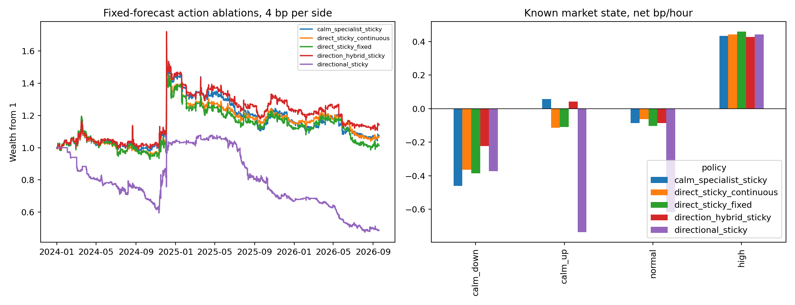
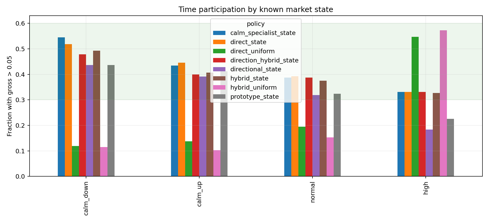
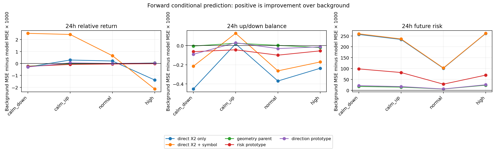
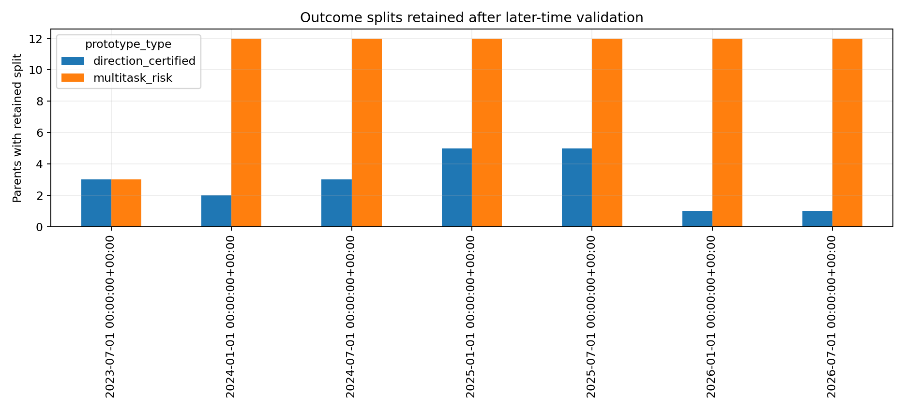
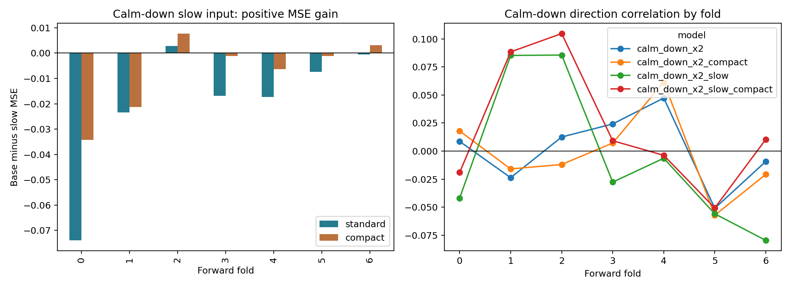

# 完整 X2、状态触发与条件预测原型：多轮实施研究报告

日期：2026-09-30。研究状态：**开发前向与已复用历史的探索复核；没有新的未触碰测试段**。本文是对[研究诊断](../../docs/RESEARCH_REVIEW_2026_09_30.md)和[优化指南](../../docs/NEXT_RESEARCH_OPTIMIZATION_GUIDE.md)的实际执行记录。原始币安 parquet 只读，旧信号链模型和报告未覆盖。结果不是实时交易建议。

## 结论先行

完整本币 X2 的 80/40 后验候选仍是必须保留的历史强基线：2025H2／已复用 2026 在 4bp/边情景分别为 **+11.60%／+12.09%**。同一入场日改用过去动量选币分别为 **−7.38%／−27.51%**，说明其选币不能简单归因于过去动量。然而两个时期分别去掉收益最好的五天后，累计对数收益都转负。高收益可能来自稀少局部尾部；不能从这两段推论一般时间都有优势。

本轮按已完成小时信息重拟合完整 X2 直接预测、低波动专用预测，以及两种分开的条件原型，进行 2023H2–2026Q3 预测开发前向／复用探索；仓位账本从 2024H1 开始。**仅降低低波动触发阈值增加了覆盖，但没有改善净收益。** 多目标原型主要预测未来波动强度，未增加方向和上下行半方差方向的稳定预测力。将拆分目标限制为方向后，稳定前向方向增益仍未形成。低波动上涨状态的专用模型有弱相关线索；低波动下跌状态单独训练、增加六个 7/30 日慢尺度变量及缩小容量，前向方向误差仍恶化。

策略侧的明确进展是降低无效换仓：复核改为每 4 小时、切换所需预测优势提高到 16bp、10% gross 以内的调仓忽略。相同固定预测下，4bp/边整体探索区的连续直接策略从 **−44.92%** 到 **+6.35%**，方向混合候选为 **+14.10%**；但是二者在 2025H2–2026Q3 合并仍分别为 **−12.61%／−12.89%**，10bp/边整体结果分别为 **−45.19%／−41.37%**。更严重的是，仅剔除 2024-12-03 一个最佳日，全期结果即变成 **−31.80%／−26.83%**。因此目前真正改进的是**成本和仓位映射**，尚未解决广泛、稳健的条件 alpha。

## 1. 研究对象、时间合同及可复现产物

旧基线固定为 `pair_full_x2_own_sparse_posthoc`：100 个本币 X2 路径坐标加 12 币种指示，24h beta 残差头，每日 00:00 UTC 已完成快照，00:05 下一根 5m 开盘执行，训练内预测分位 80/40 作为阈值。市场增强版是另一策略，不混称强基线。旧实现仍保留在 `signal_chain_v1`；其完整身份映射见 [baseline_identity.csv](baseline_mechanism_audit/baseline_identity.csv)。

新实验使用 12 币、2023-02 起的完整小时历史，已完成 15m 特征在 HH:00 可知，下一根 5m 开盘 HH:05 执行。逐币分位映射只用 **2023-07 前**数据一次拟合并冻结，对后续折只 transform；每折用已到期历史重新拟合标签尺度、波动状态界线、直接模型和原型，月份门槛只用此前已发出的预测分数。最长 120h 标签在训练边界前 purge。2023H2 参与前向预测评分和分数校准，**不进入策略账本**；策略从 2024H1 起，折为半年度，末折至 2026-09-19。2026 曾被 v1/v2 和本轮多次读取，全部标为复用探索。4bp/边仅是费用情景，不含实际资金费率、点差、冲击和容量。

新标签为 4h/24h beta 残差除已知过去风险、未来上/下半方差平衡、未来与已知波动之比，以及 24h 最大顺行／逆行路径；72h/120h 用于成熟时间合同与未来扩展。标签只在训练或评价读取，不进入当时特征。结果保存在 [regime_prototypes_v1](regime_prototypes_v1/) 和 [regime_policy_iteration](regime_policy_iteration/)；配置、预测行、阈值历史、逐小时账本与 0/4/10bp 情景齐全。

## 2. 对强基线的机制审计：有局部选币信息，但持仓后程和尾部集中是硬问题

| 已存原始策略，4bp/边 | 2025H2 | 已复用 2026 |
|---|---:|---:|
| 本币 X2 80/40 | +11.60% | +12.09% |
| 同一入场日，过去动量选币 | −7.38% | −27.51% |
| 同一入场日，反向本币 X2 | −15.74% | −16.70% |

上述对照共用入场时点，支持“局部币种选择不等于简单动量”的探索性解释；它不证明预测优势可重复。最佳 5 日的净收益之和分别为 1541bp、1447bp；剔除这 5 日后，两期累计对数收益分别为 **−0.0419、−0.0281**。[逐日集中度](baseline_mechanism_audit/baseline_attribution.csv)和[同日选币对照](baseline_mechanism_audit/selection_timing_ablation.csv)可复核。

原策略按未加权 top-bottom 差值触发，实际持有的是 beta 加权配对；前向候选分数通常约为原差值的一半。2026 低风险下降状态中，前向分数 80 分位约 0.00324，训练内入场阈值 0.00348，超过原门槛的日子仅 **11.4%**；下降／上涨低风险状态实际持仓约 **22.7%／27.7%**，滞回解释了“低于新入场门槛仍持仓”。这是标尺漂移和持仓状态的共同结果，不能仅靠整体放宽阈值解释。[状态分数审计](baseline_mechanism_audit/score_scale_audit.csv)仍缺训练内逐日分数原始序列，故尚不能把训练过拟合与机会密度变化定量分开。

新开仓日的实际配对毛收益均值约为 **+37.8／+45.3bp**，续持日为 **+7.2／−6.0bp**；续持日自身预测配对优势仅 **3.2／1.7bp**，远低于新候选优势。这揭示旧 `pair_weights` 在全截面 gap 落在灰区时无条件持有旧 pair 的问题。它支持检验旧仓自身优势和剩余可预测收益，但不证明立刻强制退出更好；退出仍受成本和短期波动影响。[旧仓续持审计](baseline_mechanism_audit/holding_survival_audit.csv)、[逐日事件卡](baseline_mechanism_audit/episode_cards.parquet)和[分位对齐](baseline_mechanism_audit/pair_score_alignment.csv)保留正反样本。

## 3. 状态触发：放宽低波条件解决覆盖，不自动创造收益

状态只用当时可知的过去 30 日共同市场波动和趋势：`calm_down`、`calm_up`、`normal`、`high`。波动高低界线在每训练折估计。入场分数是**最终 beta 加权配对**的预测收益，进入阈值按最近 90 日**已经发出的前向预测**逐月校准：低波下降／上涨用 52／58 分位，常态 70、高波 80；退出门槛更低。固定对照统一 80/40。直接预测器输入与标签相同；动态门槛不是把真实未来收益塞回校准。

在**同一直接预测、同一连续规模及每小时复核规则**下，统一 80/40 与状态门槛的匹配对照如下；仅改变阈值校准所用的状态分位。另存的状态门槛＋固定规模对照用于隔离规模影响。

| 状态，4bp/边 | 统一门槛参与 | 状态门槛参与 | 统一门槛净 bp/h | 状态门槛净 bp/h |
|---|---:|---:|---:|---:|
| 低波下降 | 11.8% | 51.8% | −0.243 | −0.847 |
| 低波上涨 | 13.8% | 44.6% | −0.073 | −0.310 |
| 常态 | 19.5% | 39.2% | +0.071 | −0.090 |
| 高波 | 54.7% | 33.1% | −0.210 | −0.090 |

用户指出的触发稀疏性在数量上确实得到缓解，质量问题却暴露得更清楚。低波状态降低阈值造成的净恶化在相同规模规则下仍存在；状态门槛固定规模的低波下降/上涨也分别为 **−0.762/−0.170bp/h**，所以不能只归罪于连续规模。因此不能以 30%–60% 覆盖率倒推阈值；需要状态内预期净优势和低换手持有逻辑同时成立。[同口径小时消融](regime_policy_iteration/state_outcomes.csv)保留三个原节奏对照。

慢复核后，低波下降的直接头毛收益仍为 **−0.136bp/小时**，扣 4bp/边后为 **−0.365bp/小时**；方向混合低波下降毛收益仅 **+0.009bp/小时**，净 **−0.224bp/小时**。这一状态缺的首先是可支付成本的正毛优势，不只是触发阈值。逐折看，同一方向混合规则的低波下降净收益在 2024H1–2025H1 为正，2025H2–2026Q3 三折连续为负；静态“低波下降”标签内部也发生了条件关系漂移。[逐折状态毛净表](regime_policy_iteration/state_fold_outcomes.csv)保存这种失败区域。

## 4. 条件预测原型：把风险地图和方向原型分开命名

12 个历史几何父区来自 18 维方向中性路径摘要。第一种多任务子区依据八个未来路径目标的训练内后段改善才保留；第二种方向子区让 24h 残差及 24h 上下半方差方向主导拆分，并要求两项的后段联合误差改善。两者都输出同一八维未来条件均值，与几何父区、全局背景、**完全同 100 维 X2 输入的直接模型**及 X2 加币种标识的原强直接模型比较。训练时间分开和每叶至少 20 个独立日，避免当前行的结果参与当前归属。

多任务子区在 2024 年后几乎每折保留 12/12 个拆分，但跨状态的 **24h 方向残差和半方差平衡误差均比父区更差**；改善主要在未来波动强度。方向子区通过的父区数从 2025H2 的 5/12 降为 2026H1、2026Q3 的 **1/12**。它在 `calm_up` 的 24h 方向误差对父区有极小改善（MSE 差约 **+0.000074**），但分折符号反复，`calm_down` 为 **−0.000068**。

同输入对照明确了“原型输给谁”：`calm_down` 的 24h 标准化方向 MSE 为背景 **0.603833**、方向原型 **0.604128**、仅 X2 直接头 **0.604131**，三者几乎不可分且均不优于背景；加入币种标识的直接头降至 **0.601309**。`calm_up` 相应为背景 **0.591661**、方向原型 **0.591614**、仅 X2 直接头 **0.591372**、加币种标识 **0.589230**。这提示币种条件异质性可能比粗路径聚类更重要，但币种增益逐折也有反号，尚不能固定为因果解释。在真正区分开的未来风险任务，`calm_down` 24h 波动比 MSE：仅 X2 直接头 **0.390393**、加币种标识 **0.387560**，远优于多任务原型 **0.549093**。原型的风险增量仅相对其几何父区成立，绝不能把它说成强于直接预测。

几何父区在相邻重拟合折的共同历史上 ARI 约 **0.25–0.32**，身份仍不稳。距离或支持数都不能直接当置信度。现阶段多任务子区最多称“随时间更新的粗风险地图”，方向子区是失败与弱线索并存的研究候选，均不能叫已认证 alpha 原型。实际条件均值、真实历史 medoid 与拆分字段见 [原型卡](regime_prototypes_v1/prototype_cards.csv)；局部增量见 [逐任务差值](regime_prototypes_v1/prototype_increment.csv)。

## 5. 低波专用监督头、持仓与成本

低波样本独立训练的 24h 残差头在 `calm_up` 的逐币前向相关由通用直接头 **0.0336** 增至 **0.0712**，但 `calm_down` 从 **0.0123** 变为 **−0.0084**。这不是“低波统一放宽”可解决的同一问题；上涨平缓与下跌弱势应有不同条件机制。更高相关也未转化为稳健的净收益：单独替换低波头后，4bp/边整体探索收益 **+7.32%**，与固定预测直接头 **+6.35%** 的配对 14 日块每日差区间为 **[−2.34,+2.26]bp**。

固定预测下的三项仓位修改是每 4h 复核、换配对预测优势至少比当前 pair 高 16bp、规模变化小于 gross 0.10 不调；旧初版允许每小时重选且约 4bp 的切换优势。直接连续策略每半年平均换手从约 400–550 降为 **184**；平均持仓 episode 约 **14.4h**，最大 **72h**，时间参与率 **37%**，符合 3h–5 天和 30%–60% 的软目标。固定满仓规模对照在相同时点和 pair 上为 **+1.21%**，连续规模 **+6.35%**，但差异还未通过独立测试。

| 固定预测后的探索策略 | 0bp/边 | 4bp/边 | 10bp/边 | 2025H2–2026Q3，4bp/边 |
|---|---:|---:|---:|---:|
| 直接 X2、慢复核、连续规模 | +65.42% | +6.35% | −45.19% | −12.61% |
| 低波专用头、慢复核 | +70.42% | +7.32% | −46.38% | −14.15% |
| 方向原型与专用头低波混合、慢复核 | +77.83% | +14.10% | −41.37% | −12.89% |
| 仅方向原型、慢复核 | +13.92% | −51.21% | −86.33% | −52.69% |

以上累计值跨 2024H1–2026Q3 多折串联，主要由 2024H2 较强表现支撑，不能称独立验证或优选收益。极端日期敏感性甚至更强：原始 5m 开盘数据在 2024-12-03 22:05 至 23:05 的 TRXUSDT 涨幅约 **20.3%**，该小时策略净收益约 **13.0%**；方向混合候选仅剔除 2024-12-03 一日由 +14.10% 变为 −26.83%，直接候选由 +6.35% 变为 −31.80%。剔除 12 月 2–4 日三天则分别为 **−19.29%／−24.77%**。这不是证明数据错误，而是证明收益集中度过高；[逐策略最佳日与事件窗敏感性](regime_policy_iteration/policy_shock_sensitivity.csv)保留完整日期。

方向混合相对直接头的配对 14 日块每日增益 **+0.71bp**，区间 **[−1.45,+3.05]bp**，跨零。10bp 场景都亏，真实成本又未核实；因此这一版不能声称可交易。策略与原型的评价分开：仓位收益没有反向“认证”原型。详细账本见 [策略消融表](regime_policy_iteration/policy_scores.csv)、[状态归因](regime_policy_iteration/state_outcomes.csv)及[块区间](regime_policy_iteration/policy_uncertainty.csv)。

## 6. 低波下跌的有限慢尺度实验：增容并未补出方向信息

为直接检验“平缓、偏弱市场应使用不同条件信息”，又单独运行了[低波下跌慢尺度对照](calm_down_slow_stage/fold_scores.csv)。只在每折历史的 `calm_down` 时钟训练两个相同预算的 LightGBM：基线为 X2 100 坐标＋币种标识，候选仅加六个当时可知的慢变量，即 7/30 日 beta 相对收益、7 日有符号趋势效率、7/30 日共同市场趋势和 7/30 日已实现风险比。所有慢变量以已完成小时收盘和风险计算，最长 720h 热身，详细公式、单位、重复可能和缺失行为在[特征登记](calm_down_slow_stage/feature_registry.csv)。再以同样输入对比 110 树/10 叶和 50 树/5 叶两种容量，避免把过拟合解释成单一模型选择。

在 2023H2–2026Q3 七个前向折中，常规容量加入慢变量的 24h 标准化残差 MSE 由 **0.610398 恶化到 0.631728**，仅 1/7 折改善；紧凑容量由 **0.604799 恶化到 0.612587**，仅 2/7 折改善。297 个活跃日的 14 日共同块抽样下，按“基线误差减慢变量误差”定义的日均增量区间分别是 **[−0.03284,−0.01061]** 和 **[−0.01527,−0.00110]**，均为负。此前训练于所有市场状态的直接头在同一低波下跌样本为 **0.601309**，仍优于这两个专门模型。减小容量确实缓解了慢变量造成的过拟合，却没有反转其增量符号；这正是“稍微有监督或增加慢变量自然会变好”的可证伪反例。它只否定本组六个粗摘要和两个容量，**没有否定其他低波路径/流动性细分信息**。完整逐币预测留在[前向行](calm_down_slow_stage/forward_predictions.parquet)，正反折与不确定性在[逐折表](calm_down_slow_stage/fold_scores.csv)及[日期块区间](calm_down_slow_stage/slow_increment_uncertainty.csv)。

## 7. 自查、失败边界与下一轮有针对性的工作

本轮反复自查了 00:00 已完成慢 bar／00:05 执行、跨币共同 UTC 时钟、最长标签成熟时间、冻结的早期映射和各折历史内模型拟合、真实 5m 开盘价、beta 加权目标与仓位一致、0/4/10bp 成本敏感，以及原始旧基线身份。独立的固定预测动作脚本重放原 `direct_state` 的 6 折 × 3 费率结果，最大累计收益差 **<1e−14**、换手差 **<1.1e−11**；慢尺度特征还通过历史前缀完全一致测试。8 个新模块测试和全项目 **74 项测试通过**。原型拆分不以收益、仓位或换手出生；策略后验比较均标为探索。研究产物保留阴性区域，不删除亏损策略。现有账本把两次决策间的目标权重视为持续再平衡目标，死区可以减少目标变化，但未建模交易所真实逐笔成交及资金费率。

下一轮应沿三条可证伪路径推进，而不是继续无条件增加原型数或降低所有阈值：

1. **低波下跌的专属机制。** 本轮简单 7/30 日趋势、相对强弱和风险比已经失败，下一步先检验真正不同的信息：路径转折/持续的非线性、上/下半方差条件分布、可核实的成交活跃度和跨币相对结构，而非再堆同类价格摘要。按训练折寻找低相关且有经济意义的特征，形成状态内净优势校准后才扩大覆盖。低波上涨专用头已有弱线索，必须分折、分币和日期块复核；低波下跌没有同等证据时允许不交易，不能以参与率硬补。
2. **原型按目标认证。** 先固定几何和邻居支持，分方向／风险／路径转移三种标签报告相对背景与同输入直接头的增量；对跨时身份做真实 medoid 匹配和年份转移矩阵。方向子区至少要求开发前向多个连续折方向改善且半方差方向不退化，再称预测原型。否则只保留描述地图或风险地图。试软归属共享头加局部修正，但与同容量直接模型公平对照。
3. **把基线利润和持仓后程拆开。** 保留原始 X2 80/40 不变作为旧对照，明确比较只改旧仓自身优势退出、只改 beta 加权触发、只改时间门槛及其组合；每项记录新开仓／续持毛净贡献、前 5／10 日剔除、币种和月份集中、4/10bp 敏感及真实可执行成本。固定规则后等待新日期顺序预测；2026-09 以前不能再次称为未触碰终段。

这轮已完成指南 D1、D3、D4、D5 的存档数据审计和 D2 的前向分数侧审计；D2 训练内逐日分数原始序列尚未留存，不能给完整的训练／前向同口径差。六个慢尺度新特征已做一次**阴性**对照；更细的流动性/条件路径、共享局部头、真实合约费率／资金费率／容量以及新日期确认均未完成，仍列为明确的未解工作，而不以报告形式假装完成。
