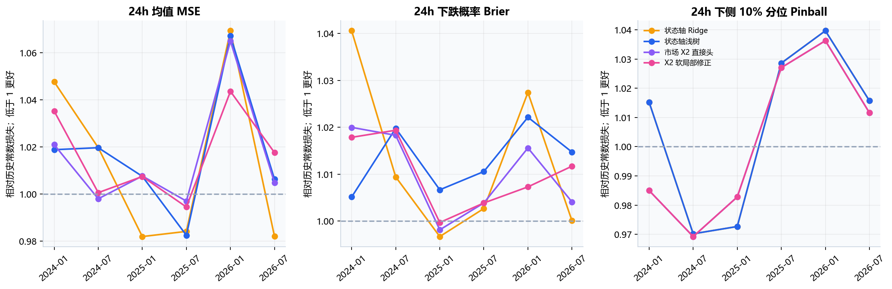
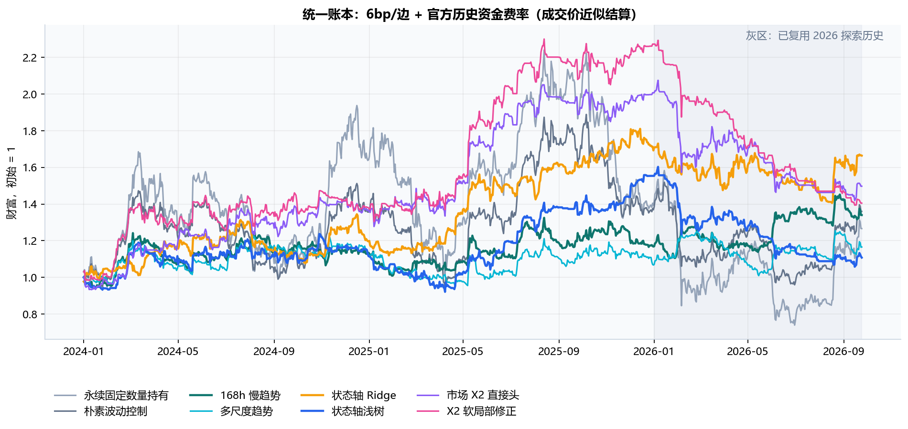
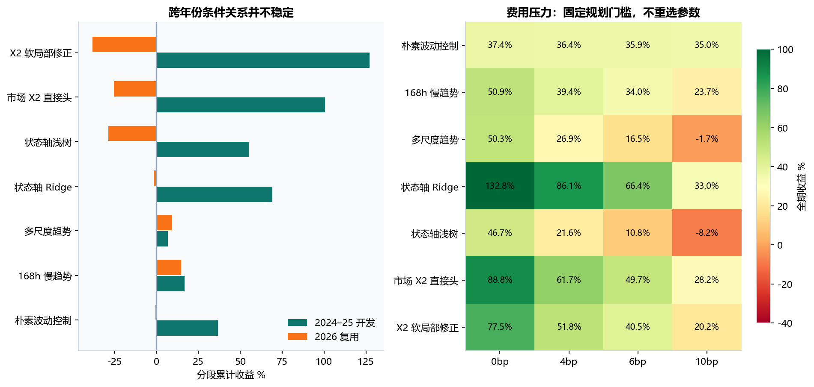
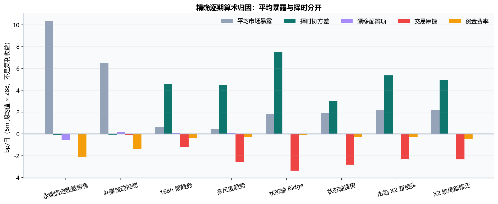
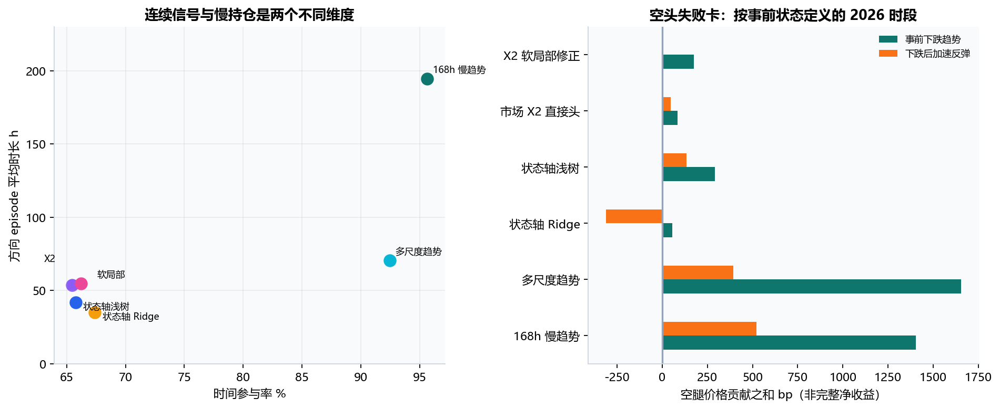
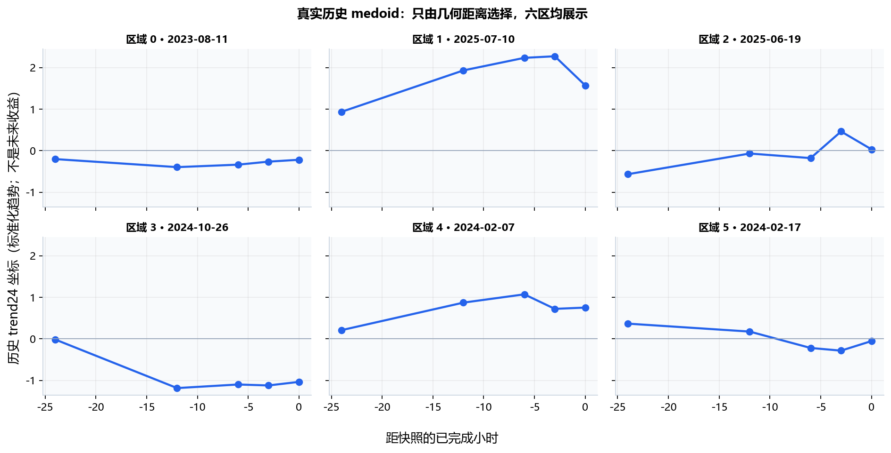

# 方案 A｜可检验的市场 Beta 状态策略

**独立研究分支 · 2026-10-04 · USDT 本位永续 · 中低频多空择时**

> 本轮完成的是可运行、可回放、可核查的研究实现。2024–2025 为开发前向，2026 是已多次复用历史；没有新的独立收益认证。原始行情只读，形态原型其他路线保留。

## 01　研究判断：应该经营趋势机会，而不是把风险分类包装成方向优势

您认可的转型文件抓住了项目真正的错位：过去的强候选用本币 X2 预测 beta 残差，再做估计 Beta 中性的配对；它可以回答相对选币，却主动消去了您希望承担的市场共同方向。本轮将策略单位改成**市场时刻的可执行净 Beta 暴露**。多头、空头与现金均是合法动作，交易对象仍固定为 BTC/ETH，而不是寻找每个状态内最漂亮的一对币。

最有价值的新结论有三点。第一，连续趋势/状态信号与慢调仓可以同时成立；监督状态策略时间参与约 67.4% / 65.8%，方向 episode 平均约 35.1 / 41.7h，已不依赖稀疏的 99% 相似触发。第二，风险与方向仍有明确分工：状态浅树的 24h 均值并未稳定优于历史常数，原型也未稳定战胜同 X2 直接头。第三，**跨年份失效比全期曲线更重要**：状态 Ridge 全期 +66.40%，2026 仅 -1.67%；状态浅树全期 +10.75%，2026 为 -28.71%；简单 168h 趋势同期分别 +33.96% / +14.71%。这些是探索结果，不据此追认任何胜者。

因此，方案 A 的下一步不是继续加大模型，而是保留**简单慢趋势参考 + 小容量方向预测挑战者 + 显式风险和执行层**。状态模型必须证明何时增加或反转 Beta 比简单趋势更值得；只降低回撤不能替代这个命题。

## 02　分支边界与策略产品定义

| 项目 | 本轮明确规格 |
|---|---|
| 代码分支 | `codex/market-beta-a`；独立目录 `market_beta_a_v1` |
| 保留路线 | 原形态原型、旧配对与未来其他原型设计全部保留，不覆盖旧产物 |
| 核心目标 | 获取有方向价值的共同市场 Beta，预测与持仓均可双向 |
| 主代理 | BTCUSDT / ETHUSDT，拟成交目标名义权重 50/50 |
| 风险预算 | 35% 年化目标，目标净多 ≤1、目标净空 ≥−0.75；无无限低波加杠杆 |
| 预测/调仓 | 每小时已完成快照产生连续信号；普通每 4h 复核；每小时风险退出检查 |
| 执行 | `available_at + 5m` 原始开盘价；随后真实 5m 盯市 |
| 持仓 | 无成交时合约数量固定，权重自然漂移；平均方向 episode 与调仓间隔分别统计 |
| 费用 | 0/4/6/10bp 每边统一摩擦情景，6bp 为规划/主展示；不是实际账户费率 |
| 认证状态 | 历史开发与复用探索；不发送真实订单 |

原转型文件 A 偏向多头/现金、B 才研究有限净空。您的本轮要求优先于该历史排序，所以本分支直接给出多头/现金与有限多空两个账本；**双向仍是待证实的动作选择，不能因工具可做空就假定空头有优势**。静态持有、波动控制与趋势对照以相同来源、时钟、资金费率与手续费口径比较。

本文“Beta”首先指相对固定 BTC/ETH 市场代理的名义暴露倍数，不是相对任意外部指数估计出的回归 beta。实际数量漂移改变 BTC/ETH 配置；这些偏离在后文漂移项中独立核算，因此不能把相同平均名义倍数进一步称为相同真实市场回归 beta 或相同风险。

## 03　数据、合约与成本：本轮真正补齐了什么

只读原始源：`D:/Trading/practical_crypto_strategy/data/parquet/{symbol}/{5m,1h}.parquet`。小时 bar 的开盘时间不是特征可用时间；本轮索引统一加 1h。主收益账本从 2024-01-01 00:05 UTC 至 2026-09-24 23:55 UTC。2023 为初始训练和最长 720h 特征热身。

官方 spot 与 USD-M 月度归档分别对照 2023-01、2025-01 的全部 12 币，共 48 次产品/月份核对。USD-M 的 **24/24 个币种月份 OHLC 逐行一致**；spot 不一致。用户亦已确认 USDT 本位永续。这个结果支持当前价格为 USD-M 成交价；它不是整段来源链、历史交易过滤条件或逐笔可成交性的完整认证。归档 ZIP 均通过官方 SHA256 校验。数据格式与校验规则参照 [Binance 官方公共数据仓库](https://github.com/binance/binance-public-data)。

BTC/ETH **90/90 份月度资金费率归档**成功；每币 4,089 个历史事件，从 2023-01-01 到 2026-09-24，按归档记录的结算间隔核查未见缺口。本样本这两个合约均为 8h；程序使用真实事件时间，不把所有合约/时期永久假定为 8h。过去已结算费率另延迟 1h 后才能进入预测输入，未来已实现值仅用于结算。官方解释规定资金费用与持仓名义值、资金费率相关，历史制度亦可能变化，参见 [Binance 资金费率说明](https://www.binance.com/en/support/faq/detail/360033525031)。

交易所 REST `exchangeInfo` 与 `fundingRate` 接口返回 **HTTP 451**。已记录失败，未绕过地域限制；因此精确结算 mark price、当前过滤条件及历史保证金表仍未补齐。资金现金流按结算事件对应的 5m 成交开盘价近似名义值，微秒/毫秒级结算时点按首次随后 5m 网格记录，使用该时点新调仓前的旧数量。账户实际 maker/taker 未提供；官方账户费率接口需要账户权限，本轮不访问账户。[官方市场数据及结算字段](https://developers.binance.com/en/docs/catalog/core-trading-derivatives-trading-usd-s-m-futures/api/rest-api/market-data)，[官方账户费率接口](https://developers.binance.com/en/docs/catalog/core-trading-derivatives-trading-usd-s-m-futures/api/rest-api/account)。

**净收益用语边界**：下文“净”指研究账本扣明确摩擦情景及上述历史费率近似现金流后的收益，不是已证实的真实可执行净利润。点差、冲击、限价成交率、维持保证金与强平尚未建模。EW12 稳健性表只比较价格和费用，不能把未取得 12 币资金费率解释为零成本。

## 04　从经济状态到有序路径：输入不是越多越好

注册 20 个当前状态字段，分别描述方向/持续性、回撤/恢复、风险扩张/下行不对称、内部一致性、成交压力、路径转折、状态年龄及过去可知 carry。每项的公式、窗口、单位、方向假说、重复字段、缺失行为和可用时间在 `feature_registry.csv`。方向预期是机制假说；高波、低波和高成交本身没有预置交易方向。

初始训练史的相关矩阵保存于 `initial_feature_correlation.csv`；24/168/720h 趋势及效率有经济相关，不被当作多份独立证据。市场 X2 为这 20 字段在 **0、3、6、12、24h** 的五个有序快照，共 100 坐标。它与旧“本币 X2 100 维”不是同一表示或任务，不能借旧配对收益替其背书。最长必要历史约 745 个小时快照。

12 币广度/离散度是当前选定面板的开发背景，有成员选择偏差；BTC/ETH 主代理的时间确定不能消除这部分背景偏差。`x2_no_internal` 删除每个快照的广度及离散度，留下 90 坐标，只检验这两个内部状态字段的作用；它**并未删除所有跨币信息**，也未重建当时可交易宇宙。

## 05　预测任务与时间因果：每个状态到底改变了哪种未来

价格标签按固定初始 50/50 数量篮子起算，不在未来路径中免费每小时再平衡：

```text
R_h(t) = Σ_i a_i [P_i(t+5m+h) / P_i(t+5m) − 1],   h ∈ {4,24,72}h
σ_h(t) = 已完成市场小时收益的过去 168h RMS × sqrt(h)
Y_h(t) = R_h(t) / σ_h(t)
long_MAE24 = −min(0, min_5m 未来 24h 篮子累计收益)
short_MAE24 = max(0, max_5m 未来 24h 篮子累计收益)
```

另外预测未来 24h 已实现风险、`P(R24<0)`、`P(R24<−1.5σ24(t))` 与 24h 收益的下侧 10% 条件分位。均值/MAE/RV 用 MSE、两个事件概率用 Brier、下侧分位用 Pinball；分位击穿率另记。二元事件由直接平方损失头估计并裁限到 [0.001,0.999]，不是未经验证的“置信度”。分位头用相同浅树预算的 quantile objective；Ridge 家族仅均值、风险与概率为 Ridge，其分位子任务也使用浅树，所以“Ridge”不是所有九目标都线性的主张。

六个外层折从 2024-01、2024-07、2025-01、2025-07、2026-01、2026-07 开始，扩展训练。训练行必须满足 **`t+5m+72h < fold_start`**；标准化器、裁剪分位、几何与预测头均只用各自合法历史，外层只 transform。0.5%/99.5% 训练分位裁剪只用于稳健拟合连续目标；评分和交易价格保留原始尾部，因此输出是裁剪目标的近似均值，而不是完整真实条件期望。

软局部修正另有内部时间分离：距外层最后成熟训练行前 90 日设校准块，其前训练也 purge 72h5m。几何标准化、中心与内部直接头只在更早部分拟合；最近 90 日的**内部前向残差**估计局部修正。生产直接头最后才在整个外层合法历史重拟合。这个做法减少拟合内残差的乐观，但局部修正与生产模型的标尺仍可能漂移；这是需要评价的结构，不是自动校准证明。

## 06　模型阶梯与实证：允许直接模型击败原型，也允许简单规则击败预测

| 层次 | 实际实现 | 正当职责 |
|---|---|---|
| 常数背景 | 历史均值/风险/概率/分位 | 最廉价的预测反证 |
| 小容量状态 | 20 维标准化 Ridge；浅树 80 棵/7 叶/最少 240 行/λ=20 | 连续状态能否改变方向和风险 |
| 有序市场 X2 | 100 维、相同直接浅树预算 | 只检验路径表示增量 |
| 软局部修正 | 同 X2 全局头 + 6 区强收缩前向残差修正 | 几何区域是否留下局部预测增量 |
| 选择偏差诊断 | 删除广度/离散度的 90 维 X2 | 当前选定面板内部背景是否有稳健价值 |

六区几何只按历史输入 KMeans 出生，温度来自历史最近/次近距离差，720 小时伪支持量收缩局部结果；不以收益选簇数、中心或方向。局部修正不对 q10 分位加均值残差，因为那没有正确的分位含义。各区保存真实历史 medoid、最近十个历史锚点距离及不同日期支持；**软成员权重和邻居密度不等于预测置信度**。相邻模型在共同过去 60 日上的身份 ARI 范围约 0.337–0.905，只是局部跨折检查，不等于整个跨年固定身份认证。局部组件比直接头多出六区修正自由度，是一个额外组件实验，不声称完全相同总参数量。

| 24h 均值比较                   | 样本        |   基准损失 − 候选损失 | 95% 区间             |
|:-------------------------------|:------------|----------------------:|:---------------------|
| 状态轴 Ridge − 历史均值        | development |              -0.01055 | [-0.04265, +0.01939] |
| 状态轴 Ridge − 历史均值        | reused_2026 |              -0.03992 | [-0.09289, +0.02599] |
| 状态轴浅树 − 历史均值          | development |              -0.00931 | [-0.03122, +0.01196] |
| 状态轴浅树 − 历史均值          | reused_2026 |              -0.05732 | [-0.09250, -0.02531] |
| 市场 X2 直接头 − 状态轴浅树    | development |               0.00165 | [-0.01570, +0.02010] |
| 市场 X2 直接头 − 状态轴浅树    | reused_2026 |               0.00286 | [-0.01140, +0.01772] |
| X2 软局部修正 − 市场 X2 直接头 | development |              -0.0045  | [-0.02060, +0.01220] |
| X2 软局部修正 − 市场 X2 直接头 | reused_2026 |               0.00655 | [-0.01624, +0.02923] |

正数表示方向 MSE 改善。X2 相对状态浅树的点估计改善不等于稳定方向优势；软局部修正在 2026 的变化也不足以单独认证。必须联合看方向、风险、概率与动作结果，不能把某个风险任务较好的评分转成多空预测已经可靠。



## 07　预测如何变成持仓：经济效用、风险预算和交易死区

主要实现用固定线性漂移假设将多期限原始预期金额折成 24h：

```text
μ24eq = 0.20×6×μ4 + 0.50×μ24 + 0.30×(μ72/3) − 3×过去已知单次资金费率
cap = min[1, 0.35 / (rv168_hour × sqrt(8760))]
b ∈ cap × {−0.75,−0.50,−0.25,0,0.25,0.50,0.75,1}
A(b) = long_MAE24 if b≥0, else short_MAE24
U(b) = b×μ24eq − 0.12×b²×A(b) − 0.05×|b|×uncertainty
       − 6bp×|b−旧目标|
uncertainty = σ24(t) × [1 + 三期限标准化方向预测的标准差]
```

这是明确可证伪的动作评分，**不是已校准的联合分布最优解**。线性漂移和未来三次资金费率重复是固定近似；期限分歧是不确定性扣分的保守代理，不是统计标准误或胜率。q10 与尾部概率先独立评分，没有在看到结果后插入额外择时门槛。

简单趋势对照分别使用 `tanh(trend24)`、`tanh(trend168)` 或 `tanh((trend24+trend168)/2)`，直接按风险 cap 连续映射；变化死区相同，反转需支付方向收益与切换成本门槛，同方向缩放按死区执行。它不采用监督候选的学习效用函数，所以趋势与监督策略收益差混合了信息与动作规则；纯预测增量仍由同目标评分、纯 X2/软修正动作增量由相同监督动作函数隔离。

新目标与旧持仓自身预测效用比较；改善须超过 2bp 缓冲、目标变化至少 0.20 才成交。4h 普通时钟之外只检查风险覆盖：事前年化 RMS 超 150%、预测任一方向 24h MAE 超 20%、或旧目标超过新 cap+0.25 时，允许立即将旧目标缩至不超过 0.25×cap。风险覆盖不会被普通冷却挡住。本轮风险覆盖是否触发可由 `decision_rows.parquet` 复查；`trend_state_risk` 与普通趋势结果相同，说明当前该覆盖没有形成增量，不能将这份空消融包装成有效新风控。

规划器比较的是旧**目标**，未针对随价格和资金费率漂移后的实际合约数量逐次重新优化效用；物理账本记录实际权重和费用。故配置限额是目标限制，不是每个 5m 的实际 gross 硬保证，报告另列 `max_gross`。硬实时限额、现有未成交订单替换及保证金状态机仍需后续执行层补齐。连续更新预测不表示每小时交易；持仓期间保留旧数量，只有显式订单才再平衡。

## 08　价格、持仓与资金：账本为什么可信，边界在哪里

```text
E_start → 旧数量支付/收取当前结算资金费用
         → 若有订单，解 E_post = E_pre − fee×Σ|q_new−q_old|P
         → q_new = b×a_i×E_post / P_i
         → 数量持有至下一 5m，PnL_price = Σ q_i(P_i,next−P_i)
R_net = R_price − R_fee − R_funding
```

费用反解使用成交后权益，不把初始满仓费忽略；反手的两方向名义成交都收费。正资金费率多头支付、空头收取；结算属于当时旧持仓，不能让新入场追溯承担已经发生的费用。期末显式平仓并计费用。固定数量的永续持有不是现货现金持有：资金现金流会改变保证金权益，所以其实际名义/净值比可能超过初始 1；另有价格-only 对照说明 carry 的影响。

独立核查从原始 5m 重新算三期限收益与整条 24h 逆行路径，从导出的实际权重/权益还原数量，检查无订单时数量不变、数量×价差精确还原价格 PnL、费用/换手恒等式和模型冻结推断。原始文件 SHA256 前后保持一致。详见 `verification.json`：价格标签最大误差 0.0；数量账本误差 1.0408340855860843e-17；冻结推断误差 0.0。单元测试专门覆盖空头线性收益、费用反解、旧仓资金结算、小时内逆行、前缀因果和脱离正常调仓时钟的风险退出。

## 09　共同口径的收益、暴露与频率

| 策略             | 全期收益   | 2026 复用收益   | 最大回撤   |   平均净 Beta | 时间参与   |   平均 gross | 实现年化波动   | 空头时间   |   方向持仓 h |
|:-----------------|:-----------|:----------------|:-----------|--------------:|:-----------|-------------:|:---------------|:-----------|-------------:|
| 永续固定数量持有 | +26.59%    | -9.16%          | -67.68%    |         1.16  | 100.0%     |        1.16  | 61.0%          | 0.0%       |      23951.8 |
| 朴素波动控制     | +35.95%    | -0.65%          | -50.12%    |         0.725 | 100.0%     |        0.725 | 39.1%          | 0.0%       |      23951.8 |
| 168h 慢趋势      | +33.96%    | +14.71%         | -21.31%    |         0.068 | 95.6%      |        0.382 | 23.8%          | 44.7%      |        194.5 |
| 多尺度趋势       | +16.53%    | +9.21%          | -24.98%    |         0.049 | 92.4%      |        0.34  | 22.6%          | 44.6%      |         70.6 |
| 状态轴 Ridge     | +66.40%    | -1.67%          | -23.14%    |         0.2   | 67.4%      |        0.363 | 24.6%          | 19.1%      |         35.1 |
| 状态轴浅树       | +10.75%    | -28.71%         | -34.80%    |         0.218 | 65.8%      |        0.327 | 24.7%          | 13.3%      |         41.7 |
| 市场 X2 直接头   | +49.70%    | -25.42%         | -32.42%    |         0.242 | 65.4%      |        0.342 | 25.2%          | 11.5%      |         53.7 |
| X2 软局部修正    | +40.45%    | -38.19%         | -39.89%    |         0.244 | 66.2%      |        0.332 | 24.8%          | 11.2%      |         54.7 |

这些曲线是从六个按历史重新拟合的规则连续形成的账户路径。分段收益为原连续账户的切片复利，不把每年先验重置为同样仓位。`方向持仓 h` 指从多到空/现金的连续 episode，期间可能多次缩放；它不是逐笔交易持有期。简单 168h 趋势可持有超过 120h，这反映慢趋势的持续性，尚未采用强制时间到期；监督候选平均约 35–54h，更贴近原普通持仓偏好。



全期与 2026 的反差说明：小容量仍可能漂移，过去收益能力不能代替下一年的条件关系。state Ridge 较强的全期表现是线索而非选型授权；不把它与较少平均敞口的买入持有直接比较最大回撤后称为风险调整 Alpha。



| 策略           | 0bp/边   | 4bp/边   | 6bp/边   | 10bp/边   |
|:---------------|:---------|:---------|:---------|:----------|
| 24h 趋势       | +36.63%  | +1.94%   | -11.94%  | -34.30%   |
| 168h 慢趋势    | +50.91%  | +39.39%  | +33.96%  | +23.74%   |
| 多尺度趋势     | +50.32%  | +26.85%  | +16.53%  | -1.66%    |
| 状态轴 Ridge   | +132.78% | +86.10%  | +66.40%  | +33.04%   |
| 状态轴浅树     | +46.74%  | +21.64%  | +10.75%  | -8.19%    |
| 市场 X2 直接头 | +88.81%  | +61.74%  | +49.70%  | +28.23%   |
| X2 软局部修正  | +77.48%  | +51.85%  | +40.45%  | +20.17%   |

0bp 仍含资金费率现金流，因此不是纯价格毛收益。纯价格贡献保存在账本，不能把 0bp/边列当成免 carry 的毛曲线。成本情景改变净值、交易数量和自然漂移，规划门槛始终保持 6bp；本表是同一策略规格下的摩擦压力，不是每个费率重新挑模型。

## 10　平均 Beta、择时与空头：把策略利润的责任讲清楚

对实际 5m 仓位令 b=Σw、m=Σa_i r_i，逐期价格收益为 b×m 加因权重漂移产生的配置项。于是对样本均值有精确算术恒等式：

```text
mean(R_price) = mean(b)×mean(m) + Cov(b,m) + mean(漂移配置项)
mean(R_net)   = 上式 − mean(交易费用) − mean(资金费率现金流)
```

这是历史归因，不把协方差解释成已发现的未来 Alpha。相同平均净 Beta 静态标尺通过事后求解常数目标、每 4h 付费维护，使实际平均 Beta 匹配到约 1e−7；它有真实漂移/费用，但目标由整个评价段的平均仓位确定，故**只是事后归因尺，不能部署**。相同平均净 Beta 也不等于相同 gross 或风险；双向策略均值可以很小、实际风险却很大。

| 策略           |   共同平均 Beta | 动态收益   | 常数目标仓收益   | 动态回撤   | 常数目标仓回撤   |
|:---------------|----------------:|:-----------|:-----------------|:-----------|:-----------------|
| 168h 慢趋势    |           0.068 | +33.96%    | +4.27%           | -21.31%    | -5.68%           |
| 多尺度趋势     |           0.049 | +16.53%    | +3.13%           | -24.98%    | -4.16%           |
| 状态轴 Ridge   |           0.2   | +66.40%    | +12.06%          | -23.14%    | -16.06%          |
| 状态轴浅树     |           0.218 | +10.75%    | +13.02%          | -34.80%    | -17.36%          |
| 市场 X2 直接头 |           0.242 | +49.70%    | +14.36%          | -32.42%    | -19.18%          |
| X2 软局部修正  |           0.244 | +40.45%    | +14.44%          | -39.89%    | -19.29%          |



旧 pair 另从原存档权重和原估计 beta 分解，估计共同市场暴露最大约机器精度，收益主要归在剩余项。这不能证明真实 Beta 完全中性或剩余项是 Alpha；beta 估计误差与算术/对数近似也在那里。旧策略与新市场策略没有合并净值，旧 X2 的原版、参数和输出均未覆盖。

空头必须在整个策略而非最佳崩盘事件内评价。2026 的事前下跌状态及“过去回撤 + 已知加速反弹”时段单列空腿价格贡献；费用和资金费率没有被重复分配给单腿。下面的空腿图是归因，完整双向净收益仍以主账本为准。



## 11　不确定性、集中与邻域：继续研究需要哪些证据

以同步市场日期为重抽样单位，14 日循环块、1,000 次共同抽样，直接对同期每日收益差给区间。不把每小时重叠标签或同步 12 币当独立样本；72h 标签已成熟 purge，但它不能消除策略收益的日期依赖。区间是有限历史诊断，未作全面多重选择修正，更不能代替新日期确认。

| 增量比较                       | 样本      |   日均增量 bp | 14 日块 95% 区间   |
|:-------------------------------|:----------|--------------:|:-------------------|
| 状态轴 Ridge − 168h 慢趋势     | 全历史    |          2.22 | [-6.96, +11.46]    |
| 状态轴 Ridge − 168h 慢趋势     | 2026 复用 |         -5.44 | [-24.04, +11.81]   |
| 状态轴浅树 − 多尺度趋势        | 全历史    |         -0.37 | [-10.11, +8.10]    |
| 状态轴浅树 − 多尺度趋势        | 2026 复用 |        -15.71 | [-41.60, +5.74]    |
| 市场 X2 直接头 − 状态轴浅树    | 全历史    |          3.05 | [-1.99, +7.89]     |
| 市场 X2 直接头 − 状态轴浅树    | 2026 复用 |          1.81 | [-2.85, +7.19]     |
| X2 软局部修正 − 市场 X2 直接头 | 全历史    |         -0.66 | [-5.72, +4.54]     |
| X2 软局部修正 − 市场 X2 直接头 | 2026 复用 |         -7.52 | [-15.92, +2.93]    |
| 状态轴浅树 − 状态轴多头/现金   | 全历史    |         -0.45 | [-2.99, +2.09]     |
| 状态轴浅树 − 状态轴多头/现金   | 2026 复用 |         -0.86 | [-3.51, +1.31]     |

| 策略           | 原收益   | 去最佳 1 日   | 去最佳 5 日   | 去最佳 10 日   |
|:---------------|:---------|:--------------|:--------------|:---------------|
| 168h 慢趋势    | +33.96%  | +21.82%       | -1.68%        | -20.91%        |
| 状态轴 Ridge   | +66.40%  | +52.31%       | +18.23%       | -5.09%         |
| 状态轴浅树     | +10.75%  | +2.57%        | -18.33%       | -35.89%        |
| 市场 X2 直接头 | +49.70%  | +37.17%       | +8.72%        | -15.35%        |
| X2 软局部修正  | +40.45%  | +25.81%       | -2.33%        | -23.61%        |

移除盈利日属于事后集中度压力，不是合法删行情或可交易策略。它与成本、月份和反弹卡共同揭示收益来自少数事件还是更广泛的参与。模型/策略阴性结果仍在完整 CSV，不只展示本报告选出的几个对照。

邻域固定预测，检查 2/4/8h 普通复核、风险效用罚项 0.08/0.12/0.16，以及执行从 5m 延到 10/20m；所有候选均事前/机制明确地列入，不以最佳点替换默认 4h、0.12。阶段内量纲修复前的策略收益保存为 `iteration_01_policy_scores.csv`，修复后初版为 `iteration_02_policy_scores.csv`；新增概率/分位任务不参与更换方向映射，核心策略输出应与修复后的版本一致。研究迭代次数和版本变更不能被抹去。

评分自查还将日期内多个状态的损失聚合改为按实际小时数加权，避免小状态被赋予与大状态相同的日内权重；日期块仍以市场日为单位。这只改变预测不确定性诊断，不改变模型输出、订单或净值。

| policy                 | 收益    | 回撤    | 参与率   |   换手 |
|:-----------------------|:--------|:--------|:---------|-------:|
| state_tree             | +10.75% | -34.80% | 65.8%    |  468.9 |
| state_tree_long_only   | +16.76% | -33.30% | 58.3%    |  329   |
| state_tree_review2h    | +17.17% | -29.09% | 66.4%    |  541.2 |
| state_tree_review8h    | +25.21% | -30.75% | 67.0%    |  379.4 |
| state_tree_penalty0.08 | +14.17% | -33.13% | 65.2%    |  489.3 |
| state_tree_penalty0.16 | +9.73%  | -31.97% | 63.5%    |  422.9 |
| state_tree_known_risk  | +10.27% | -30.37% | 62.2%    |  393.2 |

BTC、ETH 单独工具及当前面板 EW12 的固定信号稳健性见 `proxy_sensitivity.csv`、`proxy_price_only.csv`。这里只改变交易对象，未重训练主信号或重新拟合单工具风险预算，避免根据表现切换主市场；它不是代理专属策略认证。当前成交额能作事后压力诊断，但不能推导真实盘口容量或保证限价成交。

## 12　原型留在哪里：不封死未来形态研究

本分支的 6 区软局部实验只检验一个受限增量，不代表已经穷尽形态方法。真实 medoid 以下完整展示，不按后续盈利挑案例。几何、跨期身份、邻居日期支持、方向/风险分布、同输入直接模型和动作增量分别记录；任一缺口都不能靠解释性图片弥补。



后续若另设计原型策略，可独立研究事件对齐、shapelet、监督度量、局部共享/收缩及市场条件匹配：关键问题仍是**在相同市场趋势与风险背景下，有序路径是否改变未来条件结果与动作价值**。市场 Beta 方案 A 提供了一套更强的反证和执行平台，而不是宣告原型路线终止。

## 13　下一轮执行指导与停止条件

| 顺序 | 应做的具体工作 | 判断与产物 |
|---|---|---|
| 1 数据补齐 | 在可合法访问的环境取结算 mark、历史交易过滤/保证金；用户给真实费率 | 精确资金现金流、手续费与容量压力；差异不可识别则继续称情景 |
| 2 冻结顺序预测 | 用本轮固定文件/哈希，新增已完成数据先生成预测、再等标签成熟 | 追加不可覆盖的日期信号；冻结日之后且确实未读取的新日期 |
| 3 最少方向候选 | 简单 168h 趋势作为始终可运行参考；Ridge 与 X2 为有限挑战者 | 同风险预算、同费用、跨状态的方向/动作增量；不能用本轮最高收益选胜者 |
| 4 先诊断漂移 | 每月输入范围、概率/分位校准、条件方向误差、订单摩擦分开 | 区分输入漂移、关系漂移与执行漂移；不能靠增大模型掩盖 |
| 5 执行加强 | 用实际当前数量比较效用；逐小时 gross/保证金硬限额；在途订单替换 | 纸面成交/影子订单状态机、真实延迟/冲击记录；不自行发送实盘单 |
| 6 原型再研究 | 同背景匹配局部路径，仅在直接头剩余误差中找可重复结构 | 独立分支、几何与预测认证；失败仍保存 |

新日期不是只由“2026-09 之后”定义。本轮冻结日为 2026-10-04；当前文件到 09-24。09-25 至冻结日如果补历史，先登记获取/读取记录，不能事后选择净值再称未触碰。真正顺序确认要求**预测在结果出现前留档**。新数据覆盖少、没有显著状态转移时只给阶段证据，不急于宣布胜出。

停止条件：方向无增量则保留简单趋势/现金，不用提高参与率制造交易；只能预测风险则明确降级风险预算职责；原型无稳定方向/动作增量则保留历史展示；空腿在反弹与真实 carry 后无价值则限制空头；所有优势都依赖后验点则停止扩展模型，优先新数据与执行证据。本轮工程研究已经形成闭环，未来收益认证与真实可交易性因尚无新日期/真实成交数据仍待完成。

## 14　复现、交付地图与研究纪律

```powershell
cmd /c "call D:\Total_Tools\miniforge3\Scripts\activate.bat && conda activate universal && python scripts/crypto_market_beta_preflight.py"
cmd /c "call D:\Total_Tools\miniforge3\Scripts\activate.bat && conda activate universal && python scripts/crypto_market_beta_contract_api.py"
cmd /c "call D:\Total_Tools\miniforge3\Scripts\activate.bat && conda activate universal && python scripts/crypto_market_beta_a.py"
cmd /c "call D:\Total_Tools\miniforge3\Scripts\activate.bat && conda activate universal && python scripts/crypto_market_beta_verify.py"
cmd /c "call D:\Total_Tools\miniforge3\Scripts\activate.bat && conda activate universal && python scripts/crypto_market_beta_shadow.py"
cmd /c "call D:\Total_Tools\miniforge3\Scripts\activate.bat && conda activate universal && python scripts/crypto_market_beta_report.py"
```

`shadow.py` 仅从已完成原始 bar 与过去资金结算生成全部候选信号；默认历史预览不计作未来证据。`--as-of` 需显式 UTC，拒绝未来/未完成时刻；`--previous-beta` 是纸面旧目标，不读取真实账户。新日期输出请使用日期独立路径，程序拒绝覆盖已存在的顺序预测档案。模型冻结、特征列顺序及当前依赖均可核验。

可用 `--raw-root` 与 `--funding-file` 指定同结构的新只读来源，不修改冻结策略参数。记录文件包含 UTC 写入时间；最短 4h5m 标签已在写入前成熟的输入只能标为回填历史，不能追认成顺序预测。月度条件预测/概率校准、输入漂移、带期末删失的持仓 episode 与容量代理可由 `crypto_market_beta_diagnostics.py` 单独刷新。

| 层级 | 主要文件 |
|---|---|
| 宪章与配置 | `docs/MARKET_BETA_A_IMPLEMENTATION_2026_10_04.md`、`configs/crypto_market_beta_a.json` |
| 可复用内核 | `src/crypto/market_beta.py`；因果特征、有限动作、真实数量永续账本 |
| 数据核验 | `provenance_checks.csv`、`funding_archive_manifest.csv`、`funding_coverage.csv`、API 失败记录 |
| 预测 | `prediction_scores.csv`、`direction_calibration.csv`、`prediction_increment.csv`、`fit_audit.csv` |
| 策略 | `policy_scores.csv`、`portfolio_daily.csv`、`beta_attribution.csv`、`matched_exposure_diagnostics.csv` |
| 失败与稳健性 | `state_failure_cards.csv`、`best_day_deletion.csv`、`policy_uncertainty.csv`、邻域及代理敏感性 |
| 几何边界 | `prototype_identity.csv`、`prototype_support.csv`、`prototype_medoids.csv` |
| 大型本地数据 | `data/crypto/market_beta_a_v1/` 下前向预测、5m 仓位、决策与官方归档；不上传 Git |
| 冻结和核查 | `frozen_model.joblib`、`run_manifest.json`、`verification.json`、影子预览与单元测试 |

时间序列趋势和波动管理作为严肃对照，分别由 [Moskowitz/Ooi/Pedersen 的原始趋势研究](https://www.aqr.com/Insights/Research/Journal-Article/Time-Series-Momentum) 与 [Moreira/Muir 的波动管理论文](https://www.nber.org/papers/w22208)提供研究动机；市场、期限、杠杆和成本不同，文献不能替本项目的数小时到数天永续策略认证。

完整结果与代码提交在独立 Git 分支。后续继续从本轮 `STATE.md` 的新日期与执行验证步骤推进，形态原型其他路线保持独立选择权。
