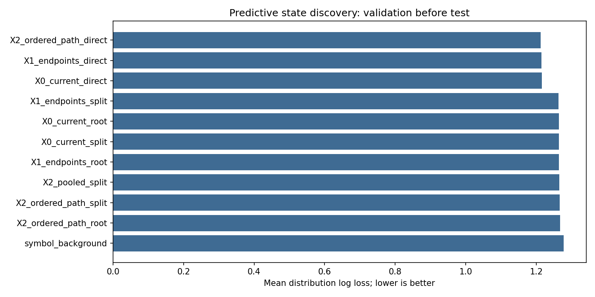
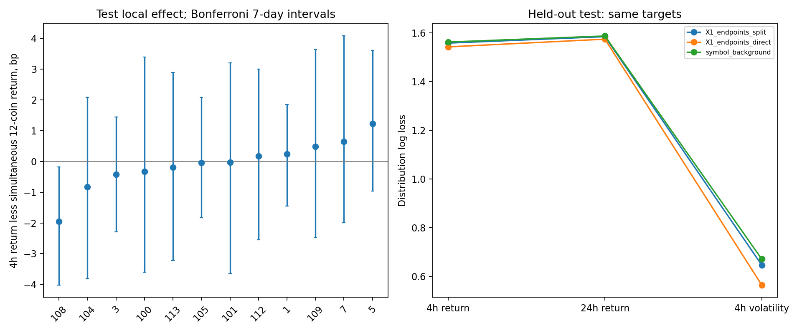

# 下一大阶段报告：方向中性的历史状态、真实近邻与未来分布

日期：2026-09-29。思想来源为[《形态原型 下阶段分析思考》](../../../docs/形态原型%20下阶段分析思考.md)，执行协议见[阶段设计](../../../docs/NEXT_PREDICTIVE_STATES_STAGE.md)。代码没有沿用旧八个多/空语义种子，也没有用 99%+ 相似度分位作为事件门槛。**本阶段研究状态与条件分布，不研究仓位、换手或费用。**旧 [136 维阶段](../04_full_pattern_stage.md)保留为不同范式的历史对照。

## 1. 问题、研究单位与实验边界

核心检验是：由已知量价历史构造的局部状态，是否同时具有历史几何支持与可迁移的未来条件分布？如果中间路径信息存在，它能否被原型距离和局部聚合真正保留？外观不同但未来分布相似的区域允许在结果层共享估计；几何层不因某次未来涨跌而强行拉近。发现时不预置方向。

12 个币、每 15m 一个完成快照，加载 1,570,164 行。所有字段的基础公式来自 `src/crypto/features.py`；本阶段选择的 100 个可能坐标逐项登记在 [feature_registry.csv](feature_registry.csv)，包括组、公式、窗口、单位、方向假说、冗余、缺失和可用时间。原始 parquet 只读。

| 职责 | UTC 区间 | 24h 标签可用性 | 有效快照 |
|---|---|---|---:|
| 拟合历史几何及初始分布 | 2023-01-01—2024-12-31 | 末端 24h purge | 839,796 |
| 发现区内部选择拆分 | 2025-01-01—2025-06-30 | 末端 24h purge | 207,360 |
| 发现区合并估计结果分布 | 2023-01-01—2025-06-30 | 末端 24h purge | 1,048,308 |
| 新方法的验证与预定选型 | 2025-07-01—2026-01-31 | 末端 24h purge | 246,528 |
| 选型后的测试 | 2026-02-01—2026-09-24 数据末端 | 末端 24h purge | 270,720 |

旧项目已看过一部分 2025 结果，故“验证”指**本算法预定切分上的验证**，不是历史上完全未触碰的数据。2026 测试在中心层次法的验证选型之后首次计算；之后的图社区、无时钟、路径与币种尺度消融均是在已看过首个测试结果后追加，明确标为**探索性家族分析**。2026 如今不能再作为未来新方案的未触碰终段。

## 2. 历史表示：语义放在特征定义，方向交给数据

以已完成 bar 的组内字段构造 28 维当前表示 `X0_current`。六个非时间组各有两个 5m、两个 15m 字段；时间组有四个周期编码。六组的两个 15m 代表字段再取过去 16 个决策格（4h）的值，形成 40 维 `X1_endpoints`。`X2_ordered_path` 加入过去 12、8、4 格（距今 3h、2h、1h）的**中间水平**以及五个节点上峰/谷发生的相对位置，成为 100 维。路径按币种滚动，不跨合约；前 16 格不参与实验。

每个基础字段由 2025 年之前**同币种训练样本**拟合 101 个分位结点，将训练、验证、测试值映到 `[0,1]`；离散并列值用中位秩。混合币种参考单独作为消融。各组在距离中的坐标向量除以本组维数的平方根，避免 100 维路径因坐标个数更多就自动压过其他组。若 $u_g$ 为一个组内的分位向量，实际几何量可写为

\[
z_g=(2u_g-1)/\sqrt{d_g},\qquad
D^2(x,c)=\sum_{g=1}^{7}\|z_g(x)-z_g(c)\|_2^2.
\]

这里的相似是**历史几何距离**；它不由种子名称或预定多空方向给出。时间组仍进入表示；去时间组作为后验敏感性诊断，不能反向改本轮选型。

路径编码的顺序是明确定义的。对每个入选字段 $v$，`X1` 增加 $v_{t-16}$；`X2` 再增加 $v_{t-12},v_{t-8},v_{t-4}$，其中一格是 15m。令 $P_v=(v_{t-16},v_{t-12},v_{t-8},v_{t-4},v_t)$，再增加

\[
\tau_v^{\max}=\tfrac14\operatorname*{argmax}_{j=0,\ldots,4}P_{v,j},\qquad
\tau_v^{\min}=\tfrac14\operatorname*{argmin}_{j=0,\ldots,4}P_{v,j}.
\]

并列峰谷按数组首次位置编码。这样同样的起点和终点可以有不同的中途回撤、反弹顺序；但这个编码本身不强迫模型认为顺序具有预测价值。原始缺失先按训练期分位映射规则处理，新增滞后在每币序列开头用中性值 0.5 补位，前 16 格已从实验样本排除。

4h、24h 收益都由状态快照可用后**再延迟 5m**的原始 5m 开盘价起算；这只是统一未来标签的观察起点，不表示已形成交易信号。用快照时点已知的过去 24h RV 进行尺度化；收益分别落到固定边界 `[-1,-0.25,0.25,1]` 划分的五档。第三个目标是未来 4h RV 是否超过过去 RV 的 4h 对应量。三个目标均做概率预测，主评分为三者分类对数损失的平均（越低越好）：

\[
L=\tfrac13\{ -\log p(Y_{4h}^{R})-\log p(Y_{24h}^{R})-\log p(Y_{4h}^{V})\}.
\]

这个目标不把一次未来亏损当成该时刻的真实“空头状态”。局部区域的结果是五档收益分布和波动事件概率；原始 bp 均值另报，用来解释分布而非决定几何出生。

若过去 24h 已知实现方差为 $q_t$，两个收益的无量纲尺度分别是 $R_{4,t}/\sqrt{q_t/6}$ 与 $R_{24,t}/\sqrt{q_t}$；两个五档目标共用边界 $(-1,-0.25,0.25,1)$。第三个事件为 $\mathbf 1\{RV_{4,t}^{\mathrm{future}}>q_t/6\}$。代码对极小 $q_t$ 设置 $10^{-10}$ 下限，避免零波动时除零。三者是**边际分布任务**，平均对数损失不等于一个完整的三变量联合似然。

## 3. 三套真正执行的模型及其职责

### 3.1 中心层次状态

在发现区前段各币抽 16,000 条几何快照，用 **PyTorch CUDA** 的组平衡距离与中心更新找到 8 个方向中性的父区域。对每个父区域，再只按输入几何尝试二分。子区域须各有足够训练与内部选择样本、至少 20 个日期；其在 2025 年上半年相对于父区域的三目标平均对数损失改善超过 0.0005，才允许拆分。`X1_endpoints` 的 8 个父区域有 4 个拆分，形成 12 个叶区；逐项正负决定见 [split_evidence.csv](split_evidence.csv)。中心另配一条真实历史 medoid 和日期支持卡，但分类本身仍基于**拟合中心**，真实 medoid 仅用于检视。

每区的分类计数以父区域分布加入 700 条伪计数收缩，币种局部结果再以共享叶区分布加入 1,000 条伪计数。由发现区样本得每区距离的 90% 半径：测试点通常可归区并得到局部分布；距离超出该半径时报告不支持并回退币种背景。此 90% 是**几何支持范围**，不是寻找 99% 以上高相似事件的交易阈值。该模型输出区域编号、距离、接受/拒绝、三个条件概率及原始 medoid。

拆分的统计作用被限制在发现区内部。设前段数据拟合的父分布为 $p_r$，仅用前段子区计数形成 $p_{r0},p_{r1}$；在 2025 年上半年、由几何分到父区 $r$ 的集合 $I_r$ 上计算

\[
\Delta_r=\frac1{|I_r|}\sum_{i\in I_r}\bigl[L(y_i,p_r)-L(y_i,p_{r,c(i)})\bigr].
\]

仅当 $\Delta_r>0.0005$，且两子区均有足够行数和至少 20 个不同日期时保留拆分。之后才用整个发现区重估概率。对任一任务、区域 $A$ 和父分布 $p_0$，概率收缩为

\[
\widehat p_A(k)=\frac{n_{A,k}+\alpha p_0(k)}{n_A+\alpha},
\]

其中父到子取 $\alpha=700$，叶区到币种局部分布取 $\alpha=1000$；背景无父分布时每类加一。半径 $r_A$ 取发现区本区域到中心距离的经验 90% 分位，只有 $D(x,c_A)\le r_A$ 才发布局部分布。因此**几何归属、历史结果估计、支持域拒绝**是三个可分别诊断的环节。

### 3.2 真实历史近邻图

另从前段抽 12,000 条真实快照作为节点。CUDA 精确计算节点间最近的 16 个历史邻居，建 132,356 条边（同币 4h 内近重复在建图时排除），再用图社区算法得到 10 个区域。新状态由最近 8 条真实历史邻居投票归区，以第 8 邻居距离及发现期 90% 支持半径决定是否回退背景。这样解决“各维中位数拼出的中心可能从未真实出现”这一质疑。它与中心法使用同一 X1、同一三个目标和分布收缩；没有在测试期调社区数。图社区的历史几何身份和结果分布分开保存。由于这一路线在首次测试读取后才落实，其测试比较是**探索性**的。

具体归属票权为 $w_j=1/\max(D(x,h_j),0.05)$，对 8 个最近历史节点 $h_j$ 所属社区求票权和并取最大者；第 8 近邻距离承担密度支持量。这比只看一个拟合中心更直接地问“附近是否真的出现过类似路径”，但图社区、票权与结果分布仍是不同假设，不能因为节点是真实样本便推断结果可预测。

### 3.3 同目标直接预测

LightGBM 分别预测三个相同分类目标，输入与对应 `X0/X1/X2` 完全相同；80 棵低叶数树、较大的最小叶样本数，训练只用发现区。它不参与原型出生，但作为同信息、同目标的内部方法对照，不再只拿单个收益均值模型与原型分布模型比较。图和中心几何走 CUDA；LightGBM 的这一对照训练走 CPU。

## 4. 验证选型与测试结果

验证期先比较预定模型，按**每日等权三目标平均对数损失**在覆盖不低于 65% 的中心模型中选 `X1_endpoints_split`。这不是挑 99.x% 的事件阈值。原型是否优于直接模型是研究问题，不通过改变方法类别来预设答案。

| 表示/模型 | 验证对数损失 | 测试对数损失 | 说明 |
|---|---:|---:|---|
| X0 当前，8 父区 | 1.26368 | 未作原先锁定测试 | 几何输入最少 |
| **X1 两端，内部增益拆分** | **1.26316** | **1.26366** | 验证选定；测试接受率 85.79%，12 叶区 |
| X2 含中间路径，拆分 | 1.26622 | 未作原先锁定测试 | 更多路径维度在当前几何中反而不利 |
| X1 真实近邻图 | 1.26534 | 1.26600 | 10 社区，测试接受率 85.09%；后续探索性 |
| X0 直接模型 | 1.21584 | 1.22934 | 路径对照，测试追加计算 |
| X1 直接模型 | 1.21436 | 1.22765 | 与选定状态同输入的严格对照 |
| X2 直接模型 | **1.21237** | **1.22536** | 中间路径增量；测试追加计算 |
| 币种背景分布 | 1.27725 | 1.27412 | 内部概率基线 |

对**锁定的 X1 中心状态模型**，测试按 7 天共同日期块配对，状态相对币种背景的损失差为 **−0.01046**，95% 区间 `[−0.01322,−0.00748]`；相对同输入直接模型为 **+0.03600**，区间 `[+0.02946,+0.04262]`。差为负表示前者更好。状态模型三个目标都超过币种背景，也都输给直接模型；对直接模型的最大差距在 4h 波动事件（+0.0820，7 天块区间 `[+0.0730,+0.0904]`）。逐月卡显示 2026-02 至 09 的每个月都是“状态优于背景，直接模型优于状态”，见 [test_monthly_scores.csv](test_monthly_scores.csv)。状态模型在验证期拆分相对八父区仅改善 0.00060（块差区间 `[−0.00101,−0.00022]`），是小幅而非结构性突破。

真实近邻图测试比选定中心模型损失高约 **0.00234**，配对 7 天块区间 `[+0.00154,+0.00316]`。真实邻居能界定支持，并未使当前社区划分的预测分布更准。因此不应把“真实样本”这个形式本身当作预测性保证。



## 5. 路径确有信息，当前原型距离没有用好

直接模型的 X0→X1→X2 验证损失为 `1.21584→1.21436→1.21237`；追加的测试为 `1.22934→1.22765→1.22536`。X2 相对 X1 的测试配对差为 **−0.00230**，7 天块区间 `[−0.00319,−0.00141]`。4h 收益、24h 收益和 4h 波动目标分别有增量。去掉四个时钟字段后，X0→X1→X2 的验证损失仍为 `1.24822→1.24492→1.24154`，测试为 `1.25219→1.24977→1.24703`。这些无时钟计算属于后验消融，只能说明路径增量并非完全依赖时钟字段，不能转成新方案认证。

X2 直接模型的 gain 重要性中，1h/2h/3h 中间节点约占 4h 收益目标的 22%、24h 收益目标的 29%、4h 波动目标的 12%；单独的峰谷节点位置在该树设置中几乎未被使用。当前时钟四字段在 4h 收益的 gain 占比也很高，说明对时间背景的归因必须单列。Gain 是模型使用频率与分裂改进的描述，**不是**中间节点的因果贡献；更可靠的证据是上述同输入层级、同目标、按时间测试的评分变化。完整字段 gain 在 [direct_path_feature_gain.csv](direct_path_feature_gain.csv)。

与此相反，X2 在等组中心几何下的验证损失为 1.26622，比 X1 的 1.26316 更差。中间节点携带弱而分散的信息，直接模型能局部利用；固定等组欧氏距离把这些节点放入每次近邻比较，可能增加无关差异。此处是基于模型对照的**解释性推断**，尚未由局部权重或协方差消融单独证实。下一方法改进应改距离、局部支持和预测性拆分，不能简单再增加路径坐标或扩大网络。

## 6. 状态是否只描述共同市场背景？

X1 的 12 个叶区在测试期 4h 原始条件均值约落在 **−5.88 至 +5.91bp**。但每时点减去同步 12 币平均 4h 收益后，大多数叶区的单币残差接近零；同时用 7 天共同块并对 12 个叶区做 Bonferroni 宽区间，只有 `leaf 108` 的测试残差区间略在零下方：均值 −1.95bp，区间 `[−4.02,−0.18]`。它在发现区和验证区的残差分别约 −0.44、+0.25bp，**符号不稳**，不能事后提升为已验证单币局部效应。完整 [局部残差卡](test_market_residual_intervals.csv) 和 [逐期原型卡](state_cards.csv) 记录所有正负叶区。

12 叶区在测试期均覆盖 12 币，最大单币占比约 9%–10%；这不支持“整个模型仅按币种身份分类”的简单解释。匹配的 X1 混合币种分位消融验证/测试损失为 1.26296/1.26324，略低于同币分位的 1.26316/1.26366，但测试按周配对差的区间 `[−0.00091,+0.00004]` 跨零。币种尺度选择在这 28 个相对量为主的字段上尚无可靠优势，不能从旧 136 维包含绝对成交尺度的疑虑直接外推。

模型的离散支持拒绝也有实际作用：选定状态模型在测试期约 85.8% 快照使用局部分布，其他回退币种背景。接受区的状态损失 1.26257，币种背景在同一区为 1.27476；但直接模型在同一区仍为 1.22817。拒绝能力本身并未使原型优于直接模型。粗十等分校准检查中状态概率的绝对偏差小于直接模型的某些事件，但这些校准图和对数损失测量不同对象，且重叠样本使普通逐行误差不可信；不能拿校准单项掩盖总分布评分。见 [校准卡](test_calibration.csv)。



## 7. 数理判断、阴性结论与下一轮方向

1. **表示层获得支持，聚合层尚未获得独立支持。** 中间节点改善直接模型在三目标上的时间外概率预测。旧 4h 两端差分不足以代表整个窗口；但当前 X2 等组几何的距离没有保住增量。
2. **数据出生比旧人工方向种子更贴近本轮命题。** 八父区、预测增益拆分、图社区都没有预置多空；状态携带真实日期、币种和支持半径，绝大多数时刻可归类，远非 99%+ 的稀疏事件筛选。4 个内部拆分有小幅验证增益，但模型整体仍输给同信息直接预测器。
3. **共同背景是主要解释之一。** 原始条件收益的正负变化比单币同步市场残差明显，少数测试残差线索跨期不稳。现阶段更接近“有几何支持的市场背景分类”，不能称稳定的币种特有预测原型。
4. **下一步应针对度量与预测层，而非先加策略。** 可在发现区做训练内交替优化：组内低秩/收缩协方差、共享组权加受限局部偏移、真实邻居密度与共同市场背景双层分布；用独立时间块评价拆分/合并整套算法。之后需要新增未触碰数据验证。仓位、换手和成本属于更后面的信号阶段，本报告不以这些指标判定形态识别。

## 8. 复现、核查及限制

在 PowerShell 使用 `D:\Total_Tools\miniforge3\Scripts\conda.exe` hook 后 `conda activate universal`。该环境实测 PyTorch CUDA 12.8、RTX 5060 可用；FAISS GPU 未安装，中心/真实邻居距离由 PyTorch CUDA 计算。按顺序运行：

```powershell
python scripts/crypto_predictive_states_stage.py
python scripts/crypto_predictive_states_registry.py
python scripts/crypto_predictive_states_diagnostics.py
python scripts/crypto_predictive_graph_stage.py
python scripts/crypto_predictive_path_diagnostics.py
python scripts/crypto_predictive_time_ablation.py
python scripts/crypto_predictive_symbol_ablation.py
python -m pytest -q
```

配置在 `configs/crypto_predictive_states.yaml`；核心数学和 CUDA 实现在 `src/crypto/predictive_states.py`。保存了逐方案分数、逐日损失、原型真实 medoid、内部拆分证据、逐期分布卡、真实图锚点、测试逐行概率/损失、状态转移与年龄、图和模型文件。新增的路径因果与 GPU 距离测试及项目全套测试 **59 项通过**。报告中的原始行情标签从只读 5m 开盘价计算；完整 bar 只在其收盘后进入特征；训练分位和任何结果拟合均停在后验区间之前。

限制：本次中心距离仍是组平衡欧氏，未学习组内联合支持或动态局部度量；真实邻居图只在 12,000 锚点上近似全历史；概率目标用固定五档和二元波动，未估计完整连续联合分布；高度重叠的 15m 标签按共同日期块处理不确定性，但这不能解决所有制度变化。GPU `index_add` 中心更新可能有末位数值非确定性，重复运行的非赢家 X2 中心结果有轻微波动；不能把微小排名差异当物理常数。图与后验消融均是在首个 2026 测试分数已知后执行，**只能解释方法缺口，不构成第二次独立认证**。
