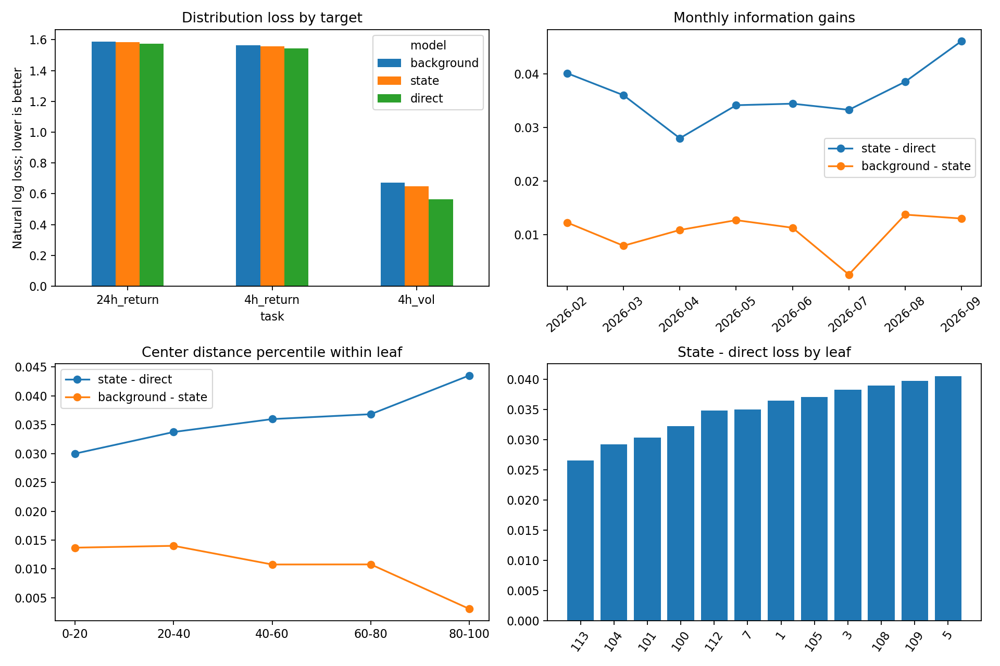
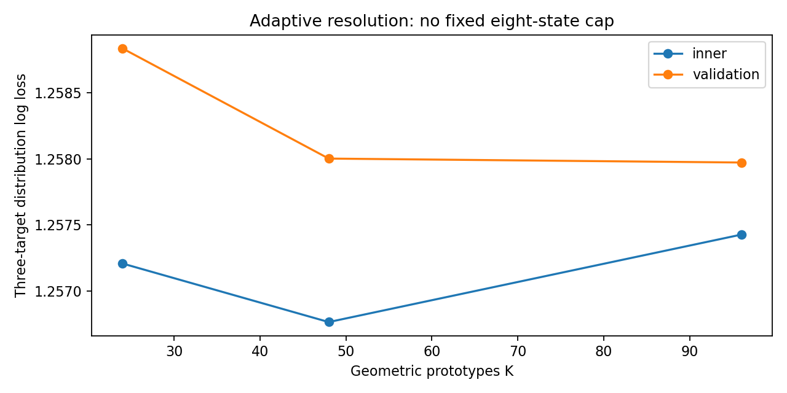
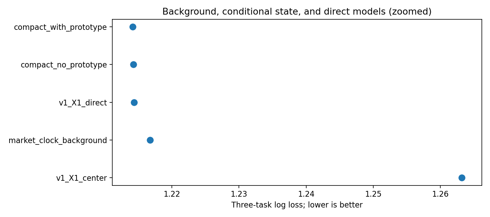
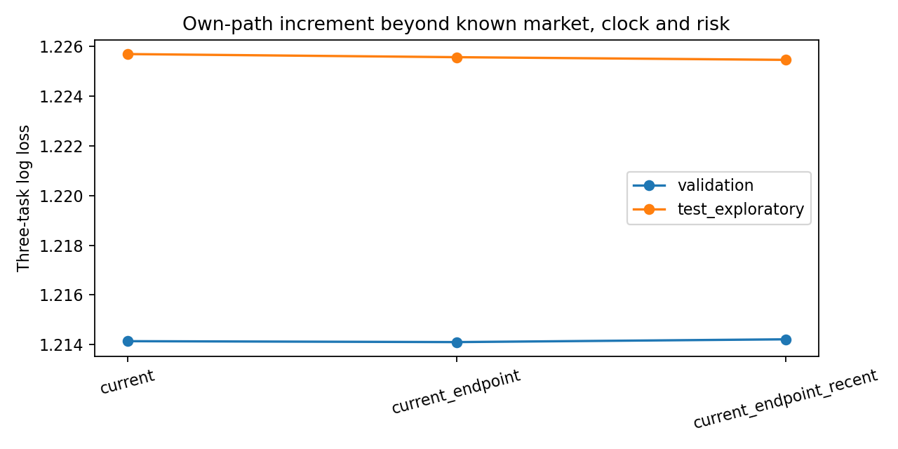
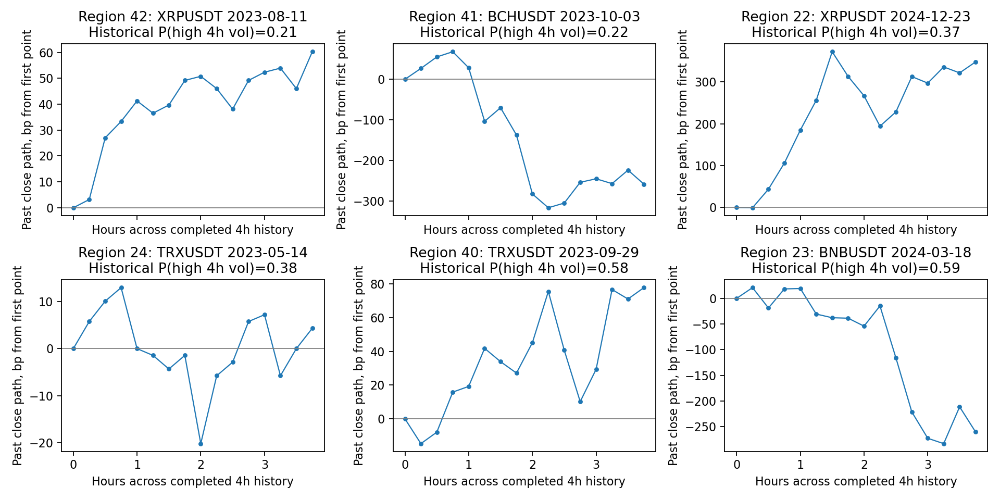
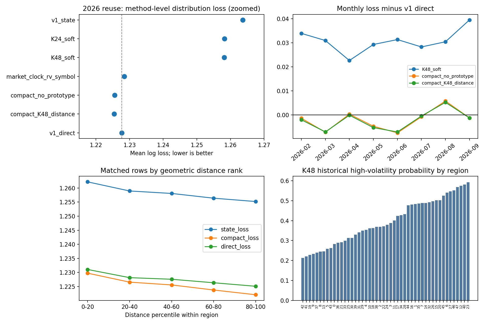

# 预测状态 v2：信息损失审计、可变原型分辨率与区内条件分布

日期：2026-09-29。依据[《模型改进思考-9-29》](../../../docs/模型改进思考-9-29.md)与[执行设计及迭代记录](../../../docs/PREDICTIVE_STATES_V2_PLAN.md)。本报告研究的是**给定已完成历史，如何分类、匹配并估计未来条件分布**。几何身份、历史支持与概率预测分别评价；不按换手、费用或仓位选状态。旧 [v1 报告](../predictive_states_v1/05_predictive_states_stage.md)及产物均保留。

## 1. 这轮究竟检验什么

v1 的十二叶区模型在 2026 测试段三目标平均损失为 1.26366，比同输入直接模型 1.22765 高 0.03600。这个差并非理论互信息量：它混合了距离、原型数量、硬归属、区内概率常数、收缩和支持回退等误差。本轮按组件分离四个问题：

1. 差距由哪个未来目标、哪些时间与支持区域承担？
2. 若不固定八父区/十二叶区，连续增加几何分辨率并软匹配，局部分布能提高多少？
3. 保留几何身份，在结果层允许少量已知市场背景和本币路径变量连续改变概率，能否缩小差距？原型身份是否仍有独立增量？
4. 原型真实代表和跨年份重拟合身份是否稳定，几何距离能否当作预测可靠度？

12 币每 15m 已完成快照，三个目标与 v1 相同：4h/24h 波动标准化收益各五档，以及未来 4h 方差是否高于当时已知的过去 24h 方差的六分之一。评分是三个边际目标的平均对数损失，越低越好。收益标签从快照可用后 5m 的原始开盘价起算，仅作为统一未来观察起点。2023-01—2024-12 拟合初始几何，2025-01—06 为内部选择，2025-07—2026-01 是开发验证；2026-02—09-24 **已在 v1 被读取**，这轮任何该段结果都只是探索性复核。各段末尾继续执行 24h 标签 purge。原始 parquet 只读。

## 2. 数理结构：把历史身份与结果估计分开

表示仍从训练期逐币 101 结点中位秩映射而来。`X1` 是 28 个当前字段加六组各两个代表的 4h 前值；`X2` 增添 1h/2h/3h 中间水平和峰谷位置。七组原始字段的公式、窗口、单位、重复性及可用时间见 [v1 特征登记](../predictive_states_v1/feature_registry.csv)。新加的 18 个组级中间摘要见 [v2 登记](middle_path_feature_registry.csv)。它们只由已完成 15m 历史计算。

### 2.1 路线 A：历史几何原型

形态几何先从 `X1/X2` 移走四个时钟坐标，保留在概率层审计。受控候选分别是等组欧氏距离和仅用输入历史估计的组内收缩协方差；每种比较有限的 $K$ 与硬/软归属。软成员为

\[
q_k(x)=\frac{\exp\{-D_k^2(x)/T\}}{\sum_{j=1}^{K}\exp\{-D_j^2(x)/T\}},
\]

其中温度 $T$ 仅由训练几何中最近与次近中心的典型平方距离差定，不看未来标签。区域与币种概率以加权历史类别计数做父区/币种收缩，最后 $\widehat p(y\mid x,i)=\sum_k q_k(x)\widehat p_{k,i}(y)$。和 v1 的硬半径拒绝相比，这条分支**不把距离越过第九十分位立即解释为不可信**；真实邻居密度和中心距离的预测可靠度另行诊断。

第一轮 $K=6,12,24$ 的最好结果落在 24 的边界，因此在看到该开发结果后，明确追加 $K=24,48,96$ 扩展；不能把扩展说成最初事前规格。扩展按验证期 7 日共同日期块配对差选择：取与原始最低损失不能区分的最小 $K$。这是一种**开发期复杂度选择**，不是独立测试认证。

### 2.2 路线 B：连续的局部结果层

原型中心可以描述“这片历史像什么”，但一个区域的全部样本未必共享常数未来概率。因此另做容量受限的三任务概率模型：各任务 75 棵、每棵最多 7 叶的 LightGBM，拟合数据只到 2025-06。输入分层如下：

\[
\underbrace{M_t,T_t,s_i,\log RV_{i,t}}_{\text{已知市场、时钟、币种与尺度}}
\quad\longrightarrow\quad
\underbrace{\psi(X_{i,t})}_{\text{本币六组当前/端点/最近变化}}
\quad\longrightarrow\quad
\underbrace{Z_{i,t}\text{ 或 }(D_1,D_2-D_1,q_1,\ldots,q_K)}_{\text{几何身份与边界}}.
\]

$M_t$ 是同一时刻十二币**已完成字段**的组级平均，不是同步的未来市场收益；它在状态可用时即已知。`Z` 用旧叶区 one-hot 做一次身份消融，再用新 48 区的距离/次近差或软成员做受限组合。同一容量下比较“不用原型”“加原型”才能判断几何身份是否提供增量。保存各任务字段增益，但相关字段的 gain 不作为因果贡献解释。这个模型输出三个完整概率向量，**不输出交易方向或持仓**。

## 3. 阶段一：定位旧模型的信息损失

逐行复用 v1 的 270,720 条已保存预测做只读审计，见[审计表](audit_by_task.csv)和图 1。旧中心相对直接模型的对数损失差按任务分别是：4h 收益 **+0.01562**、24h 收益 **+0.01035**、4h 高波动 **+0.08204**。波动任务占平均差的最大部分，所以“旧原型输 0.036”不能只归因为价格方向模式不足。

按旧中心距离的叶区内五等分，状态相对直接模型的平均差从最近端约 **0.0300** 增至最远端约 **0.0435**；旧半径回退在远端改变了输出。真实 8 近邻距离的五等分却不对应单调的预测优势。[中心支持审计](audit_center_support.csv)与[真实邻居审计](audit_real_neighbor_support.csv)因而把“历史几何常见性”与“未来概率可靠性”分开，不能把 85.8% 接受率称为可靠度保证。按叶区、币种和月份的完整正反分解也分别保存。



## 4. 阶段二：原型数与几何方法不再固定

| 形态几何与概率聚合 | 2025H2—2026Jan 验证损失 | 已用 2026 段探索损失 | 数理解释 |
|---|---:|---:|---|
| v1 X1，八父区拆成十二硬叶区，半径回退 | 1.26316 | 1.26366 | 历史参照 |
| X1 无时钟，24 区软成员 | 1.25857 | 1.25824 | 放宽分辨率和硬边界 |
| X1 无时钟，48 区软成员 | 1.25800 | 1.25816 | 扩展后简约选择 |
| X1 无时钟，96 区软成员 | **1.25797** | 未作扩展后完整比较 | 与 48 的差很小 |
| X2 无时钟，24 区软成员 | 1.26229 | 未选 | 更多路径坐标仍稀释距离 |
| X2 组内收缩协方差，24 区软成员 | 1.26501 | 未选 | 本轮协方差变换失败 |
| v1 X1 同输入直接模型 | 1.21436 | 1.22765 | 预测参照 |

第一轮所有 [18 个候选结果](geometry_all_scores.csv)与扩展 [24/48/96 完整结果](resolution_scores.csv)均保存。48 相对 96 的验证期每日损失差约 **+0.00003**，7 日块区间 `[-0.00027,+0.00031]`；24 相对 96 约 +0.00086，区间 `[+0.00049,+0.00122]`。因此本轮选择 48，而非用微小点估计硬判 96 更好。48 区在采样发现集内最小区域有 4,220 条快照；有效独立支持仍须按日期而非行数解释。

表中 24 区是第一轮运行的 1.25857；扩展脚本重新抽样历史锚点，同一脚本下可配对的 24 区值为 **1.25884**。48/96 的复杂度判断只使用扩展脚本中的相同数据与抽样职责，不把不同运行的 24 区数字直接作微小差值的统计证据。

48 区相对旧中心在已用 2026 段降低损失 **0.00550**，共同日期块区间 `[-0.00651,-0.00456]`；但相对旧直接模型仍高 **0.03050**，区间 `[+0.02413,+0.03669]`。几何路线确实提高了局部分布估计，却没有弥合主要预测差距。曲线、逐行样本和版本模型见下图及[48 区保存模型](resolution_chosen_model.joblib)。



单看预测分数还不够。对同一 2025H1 输入，分别只用 2023 与只用 2024 拟合 48 中心，并做匈牙利匹配，硬身份一致率仅 **46.3%**、ARI **0.321**。这是跨年输入几何身份的明显不稳定性；它不否定作为柔性密度估计器的价值，但限制了“48 个固定可复现原型”的说法。匹配方法及结果见[身份稳定卡](resolution_identity_stability.json)。

## 5. 阶段三：区内连续概率比扩充叶区更有效

| 同容量概率模型输入 | 验证损失 | 已用 2026 段探索损失 | 主要检验 |
|---|---:|---:|---|
| 市场当前六组均值＋时钟＋本币历史 RV＋币种 | 1.21672 | 1.22840 | 已知共同背景 |
| 上行输入＋本币六组当前/路径紧凑摘要 | 1.21428 | 1.22555 | 本币条件变化 |
| 上行输入＋旧十二叶区身份 | 1.21414 | 1.22569 | 旧原型身份增量 |
| 紧凑模型＋48 区最近距离/边界差 | **1.21386** | **1.22538** | 受限几何增量 |
| 紧凑模型＋48 区全部软成员 | 1.21386 | 1.22543 | 柔性身份增量 |
| v1 X1 直接模型，40 字段/较大树 | 1.21436 | 1.22765 | 同目标直接参照 |
| v1 X2 直接模型，100 字段/较大树 | **1.21237** | **1.22536** | 完整路径参照；测试为旧阶段后验消融 |

三种低容量模型与旧直接模型不是同一表示，因此“1.22538 对 1.22536”是预测质量比较，不能当成原型胜出。更关键的同容量消融是：**仅加入旧原型身份没有稳定增量**；加入 48 区距离/边界，验证相对无原型降低约 0.00043，7 日块区间 `[-0.00066,-0.00020]`，但 2026 探索区仅约 0.00017，区间 `[-0.00039,+0.00004]` 跨零。完整[概率层分数](conditional_all_scores.csv)、[受限组合配对结果](hybrid_paired.csv)和各任务字段 gain 均留存。旧身份的 gain 占比极小，提示结果层主要利用已知时钟、过去 RV、共同背景和连续本币量价，而不是十二个离散编号。

本币紧凑字段相对市场/时钟/RV 背景在 2026 探索段降低约 **0.00285**；这有助于定位可预测性，但仍是已使用数据上的模型比较。图 3 清楚显示“较细几何有改进，却远不及容许区内连续概率”。



## 6. 专门核对中间路径、分布质量和真实样例

自查发现紧凑概率模型起初只用了 4h 端点和最近 1h 的组摘要，没有单列 2h/3h。追加 12 个中间差值和 6 个最近段加速度，全部登记为训练分位空间中的组级差值。**单加 12 个中间差值未改善**；再加加速度，验证损失从 1.21428 降至 1.21392，但探索期相对原模型差约 −0.00008，块区间跨零。中间摘要加距离的探索损失 1.22538，与不加摘要的 1.22538 几乎相同。[全部结果](middle_path_scores.csv)与[配对区间](middle_path_paired.csv)保留失败方案。它不推翻 v1 原始 100 维 X2 直接模型发现的路径增量；它说明**简单组均值不足以无损压缩中间路径**，下一次应在发现区检验组内局部顺序，而不是机械增维。



48 个几何区域在历史拟合的“未来 4h 高波动”概率从 **0.212 到 0.593**；已用 2026 段按硬身份分组的实际发生率从 **0.193 到 0.636**，跨区域相关约 **0.981**。这说明区域确实**粗分了未来波动环境**，但不能据相关系数断言每个区域概率精确，也不能忽略其整体对数损失显著输给直接模型。全部区域均有 12 币覆盖；单个区域每月、每币及高低结果见[48 区概率卡](K48_prototype_distribution_cards.csv)。该卡另使用事后已知的剔除自身同步市场收益做诊断；同步未来市场收益从未进入训练或推断特征。

[48 个真实历史 medoid](K48_real_medoids.csv)是拟合期真实快照，包含符号、时间、到中心距离及前 4h 的 16 根已完成 15m 收盘路径。下图按**历史拟合的高波动概率**取六个不同区域展示，价格路径只说明历史几何形状，并非用事后结果挑选的交易样例。不同外观可能有相近结果分布，反之亦然；本轮保留各区域的几何身份，没有因未来结果接近就强行合并。



概率本身另用对数损失、二元 Brier、十档 ECE 和收益五档的有序 RPS 检查。旧状态模型的 4h 波动 ECE 约 **0.011**，比直接模型约 0.032 小；但它的 Brier **0.228**，明显差于直接模型 **0.191**，输出也更少随条件变化。较小的粗分箱 ECE 不能掩盖区内常数概率的分辨率损失。[完整概率质量卡](probability_quality.csv)和[校准图](10_high_vol_calibration.png)保存这些相反信息。

## 7. 支持、预测与这轮的实际结论

图 7 汇总各阶段、逐月和支持曲线。48 区在“离自身中心最近”的五分之一测试样本上损失约 1.2622，在最远五分之一反而约 1.2552；直接与紧凑模型在同批样本也随之变好。故**几何距离没有被证明是概率误差的单调可靠度**。它可解释“像哪个历史区域”，尚不能用来承诺“哪里预测更准”。没有据此重新挑一个更好看的拒绝阈值。



当前可复现的**预测状态候选实现**为：X1 去时钟的 48 区软几何提供可查询的历史身份和真实路径代表；概率由市场/时钟/波动/币种背景、本币六组紧凑变化及两项几何距离信息，经三个低容量分类头估计。这是有输出的分布预测算法，并在开发验证和已用测试区相对旧中心显著降低损失。它尚不是已认证、稳定的预测性原型库：几何身份跨年不够稳，几何对紧凑预测器的增量在探索测试中不确定。即使当前概率模型与更复杂的直接模型分数接近，也不能将其宣称为可交易策略。

## 8. 复现、文件和后续可证伪方向

在 PowerShell 用 `D:\Total_Tools\miniforge3\Scripts\conda.exe` hook，激活 `universal`，顺序执行：

```powershell
python scripts/crypto_predictive_v2_audit.py
python scripts/crypto_predictive_v2_geometry.py
python scripts/crypto_predictive_v2_conditional.py
python scripts/crypto_predictive_v2_resolution.py
python scripts/crypto_predictive_v2_hybrid.py
python scripts/crypto_predictive_v2_path_levels.py
python scripts/crypto_predictive_v2_middle_path.py
python scripts/crypto_predictive_v2_probability_diagnostics.py
python scripts/crypto_predictive_v2_summary.py
python scripts/crypto_predictive_v2_medoids.py
python scripts/crypto_predictive_v2_inference_check.py
python -m pytest -q
```

CUDA 用于中心训练、中心距离及软成员；概率头为 CPU LightGBM。完整模型、逐行损失、概率、区域卡、图和日志在本目录。冻结训练分位映射保存为 `frozen_feature_maps.joblib`；[推断复核清单](inference_manifest.json)核对保存模型只凭已完成特征重现分数，并验证每币只给最近 **17 个已完成快照**时，同一时点十二币的概率与完整历史输入**逐值一致**。推断函数 `infer_compact_geometry` 输出三个概率向量、历史距离与软成员，不读取未来标签；它要求十二币按同一 15m 时间格对齐。**下一次真正独立确认必须使用新增日期**；此前可以在开发史内继续研究有序路径的局部表示、市场共同层与币种相对层、跨年份原型身份及预测层共享，但所有后验方案必须连同失败结果留存。
