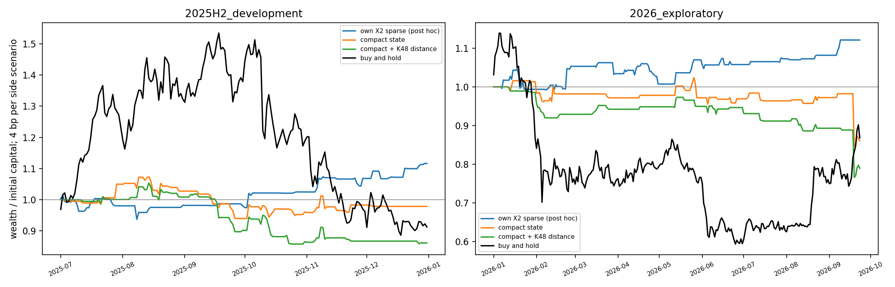
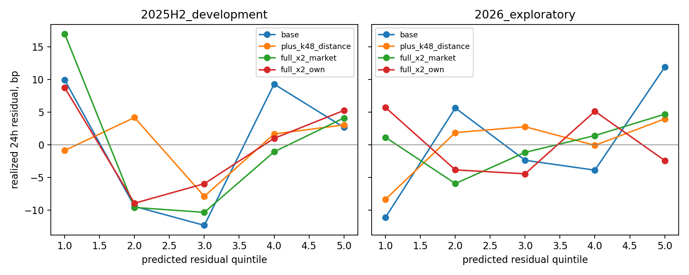
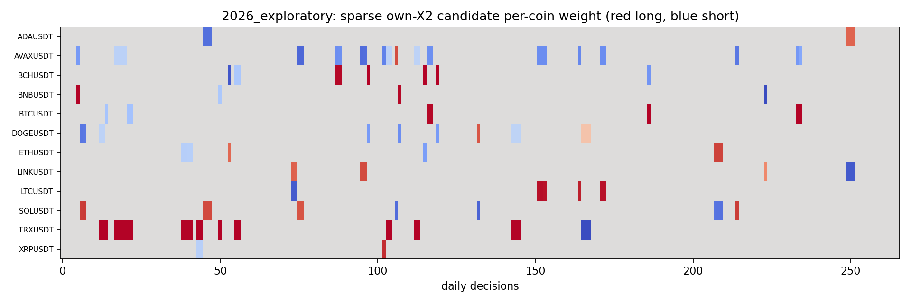
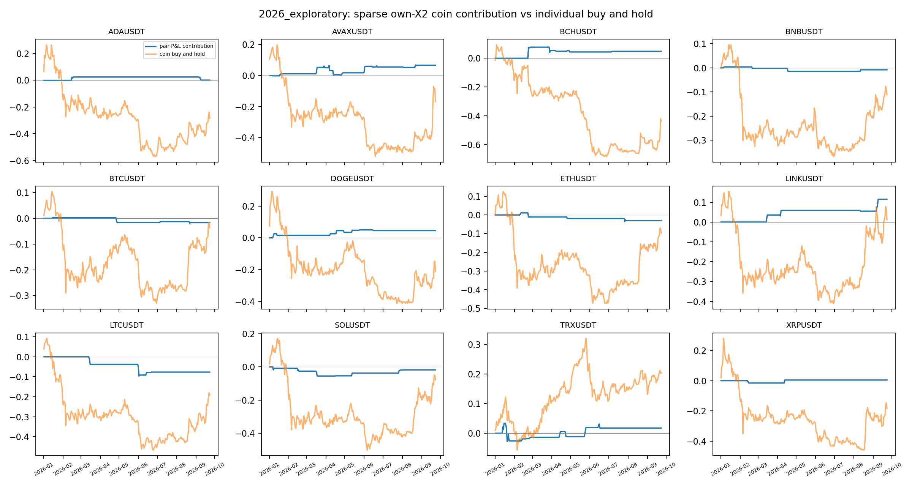
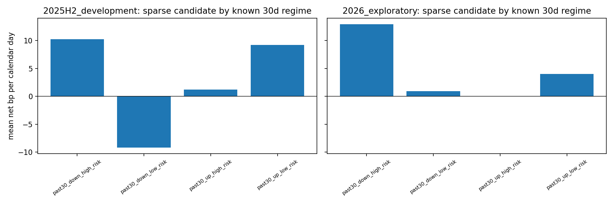
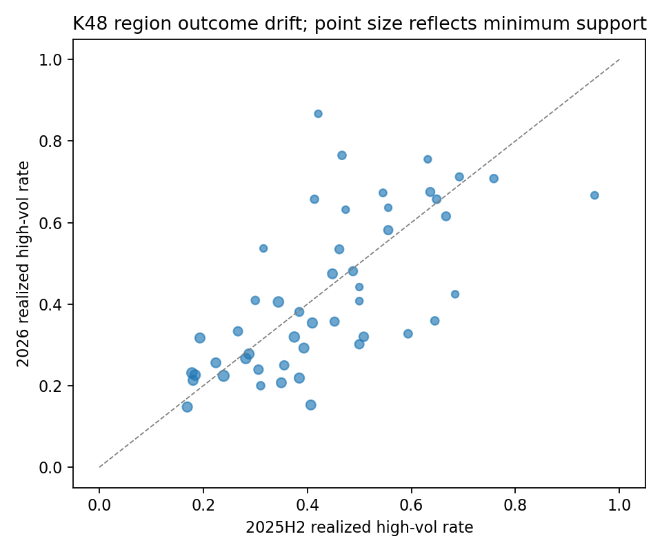
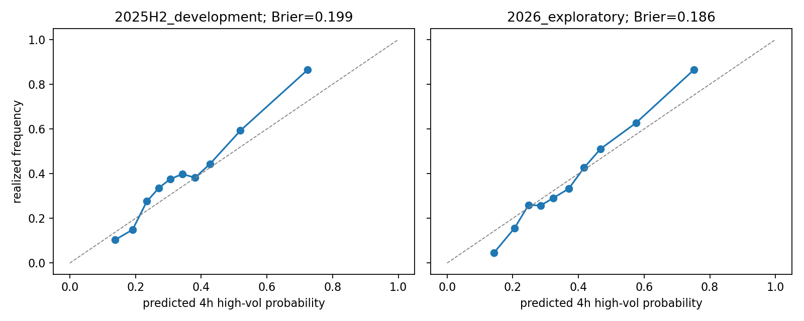

# 预测状态到多币种多空：首轮完整研究链路

日期：2026-09-29。依据 [《完整性尝试分析-9-29-17》](../../../docs/完整性尝试分析-9-29-17.md)，执行规格见 [设计与迭代账](../../../docs/SIGNAL_CHAIN_V1_PLAN.md)，新增字段与可用时间见 [特征登记](../../../docs/SIGNAL_CHAIN_V1_FEATURE_REGISTRY.md)。本报告把 v2 的分布研究延伸到**连续方向收益、市场与币种相对分解、原型距离消融、明确仓位、逐币账本及真实价格基准**。它完成一条可重跑的研究链，但**没有认证可交易优势**。

## 1. 最重要的判断

1. **48 区仍主要是一张历史波动状态地图。** 24h 币种残差的逐日横截面秩相关在 2026 探索段：紧凑本币状态 **0.0171**，在它上面添加 K48 最近距离与边界差为 **0.0088**。相同 70/35 分位决策、4bp/边情景，相对配对策略分别 **−13.93%** 和 **−21.04%**。原型距离没有形成方向增量；不可把原型编号映射成多空。
2. **完整本币路径给出一个需要继续研究的稀疏线索，且高度依赖输入与阈值。** 本币 X2 全部 100 坐标的直接残差头，在**看过结果后**追加的 80/40 稀疏规则上，2025H2 为 **+11.60%**、已复用的 2026 为 **+12.09%**；平均持有约 **44–45h**。同头的 70/35 规则在 2026 **−13.86%**；给 X2 再添当前市场摘要后，80/40 在 2026 **−2.80%**。这不是参数高原或稳定结构的证据。该线索只能作为冻结后待新日期检验的候选。
3. **全局方向预测仍弱。** 市场 24h 预测与实际的 Spearman 在 2025H2 **−0.051**、2026 **+0.012**；70/35 市场仓位在 4bp/边情景分别 **−10.67%**、**−5.30%**。高波动门控减少风险暴露，不能把绝对亏损略小解释成等敞口预测改进。
4. **既有波动预测可用于风险描述，不能代替有符号收益。** 冻结 v2 的 4h 高波动头 Brier 在两段约 **0.199 / 0.186**，分层频率有明显差异；它未在本轮赋予 48 区稳定交易方向。下图和区域卡只做风险背景诊断。

## 2. 数学对象、时间契约和模型

对 UTC 每日 00:00 刚完成的 15m 快照形成信息集 $\mathcal F_t$；对应 5m 开盘价格 $P_{i,t+5m}$，执行最早为 00:05。用**真实 5m 开盘价**定义连续训练/评价目标

$$
R_{i,t,h}=\log\frac{P_{i,t+5m+h}}{P_{i,t+5m}},\qquad h\in\{4h,24h\}.
$$

固定十二币共同因子 $R^M_{t,h}=12^{-1}\sum_iR_{i,t,h}$。过去 30 日的已完成 15m 同步收益给出 $\widehat\beta_{i,t}=\operatorname{clip}(\widehat{\operatorname{Cov}}(r_i,r_M)/\widehat{\operatorname{Var}}(r_M),0.2,2.5)$；未来币种相对标签为 $\epsilon_{i,t,h}=R_{i,t,h}-\widehat\beta_{i,t}R^M_{t,h}$。**未来 $R^M$ 只参与训练标签和事后归因**，推断输入全在 $\mathcal F_t$。这个共同因子是平均对数收益，交易账本则用等目标权重乘逐币算术收益，两者存在小的二阶口径差。

市场头以六组当前跨币状态、时钟和过去 RV 预测 $\widehat\mu^M_h$。币种头以三种受控表示预测 $\widehat\mu^\epsilon_{i,h}$：

- **紧凑**：各组当前/过去 4h/最近 1h 摘要＋市场/时钟/RV＋币种；
- **紧凑＋K48**：只增加旧冻结 X1 去时钟 48 区的最近中心距离和边界差；
- **完整 X2**：100 个有序本币坐标＋币种，另保留“再加已知市场摘要”的消融。这里的完整 X2 是**直接收益预测对照**，不冒充通过原型聚合的策略。

每个连续头是低容量 LightGBM 回归（市场 85 棵/最多 5 叶，币种 100 棵/最多 7 叶），只裁剪**拟合窗目标**的 0.5%/99.5% 尾部；前向评价使用未裁剪原始收益。旧 v2 4h 高波动头冻结于 2025H1，在此仅作风险背景概率。分位映射沿用更早训练窗冻结的逐币中位秩参考，X2 路径只由当时及之前已完成 bar 组成。

训练时序：2023-02—2025-06 拟合，2025-07—12 开发观察；同规格重新拟合至 2025-12 后，在 2026-01—09-23 决策。训练边界排除其 24h 标签尚不可知的行。2026 原已在 v1/v2 多次读取，**本轮全部 2026 数字仍是探索史**。完整 X2、稀疏 80/40 与本币/市场增强拆分，依次在看到前一步结果后追加；[计划](../../../docs/SIGNAL_CHAIN_V1_PLAN.md)逐次记录了顺序。

## 3. 从概率到动作：在何处有用、何处没有

旧五档收益概率无法唯一给出外侧档的条件金额，所以本轮直接拟合连续 $R^M$ 与 $\epsilon$，而不是把“上档概率减下档概率”当收益。市场动作 $b_t\in\{-1,0,1\}$ 由 $\widehat\mu^M_{24}$ 的训练期绝对值分位决定；币种候选差距 $g_t=\max_i\widehat\mu^\epsilon_{i,24}-\min_i\widehat\mu^\epsilon_{i,24}$ 决定是否持有预测最强/最弱配对。主规则入场用训练预测差距 70 分位、退出 35 分位；查看邻域后另存 80/40 **后验稀疏候选**。每天仅复核一次，可连续持有多日；其间不把 15m 的相邻高度重叠预测重复当独立机会。

同时，逐币[预测记录](forecast_rows_2026_exploratory.parquet)保留旧 v2 冻结的 4h/24h 各**五档概率**以及本轮连续收益头，形成“有序分布＋金额均值”双视图。以本轮每日 00:00 截面评分，2026 已用段 4h/24h 五档 logloss 为 **1.5413/1.5526**，有序 RPS 为 **0.1736/0.1782**；24h 最负档预测频率 **15.12%**、实发 **15.01%**，最正档预测 **15.46%**、实发 **14.88%**。这些是边际频率质量，不说明逐点有符号净收益足够大。[两段分布质量表](return_distribution_quality_daily.csv)与旧 v2 全 15m 截面的综合三目标分数**口径不同**，不可直接比较数值。

对选中多币 $a$、空币 $b$，令

$$
w_a=\frac{\widehat\beta_b}{\widehat\beta_a+\widehat\beta_b},\qquad
w_b=-\frac{\widehat\beta_a}{\widehat\beta_a+\widehat\beta_b}.
$$

于是总绝对仓位 1、过去估计的市场 beta 敞口 0；允许无仓。每个 00:05 根据新目标权重交易，计价到下一日 00:05。账本按日简单收益 $G_t=\sum_iw_{i,t}(P_{i,t+1}/P_{i,t}-1)$ 复利。费用对**上一日收益漂移后的权重** $\widetilde w_{i,t-1}$ 收取：$C_t=c\sum_i|w_{i,t}-\widetilde w_{i,t-1}|$，净增长 $(1-C_t)(1+G_t)$。外部基准是期初十二币等额买入、以后**不再平衡**的价格财富 $12^{-1}\sum_iP_{i,t}/P_{i,0}$；过去动量、反向、同入场日对照属于内部消融。

这批模型的总体方向分层远不足以支持“普遍预测正确”：2026 的 24h 残差逐日 IC，完整本币 X2 约 **−0.012**，完整 X2＋市场约 **−0.0035**；所有总体 top2-minus-bottom2 的七日块区间跨零。稀疏策略的正净值更像**条件于少数较大模型差距的局部效果**，但其选择、活跃币种和极端日都要继续检验。下图显示各预测分位并非清晰单调：

## 4. 策略家族、成本与风险

以下为各段**分别从 1 开始计**的总财富收益；策略列使用 **4bp/边情景**，买入持有为价格路径、无交易费。2025H2 共 184 个每日决策，2026 共 266 个。完整结果含 0/4/10bp、毛净、夏普、回撤、敞口、订单腿数和年化频率原始量，见 [全家族表](strategy_family_scores.csv)。

| 策略 | 2025H2 | 2026 已复用段 | 解释 |
|---|---:|---:|---|
| 期初等资本买入持有 | −8.73% | −13.20% | 唯一外部 benchmark |
| 市场方向连续头 | −10.67% | −5.30% | 方向证据弱 |
| 市场方向＋高波动门控 | −8.07% | −4.97% | 降敞口，未证明等敞口增量 |
| 币种紧凑状态配对 | −2.12% | −13.93% | 本币摘要不足 |
| 紧凑＋48 区距离配对 | −13.86% | −21.04% | 几何方向增量失败 |
| 完整本币 X2，70/35 | +3.15% | −13.86% | 阈值敏感 |
| 完整 X2＋市场，80/40（后验） | +10.30% | −2.80% | 追加市场变量削弱稳定性 |
| **完整本币 X2，80/40（后验）** | **+11.60%** | **+12.09%** | 待新日期验证的候选 |
| 过去 24h 市场动量 | −29.45% | +44.10% | 内部朴素对照；跨段反转 |

本币 X2 稀疏候选在 2025H2 有 **32 次**开仓/换配对、平均持有 **44.25h**，2026 有 **37 次**、**44.76h**；按观察时长折成年量级约 51–64 次，符合用户目标。活跃日占比分别 **32.1% / 25.9%**；4bp 情景最大回撤 **−7.54% / −5.23%**。同规则 0/4/10bp 情景依次为 2025H2 **+14.43/+11.60/+7.49%**，2026 **+15.32/+12.09/+7.40%**。费用只是假设；源文件没有证明合约类型、账户费率或资金费记录。[币安官方期货费用说明](https://www.binance.com/en/support/faq/detail/98488a516eb84e3eb34605683dffd554)明确手续费受合约类型、Maker/Taker 和账户等级等影响，永续持仓还涉及资金费。因此加上未知价差、冲击与容量，本轮净值不能说“已可交易”。

但不确定性不容忽略：稀疏候选相对零收益的每日均值 2025H2 **+6.27bp**、2026 **+4.50bp**；七日共同日期块区间分别约 **[−3.36,+16.23]bp**、**[−2.98,+12.16]bp**，都跨零。相对紧凑策略、市场增强 X2 与买入持有的配对块区间也多数跨零，见[配对不确定性](strategy_paired_uncertainty.csv)。2026 同入场日改用过去动量选币更差，但这是后验对照，不能消除整套家族的数据窥探。80/40 相邻 70/35 在 2026 转负，尚无可靠阈值平台，[全邻域](threshold_neighborhood_2026_exploratory.csv)与 [2025 邻域](threshold_neighborhood_2025H2_development.csv)均保留。

逐币贡献并不均匀：2026 LINK 的组合毛贡献约 **+0.115**，AVAX **+0.066**、BCH **+0.048**，LTC **−0.076**；2025H2 ADA/BCH/LTC 较有利，ETH/LINK 为负。图中蓝线是**按初始组合资本计的逐币累计 P&L 贡献**，不是给每个币独立开一个资金为 1 的策略净值；橙线是该币自身期初买入持有价格收益。逐币逐日权重与贡献见 [parquet](coin_positions_daily.parquet)，逐月贡献见 [CSV](coin_monthly_contributions.csv)。

## 5. 市场阶段、状态地图与最后历史截面

市场阶段只用已知的过去 30 日共同价格方向、过去波动相对 2023–24 历史中位数高低，得到四类背景。稀疏候选在 2025H2 的“过去 30 日下跌、低风险”22 天平均为 **−9.17bp/日**，其他三类平均为正；2026 “过去上涨、高风险”仅 2 天且无仓，不能推论那一格的适用性。[完整市场阶段归因](market_regime_attribution.csv)分开保存日数、活跃率、净均值、beta 及残差贡献。配对的过去估计 beta 暴露机器精度接近零，实际同步市场相关性仍可能与该线性近似不同。

48 个旧区域保存最近区域、距离、边界以及每区未来 4h 高波动发生率、24h 均值和支持数。每日抽样下单区单段支持仅约 **18–165** 行，且日期和币种并非独立；无法给 48 个区域分别认证方向。[区域卡](prototype_state_cards.csv)和下图供检查波动环境、跨段漂移，而不是挑“做多区域”。旧逐点高波动头在 2025H2/2026 的 Brier 约 **0.199/0.186**，[可靠性表](high_vol_reliability.csv)和图显示风险分层，但市场风险门控未证明等敞口收益优势。

[最后历史截面](latest_historical_state_snapshot.csv)为**2026-09-23 00:00 UTC** 的十二币原型、距离、4h 高波动概率、24h 预测残差、已知市场阶段和本币 X2 稀疏候选权重。该时点十二币权重全为零，说明“观望”已在状态机中生效；它不是 2026-09-29 的实时盘口或可下单建议。

## 6. 自查、边界和下一步

脚本 [研究入口](../../../scripts/crypto_signal_chain_v1.py)、[仓位账本](../../../src/crypto/signal_chain.py)、[独立产物核查](../../../scripts/crypto_signal_chain_v1_verify.py)与冻结回归模型均已保存。独立核查确认 5,400 个每日逐币预测行、21,600 个策略/费用日账本行、86,400 个逐币持仓行；十二币每时点恰好齐全，配对最大估计 beta 敞口 $1.2\times10^{-16}$，随机抽取的 24h 标签逐项与原始 5m 开盘价复算一致，费用增加时财富不反增。**全项目 66 项测试通过**。[核查记录](integrity_checks.json)与 [运行清单](run_manifest.json)可复查。

这轮的实质推进是：把原型/状态研究真正接到多币种未来收益、风险、beta/alpha、三动作信号及可执行价格账本，并发现**连续本币路径的稀疏局部线索比 48 区距离更值得研究**。下一轮应先冻结本轮全家族与 80/40 候选，在新增未触碰日期按既定时钟检验；并核实合约/费用/资金费与异常日成交可行性。若新日期仍只有少数极端日、少数币或单个阈值有效，结论应退回为“路径表示有条件信息，但策略未认证”。
